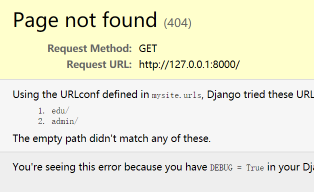

# Software-and-System-Security-
maybe more than 200 tasks in the [list](#软件安全能力清单) ...

# Tutorial

<details>
<summary>2020-3-11 软件安全概述+xss攻击入门</summary>

# 软件安全

## 三大问题

### 有什么安全问题，安全问题产生的原因

#### 二进制方面

1. 内存相关问题
   - 有明确的机制
   - 例子：**缓冲区溢出**，空指针，格式化字符串
2. 逻辑错误问题
   - 多种多样

#### Web方面

1. 典型安全问题
   - **XSS**，**SQL**注入
2. 非典型安全问题：很多
   - 主要是一些代码的逻辑错误，每个漏洞都可能有不同的原理

### 如何去发现~~问题~~ (安全漏洞) -> 漏洞挖掘技术

#### 白盒分析

- 分析**软件的源代码**去寻找问题
- 方法
   - 手工代码分析 -> 软件测试技术 / 代码review。但是软件的源代码通常比较庞大，手工分析起来很费劲
   - 自动化代码分析 -> 典型的技术：符号执行

#### 黑盒分析

- 因为白盒分析数据量大，需投入很多人工，人们寻求简单方法，和白盒分析对立的黑盒发展
- 原理：完全不管软件的内部机理 / 不看源码，把需要分析的软件当做一个黑盒子，看不见 / 根本不去看内部
- 方法：分析**表面现象**
  - 软件：通过输入和输出去猜测内部机制
  - 黑盒分析法，Fuzzing技术(模糊测试)
  
### 如果有人利用这这些安全问题，如何防御

#### 补丁

- 由于软件复杂性，要发现问题及时修补
- 方法
  - 通过**漏洞数据库**来披露和管理各种漏洞，厂家有义务定期发布软件补丁或者更新
  - 软件用户应该**及时升级**软件
  - 第三方人员，如果发现了安全问题，应该**通报**给厂家，而不是在漏洞修补以前，利用漏洞搞破坏，或者不负责任的披露漏洞

#### 防御机制

1. 寻找记录攻击的痕迹，然后分析这些数据
   - 数据的来源分为了主机层面和网络层面
2. 攻击者可能会做哪些方面的伪装，常用的伪装技术有哪些，如何去对抗伪装
   - 方法：加壳脱壳技术 / Rootkit技术

## 研究第一大方面：缓冲区溢出和XSS

- 代表了**二进制软件**和**脚本软件**（包括绝大多数Web软件都是脚本软件开发的）两大技术方向
- 缓冲区溢出虽然比XSS底层，但是更难。XSS虽然比较上层，但是相对比较容易理解
  - 计算机科学的特点就是，越底层的东西，越难
  - 开发操作系统比开发app难多了

## 二进制软件

- 计算机的底层，是CPU直接执行在内存中的机器指令
- C和C++这类编程语言开发的软件，通过编译链接过程，把程序变成CPU可以直接执行的二进制指令
- 这类软件的一个特点也是不可避免的一点：需要直接操作内存(指针)
  - 内存是所有在运行态的软件及其数据保存的地方
  - 内存分为细小的单元，每个单元有一个唯一的地址
- 二进制软件安全问题的根源
  - 所有要访问数据，必须知道数据的地址，要保存新的数据，就必须分配内存，获得可用的地址
  - 地址也是数，如果不小心计算错误，就会访问到不该访问的数据，造成数据的泄露或者破坏。
- 二进制程序的编程，有很大的难度的原因
  - 二进制文件晦涩难懂
  - CPU只能执行二进制指令(是基于物理上的电路)，所以不可能设计得机制太复杂

## 脚本软件

- 在C和C++发展成熟以后，就有人去研究如何降低编程的难度，能否避免程序员编程时直接操作内存，把需要操作内存的地方，都封装起来，屏蔽在编程语言的内部 -> 发明了脚本语言
- 概念：用C和C++这样的二进制程序开一个软件来执行一种新的程序，就是用软件来模拟CPU工作
  - 由于软件的可定制性比CPU就高多了，可以想定义什么指令就定义什么指令
  - 对象与封装：把所有需要操作内存的东西，全部封闭在执行器内部，只给程序员接口，不给程序员操作内存的机会。比如把字符串封装为string**对象**。只能调用string.len()这样的方法来操作这个对象。这样就避免了由于编程不慎造成的内存相关问题，也降低了编程难度
- 如python、java、js、web浏览器这样的脚本程序的执行器都是二进制程序。
- 解决了内存相关问题，有引出了其他的问题
  - 用户输入问题。比如XSS出现的原因如下：web程序存在一种高交互性。web是互联网时代的软件的基本框架，所以会有用户提交数据。为了网页动态的需求，开发了网页的前端脚本，比如js，直接把脚本嵌入到网页中。浏览器只要发现了script标签，就去当做脚本来执行，把网页按照程序员的定制，变的丰富多彩，变得富于变化。但是，恰恰另外一种需求，就是UGC(User Generated Conten 用户生成内容)软件，也就是网页的内容来自于用户提交的内容，比如BBS、博客、微博，电商视频网站的用户评论，都会涉及到用户提交的内容在页面上呈现。**当用户提交的内容里含有脚本**，如果直接将用户提交的内容放在页面上，那么用户提交的内容中的脚本会不会被浏览器解析执行呢？那么一个用户提交了一个脚本就可以在这个页面的所有用户主机上执行呢？用户能提交程序执行了，怎么才能不保证这个程序不是恶意的呢？前端脚本，除了渲染页面元素这样的功能，还有获得用户的输入跳转页面到其他地址等等丰富的功能。

## 实验

### 编写一个简单的html文件

- 要求只要有一个表单，用户就可以在表单中输入数据，向服务器提交。
    
    ```html
    <html>
    <body>
    <form method="post">
            <input type="text">
            <button>提交</button>
        </form>
    </body>
    </html>
    ```

- 保存为index.html文件，用浏览器打开显示如下
  
  

### 搭建一个web服务器

- 如果这个html是放在web服务器上，用户输入了数据，点击提交，浏览器就会把编辑框中的数据封装为一个POST请求，发现服务器。服务器会把这个数据发给后端脚本来处理。
- 通过定义form的属性来指明需要哪个脚本文件来处理
  - 比如PHP程序，他有一个POST超级变量，当用户提交了数据以后，对应的php脚本的post变量就是用户提交的数据
  - 假设服务器现在把用户提交的数据放在user_input.html的body标签中。然后保存在服务器文件的根目录中。当有网站的用户访问 http://xxxx.com/user_input.html 的时候，就会看到刚才那个表单用户提交的内容。当然实际的情况是这两个用户可能不是同一个用户，于是A用户提交的内容B用户就访问到了。
  - 当服务器脚本是原封不动的把用户输入的数据写到html里时，如果用户提交的数据中包括`<script>标签`，就会被执行。比如alert函数，弹出一个消息框，`<script>alert('xss attack')</script>`；比如给window.location.href赋值，能让用户莫名其妙的跳转到另外一个网站
- 最简单的实验环境
  - 在vscode中，安装一个php插件，然后编写一个简单的php脚本，调试运行这个脚本
  - F5 vscode会自动选择脚本运行的方式，把用户的表单输入写入到html文件
  - 通过浏览器访问这个文件html文件，这就是一个最简单的xss运行环境了。
- 实际的XSS漏洞可能很复杂，比如还会有数据库、登录等。另外，编程语言也不限于php，java、python也可以

### 问题

- 当编写的代码中出现中文，在网页上显示乱码
  - 编码问题，head标签里通过meta指定

# 教学网站

http://programtrace.com/

# [软件安全能力清单](https://github.com/purplezi/Security-Development-Lifecycle) 

**要求：对照清单，上面所有的东西都掌握，一项项检测自己的能力**

</details>

---

<details>
<summary>2020-3-18 python搭建简单的http服务器端 + xss攻击</summary>

# 使用python内置的库开发一个基本的http服务器端

- [测试代码](./readmeimg/2020-3-18-img/httpserver.py)
- 使用python原生的cgi和http.server两个库运行的一个简单的http服务器程序
  - 因为没有使用第三方库，所有不需要使用pip安装依赖
  - 运行比较简单
  - 公共网关接口（Common Gateway Interface，CGI）是Web 服务器运行时外部程序的规范，按 CGI 编写的程序可以扩展服务器功能

## 讲解代码

```python
# -*- coding: utf-8 -*-

import sys
import cgi
from http.server import HTTPServer, BaseHTTPRequestHandler

class MyHTTPRequestHandler(BaseHTTPRequestHandler):
    field_name = 'a'
    form_html = \
        '''
        <html>
        <body>
        <form method='post' enctype='multipart/form-data'>
        <input type='text' name='%s'>
        <input type='submit'>
        </form>
        </body>
        </html>
        ''' % field_name

    def do_GET(self):
        self.send_response(200)
        self.send_header("Content-type", "text/html")
        self.end_headers()
        try:
            file = open("."+self.path, "rb")
        except FileNotFoundError as e:
            print(e)
            self.wfile.write(self.form_html.encode())
        else:
            content = file.read()
            self.wfile.write(content)

    def do_POST(self):
        form_data = cgi.FieldStorage(
            fp=self.rfile,
            headers=self.headers,
            environ={
                'REQUEST_METHOD': 'POST',
                'CONTENT_TYPE': self.headers['Content-Type'],
            })
        fields = form_data.keys()
        if self.field_name in fields:
            input_data = form_data[self.field_name].value
            file = open("."+self.path, "wb")
            file.write(input_data.encode())

        self.send_response(200)
        self.send_header("Content-type", "text/html")
        self.end_headers()
        self.wfile.write(b"<html><body>OK</body></html>")


class MyHTTPServer(HTTPServer):
    def __init__(self, host, port):
        print("run app server by python!")
        HTTPServer.__init__(self,  (host, port), MyHTTPRequestHandler)


if '__main__' == __name__:
    server_ip = "0.0.0.0"
    server_port = 8080
    if len(sys.argv) == 2:
        server_port = int(sys.argv[1])
    if len(sys.argv) == 3:
        server_ip = sys.argv[1]
        server_port = int(sys.argv[2])
    print("App server is running on http://%s:%s " % (server_ip, server_port))

    server = MyHTTPServer(server_ip, server_port)
    server.serve_forever()

```

### 运行代码

- 使用`python httpserver.py`或者`py httpserver.py`
  - 使用vscode调试代码，在同目录下会自动生成一个`.vscode`的目录，目录下生成`launch.json`文件，配置如下
        
    ```json
    {
        // 使用 IntelliSense 了解相关属性。 
        // 悬停以查看现有属性的描述。
        // 欲了解更多信息，请访问: https://go.microsoft.com/fwlink/?linkid=830387
        "version": "0.2.0",
        "configurations": [
            {
                "name": "Python: 当前文件",
                "type": "python",
                "request": "launch",
                "program": "${file}",
                "console": "integratedTerminal"
            }
        ]
    }
    ```

- 在浏览器的访问网址为`127.0.0.1:8080/a.html`
  
  

### 主要的父类与子类

#### http methods

- [http请求下的多种methods](https://developer.mozilla.org/en-US/docs/Web/HTTP/Methods)
  - 通常使用得最多的，是 GET 和 POST
  - 直接在浏览器中输入链接，浏览器拿到地址以后，默认是采用 GET 方式向服务器发送请求，GET 方式最常见。
  - 表单使用的 post 方法提交数据 `<form method='post' enctype='multipart/form-data'>`
  - 通常来说，从服务器获取数据，使用 get 方法，向服务器提交数据，使用 post 方法
  - 其他的方法，在现在的web应用程序中，用到的很少

#### MyHTTPServer类

- MyHTTPServer类，是继承自原生的HTTPServer，重写 init 函数，增加了打印输出语言
- 然后直接调用父类 HTTPServer 的 init 函数传递了服务器运行需要的地址、端口等参数，我们的监听地址和端口是 0.0.0.0:8080

  ```py
  class MyHTTPServer(HTTPServer):
      def __init__(self, host, port):
          print("run app server by python!")
          HTTPServer.__init__(self,  (host, port), MyHTTPRequestHandler)
  ```

#### MyHTTPRequestHandler

- MyHTTPRequestHandler 类，这个是 HTTPServer 的回调，用来处理到达的请求，也就是 0.0.0.0:8080 上有任何的 HTTP 请求到达时，都会调用 MyHTTPRequestHandler来处理
  - MyHTTPRequestHandler 直接继承自 BaseHTTPRequestHandler
  - 重写了父类的 do_GET和do_POST两个方法
  - 这个HTTP请求的处理类是整个代码的主体，也是出问题的地方
  - 在 python 的 BaseHTTPRequestHandler 类中 ，do_XXX函数，就是处理对应的客户端请求的函数。代码指定了 MyHTTPRequestHandler 来处理 http 请求，那么当用 GET 方法请求，就会调用 do_GET，POST 方法请求，就会调用 do_POST函数
  - 浏览器所发送的数据包里包括请求类型， 在 http 的 headers里，会说明方法。
  - 这是python最基本的http 服务器的方式

### 其他处理

- 通常，一个静态的http服务器，这里的路径就是 http 服务器根目录下的文件，动态服务器可能是文件和参数，或者是对应其他服务器后台的处理过程
  - self.path 是这个请求的路径
  - 例如 http://127.0.0.1:8080/a.html 。其中 http://127.0.0.1:8080是协议服务器地址和端口。/a.html就是路径
  - 例如 http://127.0.0.1:8080/a.php?p1=x 。指定由 a.php 来处理这个请求，参数是 p1=x 。问号后面是参数，可以有多个
- 一般来说，如果读的文件不存在，应该返回404
  - self.send_response(200) 按照协议应该是404
  - 则这里的处理为 如果指定的文件不存在，还是返回200，表示请求路径是正确的，可以处理，然后返回一个默认的页面。这个页面是 form_html的变量，在FileNotFoundError异常处理过程中写回
  - self.wfile 和 self.rfile 对应 http 响应和请求的 body 部分
- GET处理完成以后，浏览器就拿到了 200 状态的  "Content-type" 为 "text/html" 的 form_html
- 在浏览器刷新是重复上一次的POST请求，所以会提示是否要重新提交表单

### 调试运行

- 在 def do_GET 下断点，刷新浏览器，代码就会断点命中中断。
- 结合浏览器，抓包看看 http 请求和响应的数据格式 （用抓包器或者浏览器的调试模式观察）

#### 浏览器调试模式

- 打开浏览器的调试模式(chrome > 菜单 > 更多工具 > 开发者工具)
- 在sources这个标签下看到服务器向浏览器返回的数据，即 form_html 变量
  - 这一段 html 浏览器渲染出来，就是那个带一个编辑框的表单- 表单指定了使用post方式向服务器提交数据
  
    

- 在network tab里可以看到完整的请求响应过程
  
  

  - 完整的网络数据，其中 header 里就说了 GET 或者 POST 、返回的状态码200等等
    
    

- 在表单中填入数据，点提交按钮，然后服务器的 do_POST 函数被调用。通过 cgi.FieldStorage解析了客户端提交的请求，原始的请求的头部在self.headers。body部分在self.rfile。解析完成以后放到 form_data变量里，其中 form_data['field_name'].value 是在编辑框中填入的数据
  ```py
  form_data = cgi.FieldStorage(
            fp=self.rfile,
            headers=self.headers,
            environ={
                'REQUEST_METHOD': 'POST',
                'CONTENT_TYPE': self.headers['Content-Type'],
            })
  ```

### 使用场景

- 通常，一个服务器会根据业务逻辑处理用户提交的数据，比如用户发表的商品评论，比如在线教学系统中填入的作业一般会写入数据库。但是这些数据，在某些情况下又会被显示出来，比如其他用户查看别人的商品评论的时候，比如老师查看学生的作业时。
- 为了模拟这个过程，简化了一下，没有用户系统，也没有数据库，直接写入了 path 对应的文件。
- 处理用户提交，写入文件
  ```py
  fields = form_data.keys()
  if self.field_name in fields:
      input_data = form_data[self.field_name].value
      file = open("."+self.path, "wb")
      file.write(input_data.encode())
  ```
  - fields = form_data.keys()是获取表单中的键值对，因此使用.value得到输入的值：这里获得是对应的是form中input的name `<input type='text' name='%s'>`
  - 表单以变量名变量值的方式组织，input的name相当于变量名，填入的数据就是变量值
  - python的cgi.FieldStorage将form组织为python的dict数据类型，所以可以通过  form_data['field_name'].value 获得所填入的数据
- 如果写入成功，就返回一个 200 状态的 OK 
  ```py
  self.send_response(200)
  self.send_header("Content-type", "text/html")
  self.end_headers()
  self.wfile.write(b"<html><body>OK</body></html>")
  ``` 

## 漏洞

- 如果向网页中填入了 123 ，那么123被写入了a.html文件。执行完成后，同目录下会多一个a.html，内容为123。然后下次再访问 http://127.0.0.1:8080/a.html 时，在浏览器地址栏里回车。由于这个时候a.html已经存在了，所以是运行的部分是
  ```py
  else:
      content = file.read()
      self.wfile.write(content)
  ```
  - 会直接把文件内容会写给浏览器
  - 这里是在简化模拟用户提交数据 > 存入数据 > 其他用户获取这个数据的过程
  
  

- XSS漏洞
  - 再访问一个不存在的页面，比如b.html，又会出现那个默认的form。这时输入`<html><body><script>alert('XSS')</script></form></body></html>`，然后在访问b.html的时候，整个页面被载入 script 在浏览器上执行，也就是**用户提交的数据被执行了**

    

  - 重新开一个页面，在c.html中填入`<html><body><script>window.location.href='http://by.cuc.edu.cn'</script></form></body></html>`。下次再访问c.html的时候。页面跳转了。`window.location.href='http://by.cuc.edu.cn'` 这段脚本的功能是实现了跳转
        
- 理论上，任何的js都是可以被执行的。js可以实现非常丰富的功能。比如可以骗取用户扫码、支付，实际到黑客的账户。如果是没有基本防御措施的网站，这段会被放进服务器数据库里，然后别人提交了数据就自动跳转到这个网站。比如有一个商品A，用户在评论里输入了一段js代码。如果服务器不做处理直接保存。后面的用户访问商品A、看评论，前一个用户输入的代码就会在其他用户的页面上执行。

### Furthermore

- 如果大家在浏览器中访问 http://127.0.0.1:8080/httpserver.py ，则在sources中显示全部完整的源代码。由于服务器没有做任何过滤，只要是存在的文件，就发送给客户端
  - 现在黑客可以知道我整个后台的逻辑了。
  - 如果还有一些配置文件，比如数据库地址和访问口令等。那就更严重了
  - 更严重的是，黑客甚至可以注入后端代码。由于我们是回写到文件，可以构造一个http post请求，把httpserver.py文件改写了。但是构造这个请求用浏览器就不行了，需要采用curl等更基础的工具裸写post请求发送给服务器的
- 在调试工具的 elements tab，由于后台只处理名为a的表单项写入文件，所以我们需要把input的把 name="%s" 改为 name="a" 再提交。改为以后，同时在提交框中输入‘hahaha’提交。此时httpserver.py，它变为'hahaha'，只是注入一个hahaha 服务器就挂了，再也跑不起来了。
  
  

- 所以，这是一个及其简单，但是漏洞百出的web服务器。这就是不做任何过滤，直接写入数据的危害。

## 参考资料

- [http methods](https://developer.mozilla.org/en-US/docs/Web/HTTP/Methods)

</details>

---

<details>
<summary>2020-3-25 sql注入 + 简易教务系统web应用 </summary>

# sql注入

`web程序开发和web程序`非常常见的一种漏洞

## web程序的开发

### 客户端(浏览器)和服务器

用户使用**浏览器**访问**服务器**，服务器在云端(我们看不见)，只有一个域名对应的IP地址。浏览器通过**发送请求**到服务器，服务器收到请求以后返回响应。其中数据的发送和接受的底层是计算机网络。对web程序来说，主要关心`Requests and responses(一收一发)`的过程

### 实验分析

- 使用抓包器，抓取一次 web 访问过程中的数据包，分析一下 Requests and responses 数据的数据包格式，可以看到在 tcp 数据包的 payload 部分是 http 协议数据包，又分为了 headers 和 body 等部分
- 浏览器发送的 Request ，最核心的部分是一个 url ，就是通常说的网址。比如`https://www.baidu.com/index.php?tn=request_1_pg&ch=1`，其中`/`前的部分，是主机地址，被解析为 ip 地址；第一个`/`后的部分为路径和参数，会对应服务器上的文件或者功能。服务器处理完毕返回 response ，一般是一个html格式的文本
- 浏览器，会直接把html渲染为我们所看到的页面的不同样式。
- html有自己专门的语法，其格式是以标签树的结构组织的，又可以嵌入js和css：js用来要求浏览器执行动态的效果，或者根据css的配置，对各种html的内部的标签和元素，显示不同的样式。

    

  - 学习html和js最好的工具就是chrome的调试模式。所以必做的实验，就是用chrome的开发者工具的 `elements`、`sources`和`network`几个工具，分析网页

### 开发一个web程序的基本过程

使用python内置的库开发一个基本的http服务器端
- 不是框架，是比较原始的http请求和响应过程。
- 涉及Requests and responses、html、表单、get、post、url等基本概念
- 但现在的web程序一般都比较复杂，会使用数据库，而且一般会有很多功能和页面

**开发web程序的基础架构 / 框架(主流开发技术)**
- 把web程序开发的一些底层的东西事先处理，开发者只需要关注功能的构建
- 各种web后端编程语言，比如java、php、python都有自己的框架。比如python现在最火的框架是[Django](https://docs.djangoproject.com/en/3.0/)，然后是flask。
  - 框架第一，把web开发流程变成了`mvc`结构。第二，提供了非常多丰富的web开发过程中需要使用的`库`。
  - 框架处理了最基本的请求响应过程：把请求映射到了`处理函数`，程序员就不用管很多麻烦的底层过程，只需要专心业务逻辑的处理。
  - 框架就是这些基本请求的函数的`封装`的整合

#### django

##### 基本使用

- 安装
  ```
  pip install Django
  python -m pip install Django
  ```
  - 如果pip安装速度很慢，大家可以修改pip使用的镜像源，改为国内的源
- 构建一个基于Django的基本框架的web应用程序。
  ```
  django-admin startproject mysite
  cd mysite
  python manage.py startapp polls
  python manage.py runserver
  ```
- 访问 http://127.0.0.1:8000/

  

  - 在命令行里可以看到服务器的打印输出，表示服务器收到了 request
  - 在浏览器看到的页面就是框架自动返回给大家的response
  - 说明request和response，请求相应的处理过程已经搭建起来

##### 简单的教务管理系统

- 教务管理系统肯定要用到**数据库**
- mvc：编写大型程序的时候，一定要做到mvc分离
  - m数据模型，我们要先建立基础的底层的数据结构
  - c控制，处理用户输入，构建每个用户输入对应的处理函数
  - v视图，在底层m数据模型的基础上，绘制用户界面
  - 比如贪吃蛇游戏，最先做的事情是使用链表来保存蛇和食物的相应的数据，写一些处理这个数据的函数，供上层的c和v来调用，这个叫做**封装**。这是基本的编程思想，和正确的工作组织流程。
- mvt:一个复杂的大型web程序，其实底层思想还是mvc，只是换了个名字，叫mvt，其中t是页面模板
- 写Django或者任何框架的程序，主要就是写三大部分：第一，数据模型models；第二，views和url，是用户请求对应的处理程序；第三，前端页面模板，即处理完的结果如何显示的问题
  - 其中url部分，又称为路由。把用户请求的url，对应到处理函数的过程。Django的处理函数，有一个专门名称，叫views。其基本过程就是框架收到用户的request，其中有URL。框架根据urls.py中的配置，将用户请求对应到一个处理函数，一般在views.py中。
  - views.py中的函数，参数就是request对象，Django中是HttpRequest类，然后views函数需要返回一个HTTPResponse类型的request。Django把这个reqeust变化为http协议的request数据包，返回给浏览器。
  - 一般在views的处理过程中，会访问数据库，也就是models。比如底层操作数据库是用sql语句，models把底层的数据库操作的sql全部封装为了对象化的处理。而最原始的web程序一般程序员会拼装sql语句，但是在Django中不用。这种底层数据的封装，称为orm(Object-relational Mapper)。

##### 编程

现在使用的数据库分两种：关系型数据库 & 非关系型数据库

关系型数据库的基本结构是表，关系其实是指表与表之间的关系。其中教务系统这种信息管理类的软件，一般是使用关系型数据库

首先就是设计数据库表结构

```python
class Course(models.Model):
    name = models.CharField(verbose_name='课程名',  max_length=100)
    number = models.IntegerField(verbose_name='编号', default=0)
    summary = models.CharField(verbose_name='摘要', max_length=500, null=True)


class Student(models.Model):
    class_name = models.CharField(verbose_name="班级", max_length=100, blank=True,null=True)
    phone_number = models.CharField(verbose_name='手机号', max_length=11,null=True)

class Score(models.Model):
    course = models.ForeignKey(Course, verbose_name='课程', on_delete=models.CASCADE, related_name='students')
    student = models.ForeignKey(Student, verbose_name='学生', on_delete=models.CASCADE, related_name='my_courses')
    score = models.FloatField(verbose_name='成绩',  null=True)
```

- 一个教务系统，需要表为：学生信息 课程信息 成绩信息
- 表中的每个记录，都有一个唯一的编号，称为主键。而外键是其他表中主键记录。通常我们用外键来记录表和表的关系。
- 其中成绩表就是学生和课程的关系，也就是选课。成绩表中的一个记录，表示某个学生，选了某门课程。成绩，是学生与课程的“关系”
  - 所以成绩表需要记录的就是某学生某门课的分数。而学生和课程都有专门的表来记录，我们无需在成绩表中重复记录多余的信息，只需记录id
  - 这个其他表中主键id，就是外键，所以外键体现了关系。
  - 而每个表中的主键，这里没有明确说明。系统会自动增加一个id字段。这个id每次插入记录时自动增加。
  
Django把建表这种基本操作变成了python中的类的定义，所定义的这些类，直接继承models.Model。即程序员只需要写好这个models.py文件，所有的建表的操作框架就可以完成。大家可以建一个app ，比如叫 edu_admin ，命令为`python manage.py startapp edu_admin`
  - `code .`可以用vscode创建一个新窗口并且打开当前目录
  - 将上述内容直接放入edu_admin中的models.py，然后把这个表结构，真实的写入到数据库中，也就是create table的过程，在django中称为`migrate`
  - 打开 mysite的 settings.py，在 INSTALLED_APPS 这里增加一个 edu_admin ，表示 edu_admin 这个是这个site的一个app。之前startapp命令只是创建了app，必须要把app写入到这里，这个app才会被纳入到站点功能中

    

  - 然后在命令行下执行 `python .\manage.py makemigrations` 和 `python .\manage.py migrate`，结果如下，同时会增加一个 `db.sqlite3`

    

    - makemigrations成功的标志是在app的目录下有migrations目录

到此文件，数据库表结构就建立完成了。
- Django这里默认使用了sqlite这种简单的文件型数据库。这种数据库的好处是一个文件来保存数据的所有信息，适合轻量级小规模的应用，但是效率和容量都有效，一般用在开发调试环境，不用在生产环境
- 为了验证Django真的建立了表，下载一个[sqlite](https://www.sqlite.org/download.html)的客户端软件，查看数据库的表结构
  - Windows下载`sqlite-tools-win32-x86-3310100.zip`，Linux直接`apt install sqlite3`
  - 把sqlite.exe加入在PATH环境变量或者放在db.sqlite同一个目录，然后执行`sqlite3.exe db.sqlite3` (database的路径不能有中文)
  - 进入到sqlite的命令行以后执行`.table`命令，可以看到所有的表，其中这三个表是在models中定义，其他表是Django自己要用的
  - 可以执行sql语句，比如插入一条记录，如 insert 和 select 可以成功，说明表是好的

    

## 作业

在不使用Django的情况下，我们可以使用更底层的pyhton的[sqlite](https://docs.python.org/3/library/sqlite3.html)库来编程操作数据库。在httpserver.py的基础上，继续编写漏洞。写两个页面，一个是教师录入成绩页面，一个是学生查询成绩页面。教师录入成绩页面表单有三个字段，课程id，学生id，成绩。录入提交以后，httpserver调用sqlite库使用sql语句写入数据库。然后是学生查询成绩表单，学生输入学生id，课程id，httpserver使用sql语句查询成绩后返回给用户。这里不需要做登录功能，课程也用直接输入id而不是下拉菜单的方式，或者其他选择的方式，而是直接输入id，为了体验最原始的web的开发过程

</details>

---

<details>
<summary>2020-4-1 web程序设计和SQL注入 [无作业]</summary>

# web程序设计和SQL注入

###### 工程目录


###### 数据库edu_admin回顾

使用Django这种框架编程，第一步是定义模型，Django会自动把定义好的模型转化为数据库表结构，这种方式称为 ORM

在models里定义了三个类，然后执行了生成migrations和migrate，即数据库的表就建立完成，以后每次修改了models，都需要执行makemigrations和migrate，才能将修改结果对应到数据库中

## 编写view

views是Django功能实现应用功能的地方。如果想写一个动态的页面，就在views中定义一个函数。这是最基本的方法。在此基本的方法上还可以有高级的，系统内置的一些高级的数据库增删改查的方法

最基本的views函数，是收到一个HttpRequest类型的参数，需要返回一个HTTPResponse类型的返回值，和http协议对应。

在edu_admin中的views.py写入如下内容，这个函数就是一个基本的 “处理请求，返回响应”的过程

```python
from django.http import HttpResponse
def index(request):
return HttpResponse('<html><body>OK</body></html>')
```

需要把这个views，对应到一个路径上，也就是客户端需要调用这个views函数对应的功能。因为一个实用的web app只有一个views是不够的，可能有很多很多views，然后需要把这些views对应到不同的url上，这样客户端才能访问。

这个工作，是urls.py来完成的。在 edu_admin 中建一个urls.py文件，写入如下内容
```python
from django.urls import path
from .views import *

urlpatterns = [
     path('index', index),
]
```

然后需要在`主urls.py`，也就是 mysite 的urls.py中包括这个url配置。这是为了适应可能有多个Django app共同工作的情况，比如这里的edu_admin是一个app，polls又是一个app
```python
path('edu/',include('edu_admin.urls')),
```

## 运行网站，查看效果

执行命令 `python manage.py runserver` 命令，也可以在vscode中调试运行

即在运行调试的时候，在调试页面，生成一个 lanuch.json ，选python Django。默认配置，生成的launch.json如下所示。lanuch.json的作用就是告诉vscode启动程序运行,任何一种编程语言和平台，都会有  lanuch.json。
  
  

  

访问` 127.0.0.1:8000`，这个是404页面，说明我们访问的url路径并不存在
  
  

只有 edu/ 和admin/两个路径存在。正如我们在 urls.py中配置的一样，访问 http://127.0.0.1:8000/edu/index
  
  

成功访问说明我们urls和views配合工作成功：用户在浏览器中输入路径，django把这个url对应到一个views函数上，views函数处理HttpRequest，返回HttpResponse

把url对应到一个views函数的过程，叫“路由”。注意，这个路由不是路由器的那个路由。路由器的路由是IP层的IP数据包分发功能。web框架的路由只是借用了这个概念，引申为 web 程序中 url 和处理函数的对应关系
- 注意一个url是可以带参数的，views函数也是可以带参数的。如下代码中，pk就是参数，而且只允许整数。路由系统会把这个参数赋值传递给views函数的pk参数。
  ```python
  # edu_admin/urls.py 的urlpatterns修改为
  urlpatterns = [
    path('index/<int:pk>',index),
  ]

  # edu_admin/views.py
  def index(request,pk):
    return HttpResponse('<html><body>Hello World %d </body></html>' % pk)
  ```

  - 在浏览器中输入`127.0.0.1/edu/index/1`，得到的结果如下：

    

## 在views中访问数据库

### 修改views.py

```python
from django.shortcuts import render
from django.contrib.auth.decorators import login_required
from django.http import HttpResponse

from .models import Score

def index(request, pk):
    return HttpResponse('<html><body>hello world %d </body></html>' % pk)

# Create your views here.

@login_required
def my_score(request):
    result = Score.objects.filter(student=request.user)
    return render(request, 'score.html', {'result': result})
```

### 代码解释

- 先从models中导入模型类Score
  ```
  # edu_min/views.py
  from .models import Score
  ```
- 然后调用这个模型类的objects的filter方法完成了一次sql select。filter函数的参数是就相当于查询的过滤条件。我们要查询的是 student 为当前登录用户的Score表的记录：`Score.objects.filter(student=request.user)`。Django中，当前登录用户，就在request对象的user属性中

### 修改模型

views写了还不够，我们还需要修改一下模型。Django是有默认的用户管理系统的，用户相关的数据库表结构其实Django已经建立好了，但是我们这里用了student表来作为系统用户。所以我们要告诉Django不要用系统默认的用户模型了，用Student

首先在 models.py中 导入`from django.contrib.auth.models import AbstractUser`，这个是Django默认的用户管理的数据库模型，然后继承修改自`class Student(AbstractUser):`

AbstractUser已经有很多数据库字段，比如密码肯定是需要以某种方式保存到数据库中的。在AbstractUser的基础上，扩充几个要用的字段就可以了。修改模型为：

```python
from django.db import models

# Create your models here.

from django.contrib.auth.models import AbstractUser

class Course(models.Model):
    name = models.CharField(verbose_name='课程名',  max_length=100)
    number = models.IntegerField(verbose_name='编号', default=0)
    summary = models.CharField(verbose_name='摘要', max_length=500, null=True)

    def __str__(self):
        return self.name

class Student(AbstractUser):
    class_name = models.CharField(verbose_name="班级", max_length=100, blank=True, null=True)
    name = models.CharField(verbose_name="姓名", max_length=100, blank=True, null=True)
    number = models.IntegerField(verbose_name="学号", default=0)
    phone_number = models.CharField(verbose_name='手机号', max_length=11,null=True)

class Score(models.Model):
    course = models.ForeignKey(Course, verbose_name='课程', on_delete=models.CASCADE, related_name='students')
    student = models.ForeignKey(Student, verbose_name='学生', on_delete=models.CASCADE, related_name='my_courses')
    score = models.FloatField(verbose_name='成绩',  null=True)
```

Student继承了AbstractUser后，告诉Django用Student作为系统用户管理的数据库模型

在mysite settings.py也就是整个站点的配置文件中，增加一条：`AUTH_USER_MODEL = 'edu_admin.Student'`，即告诉Django，使用 edu_admin 的Student作为用户管理登录授权的模型

代码修改完以后，由于涉及到数据库修改，所以要进行数据库表结构的migrate，前一步生成迁移文件，后一步实施迁移，迁移过程中，可能会要求输入一些默认值，选择1，而后全部都输入为空字符串就可以' '。执行结果如下所示


## 测试Django数据库访问是否正常

最原始的方法就是在sqlite.exe 中用sql语句插入。但是这个方法容易把数据搞乱了，而且比如用户密码这样的东西，不是明文保存的，所有插入会有问题

用Django的方式，先建立一个超级用户，执行`python manage.py createsuperuser`
- 建立一个管理员账户，用sqlite3.exe可以看到Student表多了一条记录
- 然后我们可以用Django的admin功能，用超级管理员录入数据。Django的admin相当于一个数据管理的超级权限后台，可以直接操作数据库
- 在edu_admin/admin.py中录入以下内容，这样直接就可以生成一个管理数据库的后台页面
    ```python
    from django.contrib import admin

    # Register your models here.
    from .models import Student, Course, Score

    class ScoreAdmin(admin.ModelAdmin):
        list_display = ('course', 'score','student')

    admin.site.register(Student)
    admin.site.register(Course)
    admin.site.register(Score, ScoreAdmin)
    ```
- 访问 http://127.0.0.1:8000/admin/ ，登录后看到这个页面
  
  

- 该页面上可以录入一些课程，学生，和成绩了。录入成绩前，先录入学生和课程。录入以后，在数据用sql也能查询到
  
  

  - 本身createsuperuser时的admin也是一个学生

  出现外键错误的解决方法：删掉同目录的数据库文件 db.sqlite3，重新进行一次makemigration和migrate，再创建超级用户

  

  同时数据库中也可以查询到

  

- 为了在admin管理的时候，直接显示课程名称，可以给course模型增加一个 __str__方法。这样所有course对象的str ，返回的是name字段。界面显示就是课程名称了
  
  

- 当数据库有了值以后，就可以在view中验证查询自己成绩的功能是否正常了。views中的`@login_required`表示需要登录，我们这里已经用超级管理员登录了，所以是可以访问的。
- `return render(request, 'score.html',{'result': result})`，其中render函数是一个Django内置的函数，用于在模板文件的基础上，通过渲染得到动态的网页效果。其中 score.html 是模板，后面的{} dict是参数，render必须传参reqeust。然后render函数就会在模板html文件的基础上，生成一个html并返回 HTTPResponse，所以可以直接作为 views函数的返回

## 编写score.html

在 templates目录下
  


```
<html>
<body>

科目：{{ i.course.name }}
成绩：{{ i.score }}
<br>

</body>
</html>
```

这里的result 就是 render传入的result。对每一个result 显示其课程名和分数。大家看到这里的多表查询 (course表中的name）直接.就调用出来了。模板语言的语法 {{ 变量名 }}

注意，写了新的views函数，需要在`views.py`下增加url，如下所示


这就完成了当前登录用户（超级管理员 admin 同学）的成绩查询。注意，这里我们偷了一个懒，实际情况，并不是每个用户都是超级管理员。需要有普通用户登录注册页面。这个页面需要自己写，我们这里时间关系，先不实现普通用户的登录，先用超级管理员用户验证一下查询功能。实际情况下普通用户 是不能访问 127.0.0.1:8000/admin页面的。


</details>

---

<details>
<summary>2020-4-29 二进制安全 [无作业] </summary>

# 软件安全中的二进制安全

二进制安全是整个软件安全中核心的内容

## 二进制软件

- 核心：二进制是软件的最基本形态
  - 所有的基础软件都是以二进制软件的形式存在
  - 二进制软件：操作系统、浏览器、数据库、中间件、各种脚本软件的解释执行器、很多大型游戏
- 二进制软件的基本特征：是CPU可以直接运行的机器指令
  - CPU能够运行的机器指令都是二进制的，包括了很多非ASCII的不可打印字符
  - 二进制程序无法跨平台：不同平台的二进制软件是不同的，Intel架构的cpu的二进制无法在ARM架构上运行，反之也是
  - 二进制形式的软件无法跨操作系统运行：二进制程序还需要操作系统的支持
- 直接使用二进制或者十六进制进行编程，人进行数据阅读比较困难，效率非常低下 -> 编程的时候不直接处理二进制，直接使用文本来编程
  - 文本代码CPU无法执行，需要**编译和链接**
  - 程序员编写出来的文本形式的代码 -> 源代码
    - 首先发明的源代码是汇编形式的，是使用的和机器指令一一对应的汇编语言，是一种直接最简单的操作指令级别的翻译过程
    - 汇编的编程还不是很方便，后来发明了C语言等高级语言，高级语言不止C语言一种，但是C比较成功，又发明了C++
  - 编译后生成的机器可运行的代码 -> 目标代码
- 研究二进制安全，首先需要了解的就是二进制软件和源代码，之后是脚本语言的关系

## 软件安全研究的核心问题

- 看表面不够，深入内部细节，需要了解的软件的具体原理，到代码级别
- 已经发现的软件安全典型的问题：栈溢出、堆溢出、格式化字符串漏洞、空指针、整形溢出等等
- 软件安全研究的两个核心问题
  - 安全问题（也叫脆弱性，通常叫漏洞）的存在性问题 - 漏洞挖掘
  - 这个安全问题的可利用性问题，安全漏洞具体有什么危害，如果达到这个危害如何防止 - 漏洞利用

### 漏洞挖掘 - 安全问题的存在性问题

- 安全问题的脆弱性，通常叫漏洞
- 由于软件安全的漏洞都是具体的，都是由软件内部的代码的编程不慎所引起的 > 所以漏洞挖掘方法就是分析代码
- 分析二进制（安全人员捕获一个攻击程序后拿不到源代码，源代码在发起攻击的人 / 黑客手上）
  - 在了解二进制机器指令的基本原理后，通过一些辅助的工具来解读
  - 通过逆向工程的一些技术，把二进制软件解构、翻译，然后就能理解其实现的原理
- 漏洞挖掘技术现在是攻防双方都在使用：软件的开发人员也在采用黑客发明的漏洞挖掘技术来挖自己的漏洞，以争取在软件发布前把安全问题尽量发现和修补

#### 反汇编

- 反汇编以及在汇编代码上的一些解构，比如获得函数列表、获得每个函数的调用关系、获得函数内部的控制流程图
- 变量名、函数名、注释、一些数据类型是源代码层面方便程序员编程的，对于二进制软件来讲，名称信息没有用处，机器指令内部全部是使用“数据和代码的存储地址”
- 反汇编工具：基本 > dumpbin & objdump，高级 > IDA-pro
- 所有的调试器也都有反汇编功能

#### 调试器

- 调试器比反汇编器要高级，因为反汇编器只能在程序没有运行起来的时候去观察它，而调试器可以在程序运行起来以后，随时中断程序的运行并观察
- 运行时的信息要更丰富，比如运行时候可以看到用户输入的数据、外部读入的数据、这些数据的具体处理过程、某个变量在运行时的赋值情况等，这些信息都是静态的反汇编所没有的。但信息丰富则需要分析和处理的数据量是非常大的
- 调试器还有一个反汇编器没有的功能：能捕获**程序执行的异常**
  - 异常信息：因为二进制软件的安全问题，通常会引起程序运行时的内部数据结构被破坏，比如各种溢出，其实是覆盖了正常的数据。内部数据结构被破坏以后，程序在后续执行时，可能访问这些不正常的数据，进而引起运行时错误
  - 大多数运行时错误，最后都变成内存访问的异常 > 虚拟内存管理方面的知识

#### 漏洞寻找

有了调试器和反汇编器，就有了观察和了解程序内部原理的工具，这些基础工具就像医院用的心电图、X光和CT一样，是获得内部基础数据的工具。但是只有这些工具，有时候还是不能发现具体问题，我们得了解具体漏洞产生的原因，比如溢出，为什么溢出是严重的安全问题

寻找漏洞最直接的思路，是一行行看代码 > 可行性 && 巨大的麻烦(软件是一个非常复杂和庞大的事物，比如Windows，有上万名开发人员，持续开发了20年，发布了无数个版本。如果一行行看代码，还不是源代码，是二进制反汇编代码，则需要和开发人员同等数量的人员和时间，这往往是达不到的)

**所以漏洞的挖掘，极少情况下会直接人工分析源代码，安全研究人员们，更希望借助自动化的工具**

#### 两大类自动化工具：模糊测试工具 & 程序分析工具

##### 模糊测试(Fuzzing)

- 认为软件很复杂，干脆不要去看内部了，把软件当做一个黑盒子，只看它的外部表现，给它各种各样的输入，看它在处理过程中会不会出现异常。如果有异常就说明软件在设计的过程中，没有考虑到用户会输入这样的数据，和软件的预期不符合，则存在漏洞。程序异常通常会引起程序的崩溃，用调试器来捕获异常，能实现自动化
- 通过研究漏洞的原理，漏洞是**畸形数据**引起的，比如输入了一个超长的字符串，比程序员内部预留的长，则发生溢出。所以通过输入畸形数据去尝试触发崩溃的方法，理论上也是可行的
  - 通过**随机**，构造畸形数据。随机并不是每次都能构造出正好合适的畸形数据，但是随即构造大量数据以后很有可能有那么一两次成功
  - 软件虽然复杂，但是运行速度很快，可以**不停的自动**运行目标软件，让软件来处理这些随机构造的可能是畸形的数据，然后运行的时候启动调试器来捕获可能得异常，虽然不是每次都能触发异常

##### 模糊测试工具

- 深入软件的内部原理的，分析它的每一行代码
- 代表的技术：危险函数定位和符号执行等
  - 危险函数定位的思路是，既然strcpy等能引起缓冲区溢出，那么就把全部的strcpy找出来看一看。随着研究的深入，人们发现，不是所有的漏洞都是危险函数引起的。内存操作的方法各种各样，千奇百怪，而且不是所有的危险函数都会引起安全问题。比如调用之前进行了长度判断 > 所以这种方法效果很差
  - 符号执行：分析方法，逐步复杂

### 漏洞利用 - 安全问题的可利用性问题

- 安全漏洞具体有什么危害 / 安全缺陷的危害，如果达到这个危害，如何防止
- 编写exp（漏洞利用程序）也是软件安全研究人员的基本功
  - exp一般分为攻击数据部分 + 攻击成功后的控制部分，前一部分比如一个超级长的字符串，用来溢出缓冲区；后一部分，就是shellcode
  - shellcode很多时候可以通用，但是攻击数据部分，每个漏洞都不一样。这部分的学习，比较有效的办法就是去阅读和使用别人写好的exp。kali Metasploit exploit-db上有很多这样的程序，有一些安全研究人员的个人博客上也有很多。所以大家就去找一两个公开了exp的具体的漏洞，搭建漏洞环境，解读学习exp > **漏洞复现**

#### 别人已经挖掘发现的漏洞

- 一些软件厂家，比如微软会定期升级自己的系统，打补丁。在打补丁升级系统的时候，就会同时给出安全公告说修补了那些问题
- 统一的数据库CVE：但是并不是每个软件厂家都有能力或者意愿去维护一个安全漏洞。有一些第三方的组织就来收集各种漏洞，并形成了一个统一的数据库，比如CVE
  - CVE给每个漏洞都编写，说明漏洞影响的软件及其版本，危害程度等等详细信息
  - 少量的漏洞还会给出PoC，也就是概念验证程序。早期的漏洞很多都有PoC，因为那个时候，很多软件厂家不重视漏洞修补工作。漏洞的发现人员，或者安全厂商放出PoC也能逼迫软件厂商去修补
  - 现在，软件漏洞的披露已经很规范了。国家也重视，所有美国和我们有国家安全漏洞数据库，美国有NVD，我们国家的CNVD和CNNVD。这些都是大家去找已经公开的漏洞的地方

#### 漏洞复现

如果拿到了一个漏洞的详细公告和PoC，如何去复现这个漏洞：安装一个有漏洞存在的软件版本

虚拟机：这个过程中，通常在**虚拟机**里安装配置。因为漏洞需要的环境可能和我们的工作主机的环境冲突很大，而且漏洞环境复现过程中，可能会破坏系统。如果我们要复现很多漏洞，不在虚拟机中进行，会把自己的工作环境弄得很乱

模拟器：模拟器和虚拟机相似又不同，他们都是在内部构造了一个“虚拟的机器”。这个虚拟的机器可以和真实的机器一样安装和运行操作系统以及各种软件。但是虚拟机，还是借助的物理CPU的虚拟化功能，而模拟器是使用软件来“实现”了一个CPU及其附属的设备
- 虚拟机的host系统和guest系统，只能是同一架构的。比如物理主机是intel架构，那么host和guest都这能是Intel 0x86架构的系统，比如Windows和Linux x86。但是模拟器就可以跨架构，host是Windows x86，guest是arm架构的安卓系统。
- 模拟器的典型代表：[QEMU](https://www.qemu.org/)
- 如果要研究安卓系统、路由器等MIPS架构的系统，就需要模拟器
- 模拟器通常也有调试、单步运行等功能，除了用于漏洞复现，也可用于漏洞挖掘。比如要挖掘一个路由器的漏洞，不能直接对着物理路由器Fuzzing，因为就是触发了异常，也无法捕获。所以通常是把固件提取出来，在模拟器中运行

#### 软件攻防

黑客如果通过攻击，进入到了一个目标系统。除了要考虑窃取信息、加密硬盘（勒索软件）、破坏数据等攻击之外，还需要考虑：第一是不留痕迹，第二是不能被杀毒软件和主机中的一些防御系统识别

早期，安全研究人员也在想办法对抗漏洞攻击和计算机病毒（计算机病毒其实就是一个可以自我复制的漏洞利用程序）。他们想到的办法就是杀毒软件
- 杀毒软件的基本原理是把已经发现的病毒等各种恶意程序的特征值记录在数据库中，每当系统中有新的文件时就计算一下这个文件的特征值，然后和数据库中的特征值进行比较，如果匹配上了，说明这是一个恶意程序
- 特征值通常是hash值。因为恶意软件很多，不可能把整个恶意软件都作为特性，占用空间也不方便分发特征值（分发特征值就是病毒升级）。但是如果源数据稍微变化一下，hash值就变化了。比如病毒修改自己的一个无意义的常量数据，功能不变，杀毒软件就无法查杀了。所以后来有发明了动态的基于行为的检测。
- rootkit技术：恶意软件需要隐蔽自己，比如文件、进程、通讯的端口都需要隐藏起来
  - rootkit技术很多是基于API hook。通过挂钩API，篡改了操作系统的行为，当防御软件在列举目录中文件时，根本就获取不到攻击程序的文件

防御软件和攻击软件就是一个技术博弈，此消彼长的过程，产生了非常多很有意思的技术：
- 比如攻击软件为了防止被发现，根本就不产生文件。可执行程序首先是一个文件，在系统上创建进程运行。后来出现了根本不产生文件，也不修改其他文件，寄生在其他可执行程序进程中、直接从网络加载到内存就能运行的恶意程序
- 外挂：外挂程序也是通过修改正常程序的软件行为，比如直接篡改内存中的数据，或者挂钩其函数，达到修改软件行为的目的。开发和防御外挂软件的技术与软件攻防技术相似，都是需要使用逆向工程工具和调试器等、都需要大量的数据分析工作

</details>

---

<details>
<summary>2020-5-13 符号执行 + KLEE</summary>


# 符号执行

## 黑盒测试

黑盒测试主要通过操纵其公开接口对软件进行评估，其中最知名的黑盒测试是模糊测试（Fuzzing）

模糊测试把测试对象当做一个黑盒子，不深入理解内部原理。模糊测试或者模糊化是一种软件测试技术，通常是自动化或者半自动化的，它能提供有效的、未预期的、随机的数据作为程序的输入

模糊测试能产生很多崩溃，分析人员通过这些崩溃作为分析问题的起点，以便确定漏洞的可利用性。然而，因为对程序控制流缺乏语义上的理解，模糊测试有代码覆盖率低的缺陷，即使是当前最高级的模糊测试技术也很难完全覆盖大型程序的所有路径

举个例子，对于以整形数据为路径分支条件，含有长为32比特的常量的约束等式条件（如if(v==4)），Fuzzing测试仍然有可能达到其上限次数（2^32次尝试）才能找到使得此等式为true的值，那么这个if为true分支被测试到的可能性极低

**毕竟不看代码，完全瞎试是Fuzzing的精髓嘛**

## 符号执行

符号执行就是为解决这个问题而设计的

符号执行作为一种能够系统性探索程序执行路径的程序分析技术，能有效解决模糊测试冗余测试用例过多和代码覆盖率低这两个问题。

与模糊测试的思路不一样，符号执行是一种程序分析技术，是白盒测试技术，基于程序分析 / 或者说是一种程序分析技术，需要解析程序的源码（或者至少是反汇编后的汇编代码）

### 主要思想

以**符号输入**代替程序的实际输入，以**符号值**代替程序运行过程中的实际值，并以**符号布尔表达式**表示程序中的分支条件。这样，一条程序执行路径就包含了一系列的符号变量、表达式赋值以及约束条件等，程序中的各路径的信息能以符号的形式被完整记录和保存

我们把**某条执行路径上的所有分支条件所组成的约束集**（Constraint Set）称为路径约束或路径条件（PC, Path Constraint，Path Condition）。符号执行的主要目的是通过对路径约束的求解来判断此条路径的可达性（Feasibility），并能给出执行此条路径的实际测试输入

简单来说，符号执行的目的是**覆盖程序执行的每一个分支**。方法就是查看和收集程序执行过程中每一个分支条件的具体条件，把这些具体条件收集起来，变成一个数学的表达式，然后通过一些方法自动化的求解这些表达式，得到满足执行程序的路径的具体的输入的值，就可以覆盖特定的程序分支了

### 例子讲解


左边的是一段示例代码，一共13行，包括两个函数，一个main函数，一个foo函数

程序有两个输入，从外部读入的数据x和y

foo函数以x和y作为条件，内部有分支

假设在第五行有一个bug，需要一种自动化的方法来找出这个bug

Fuzzing技术在某些特定情况下有可能极其小的概率才能覆盖到特定分支，所以Fuzzing技术最大的问题就是代码覆盖率不高。对于穷尽每个执行路径目标来说有点难

符号执行在解析代码的情况下，首先把程序的**每一个分支**画出来，形成一个称为**符号执行树**的数据结构 
- 类似程序的控制流程图
- 要明确每个分支的具体的执行路径条件
- 比如第一个分支的执行条件是y>x，第二个分支的执行条件是y<z+10。x和y都是输入数据，在数学上来说，都是未知数。如果我们能够有一种方法，可以求解 y>x 的一个满足解和一个不满足解，就找到了覆盖两个分支的两个测试用例。同样，对第二分支来说，在满足 y>x 的情况下，同时再满足 y<z+10 或者不满足 y<z+10 ，就能得到两个二级分支的具体的输入数据
- 这里多了一个变量z，通过分析代码发现，z并不是一个新的数据数据，并不是未知数，而是其他未知数赋值而来，所以每一步，我们都记录下这种赋值关系，形成一个“表达式组” > 我们初中的时候学的“不等式组”
- 理论上来讲，每一个程序执行的分支，每一个“执行路径”都有一个**确定的不等式组**作为执行条件，我们称为“约束”。如果能求解到这个不等式组的一个解，那么就可以构造出专门覆盖这条路径的测试数据，称为“约束求解”
- 对于我们想要找的bug > 第五行的代码，最终形成一个这样的“约束条件” > 是这一个具体路径的路径约束
  
  

#### 求解约束

- 自动化求解，不是人工求解
- 得到一个满足解即可，不用得到解析解 > 只需要得到一个满足这个不等式组的具体的值，就等达到目的
- 如果我们把每一个路径的约束全部求解一遍，那么我们就能得到100%代码覆盖率的测试数据集，能够充分测试一个软件，找出软件中所有潜在的bug和漏洞

#### SAT

**想法很好，难度很大**

符号执行技术在上个世纪70年代被提出之后，受限于当时计算机的计算能力和约束求解技术的不足，并没有取得太大的进展

近年来，由于可满足模理论(SMT)研究以及动态符号执行技术的提出和应用使得符号执行技术研究有了革命性的进展，并已经被学术界和业界广泛应用于**软件测试、漏洞挖掘、模型验证**等领域

基本想法，已经提出来50年了。但是一直找不到一种自动化求解约束表达式的方法，所以停留在理论层面，但是最近十几、二十年情况不一样了，我们有了一种新的方法，并且开发出了工具，可以做到了

抽象一点，布尔可满足性问题（SAT，Boolean Satisfiability Problem），又称为命题可满足性问题（Propositional Satisfiability Problem），通常缩写为SATISFIABILITY或者SAT。布尔可满足性问题主要作用**是在使用某种特定的语言描述对象（变量）的约束条件时，求解出能够满足所有约束条件的每个变量的值**

#### SMT

SAT求解器已经被用于解决模型检查、形式化验证和其它包括成千上万变量和约束条件的复杂问题。但SAT问题是个NP完全问题，具有比较高的复杂度，且直接使用SAT求解器对程序进行分析的话需要需将问题转化为CNF形式的布尔公式，这给转化工作带来很大的困难

数学家已经证明了所有的NPC问题，都可以转化为SAT问题，后来发现一种算法，可以缓解这个问题，并在一定程度上求解。具体算法我们不用去深入了解，因为前人已经开发出工具了，简而言之是一种基于多维空间收敛搜索的方法。这个工具称为 SAT 求解器 / 他的变种SMT 求解器

可满足模理论(SMT，Satisfiability Modulo Theories)主要用于自动化推论（演绎），学习方法，为了检查对于一些逻辑理论的一阶公式的可满足性而提出的。SMT技术主要用于支持可推论的软件验证，在计算机科学领域已经被广泛应用于模型检测（Model Checking），自动化测试生成等。可以被用于检查基于一种或多种理论的逻辑公式的可满足性问题。典型的应用理论主要包括了各种形式的算术运算（Formalizations of Various Forms of Arithmetic），数组（Arrays），有限集（Finite Sets），比特向量（Bit Vectors），代数数据类型（Algebraic Datatypes），字符串（Strings），浮点数（Floating Point Numbers），以及各种理论的结合等

相对于SAT求解器而言，SMT求解器不仅仅支持布尔运算符，而且在使用SMT求解器的解决问题的时候不需要把问题转化成复杂的CNF范式，这使得问题得以简化。上面我们总结出来的“约束求解”问题有自动化的方法了，而且已经有人开发了工具了 > 其中比较优秀的是Z3，微软研究院开发的。


#### 约束求解器的使用

- [Z3网页](https://rise4fun.com/z3)
  
  

  - 这个是 SMT 求解器使用的一种描述语言，来描述变量之间的约束关系
  - `Is this formula satisfiable?`表明检测这个formula是否可满足的。
  - 简化修改如下
    ```
    ; This example illustrates basic arithmetic and 
    ; uninterpreted functions

    (declare-fun x () Int)
    (declare-fun y () Int)
    (declare-fun z () Int)
    (assert (>= (* 2 x) (+ y z)))
    (assert (= x y))
    (check-sat)
    (get-model)
    (exit)
    ```
    - 运行后的结果为
        ```
        sat
        (model 
            (define-fun z () Int
                0)
            (define-fun y () Int
                0)
            (define-fun x () Int
                0)
        )
        ```
    - formula 按照工具的要求语法，写成一种固定的形式
    - 1、2行是注释
    - 3、4、5三行相当于定义了三个int类型的变量
    - 7、8两行定义两个约束 > 固定语法：运算符写在前面，运算数写在后面。第一个约束表达式实际是：2 * x >= y + z
    - 9、10、11行是要求求解器做三个具体的事情，第一个是检测是否这个表达式是否满足 > 有无解；get-model得到一个具体的满足解，求解器给出了 x=0 y=0 z=0 就能满足两个约束；11行告诉求解器，工作做完了可以退出
- 改写前面例子
    ```
    ; This example illustrates basic arithmetic and 
    ; uninterpreted functions

    (declare-fun x () Int)
    (declare-fun y () Int)
    (declare-fun z () Int)
    (assert (= z (* 2 x)))
    (assert (> y x))
    (assert (< y (+ z 10)))
    (check-sat)
    (get-model)
    (exit)
    ```
    输出
    ```
    sat
    (model 
        (define-fun y () Int
            0)
        (define-fun x () Int
            (- 1))
        (define-fun z () Int
            (- 2))
    )
    ```

#### SMT-LIB

编程实现这种自动化的格式转化，就能实现一个全自动能完成100%代码覆盖率，生成每一条路径的测试数据的自动化工具

实际上有的SMT求解器都已经标准化了，上面的那种描述语言是所有约束求解器都遵守的输入语言，称为SMT-LIB

SMT-LIB（The satisfiability modulo theories library）自从2003年开始发起的为SMT理论研究提供标准化支持的项目，旨在促进SMT理论的研究和开发

SMT-LIB的目的主要如下：为SMT系统提供标准化严谨的背景理论描述；发展和促进SMT求解器的输入和输出语言；为SMT求解器研究团队建立和提供大型测试集library等。

SMT-LIB的定义：如果对于用户声明(declare)的常量和函数，存在一个解（interpretation）能使全局栈里面的所有的公式集（the set of formulas）为true，则称这些公式集是可满足（satisfiable）的


- 这个为SMT-LIB V2语言在实际约束求解中的应用
- declare-fun 命令用于声明一个函数，当函数里面参数为空时，表示声明一个符号常量；
- assert 命令用于添加一个约束式formula到SMT全局栈里面；
- check-sat 命令决定在栈里面的公式（formulas)是否是可满足的，如果是，则返回sat，如果不满足（not satisfiable，即unsatisfiable），则返回unsat，如果求解器无法根据已有的formula决定是否满足，则返回unknown；
- get-value 命令用于在check-sat命令返回的结果是sat的前提下获取满足使SMT求解器全局栈中所有formulas为true的其中的一个解

当前很多非常著名的软件测试工具都采用了符号执行技术，而且已经有很大一部分开放了源代码。例如：NASA的Symbolic (Java) PathFinder，伊利诺大学香槟分校（UIUC）的 CUTE和jCUTE，斯坦福大学（Stanford）的 KLEE, 加利福尼亚大学伯克利分校（UC Berkeley）的 CREST和 BitBlaze，瑞士洛桑联邦理工学院（EPEL）的S2E，卡内基梅隆大学（CMU）的Mayhem和Mergepoint，加利福尼亚大学圣巴巴拉分校（UC Santa Barbara）的angr等。在工业领域也有符号执行工具被广泛使用，如Microsoft(Pex, SAGE, YOGI和PREfix), IBM (Apollo), NASA 和Fujitsu的 (Symbolic PathFinder)等

这些工具发现了很多软件的bug > 比如SAGE，win7三分之一的安全漏洞是它发现的

上面说了这么多符号执行工具，实现过程：根据代码生成符号执行树 > 收集路径的约束 > 转为SMT-LIB格式 > 输入给约束求解器 > 验证路径可达或者不可达，可达的情况下获得解 > 根据解自动构造输入数据

#### [KLEE](https://klee.github.io/)

但是不同的符号执行工具在实现时有不同，比如KLEE只能分析C源码程序，后续的一些工具可以分析二进制程序

KLEE能实现全自动化，唯一的缺点是需要在程序中进行少量的修改


- klee_make_symbolic(&a, sizeof(a), "a") 的作用就是a标记为需要求解的输入数据
- BitBlaze还有一些后续工具，能够实现输入数据的自动识别，更高级一些

使用KLEE一共就几个步骤：准备一份源码，标记要分析的输入数据，编译，使用KLEE来运行编译后的程序，得到KLEE自动生成的测试用例，最后把所有输入测试用例循环输入给被测试程序，完成自动测试

KLEE不是使用的在线版本的示例性质的约束求解器，而是直接调用本地的二进制程序。Windows和Linux下都有Z3的可执行程序，Windows系统中是Z3.exe，可以在官网下载

**KLEE是暴力求解吗？**

##### 实验

- 环境：Linux
- [官方的教程](https://klee.github.io/tutorials/testing-function/)
- 使用KLEE，来完成自动走迷宫
  - https://github.com/grese/klee-maze
  - https://feliam.wordpress.com/2010/10/07/the-symbolic-maze/
  - 把这个迷宫小游戏的代码整理编译运行一下，然后在教程的基础上使用KLEE来完成这个迷宫游戏的自动探路，体验一下符号执行是如何去根据程序分析来自动生成满足特定约束条件、覆盖指定程序执行路径的输入数据的

#### 符号执行的主要问题

##### 路径爆炸

当程序中有循环的时候，按照符号执行树，每一个分支条件都是需要展开，这会造成程序的路径非常多。但循环是程序的一个基本结构，普遍存在的，这种情况要遍历每一个路径，实际路径数量会非常巨大，造成消耗的时间不可行。这个问题称为路径爆炸，路径的数据量是分支数量的指数级，循环更加强了这个问题。

当程序路径非常多，输入变量非常多的时候，会超过SMT求解的求解能力

所以对大型程序，目前符号执行只是一种**辅助性**的手段。但是这种技术是有前景的，随着计算能力的增强，算法的优化和改进，未来可能成为程序分析、程序自动化测试和程序安全性分析的主要的形式化的方法，在软件安全领域有非常重要的应用

</details>

---

<details>
<summary>2020-5-20 恶意软件防御体系 + cuckoo</summary>

# 恶意软件防御体系

## 杀毒软件

- 背景：互联网没有今天这么发达，低速网络条件 - **单机的杀毒软件**
- 机制简单、容易实现，所以杀毒软件很早就被开发出来
- 核心：对系统中的所有文件进行全盘的扫描，将每个文件的**静态特征**，主要是文件类型、文件的hash值得数据与一个数据库中保存的信息进行对比
- 这个数据库中，主要保存的是一些**已经发现**的蠕虫病毒、恶意软件的hash值等静态特征。如果能匹配上，说明扫描到的文件是一个蠕虫病毒或者恶意软件，那么就进行删除。
- 开发杀毒软件的厂家，必须进行**病毒数据库的更新**：把厂家们已经发现的恶意软件加入到病毒数据库中，并让已经安装在客户主机中的杀毒软件定期链接服务器，升级病毒数据库。

## 入侵检测系统

- 在杀毒软件的基础上，人们还开发出了入侵检测系统
- 把数据库和对数据的扫描做成一个单独的设备，这个设备安装在一个网络的入口处，所有进入这个网络的**数据流量**都和**恶意数据的特征库**进行比较，找出其中可能有问题的数据并**拦截**

## 基于静态特征的匹配和查杀机制的缺陷

1. 查杀滞后
   - 杀毒软件能够查杀到的前提，是病毒的特征已经在数据库中。
   - 而这个数据库的特征是人为加入的。如果黑客们开发了一个新的蠕虫病毒或者攻击程序，杀毒软件是无法查杀的。
   - 只有当一个恶意软件已经流行开了，被杀毒软件厂家获得了**样本**，进行了**逆向分析**以后，才能确定其是否恶意，并提取其hash值等静态特征
2. 分析不容易
   - 从获得样本中进行软件的行为分析判断其是否恶意并不容易，需要很多的逆向工程的工作，这个工作需要有非常高的专业技能，同时有非常耗时间
3. 病毒变异容易
   - 恶意程序的源代码在黑客手里，他们要想进行变异，绕过杀毒软件的特征检测非常容易，只需略微进行修改，重新编译，hash就变了

## 改进

面对大规模变异的恶意软件，杀毒软件很可能疲于奔命

### 改进样本的获取渠道

- 原来杀毒软件厂家会在网络中容易被攻击的地方布置一些“陷阱”，如果恶意软件攻击进入了这些陷阱，杀毒软件厂家就获得了样本，这些陷阱就是早期的蜜罐。但是这种蜜罐只对蠕虫病毒等大规模流行的恶意软件有作用，对于一些定点的攻击很难获得样本。
- 后来，有杀毒软件厂家基于**黑白名单机制**，开发了一种直接从用户主机和网络流量中获取大量样本的方法。把一些**已知的可信的正常的软件**加入到一个“白名单”中，就像发一个“良民证”一样，这些软件就不查了。对于已经在黑名单中的文件，全部无条件查杀。对于既不在白名单又不在黑名单中的新的样本，全部回传到服务器。
- 带来新的问题
  1. 可能造成用户隐私泄露，造成用户的反感，甚至卸载防御软件
  2. 虽然解决了样本获取的问题，样本量却变得很大，是否能进行有效的分析变成了问题 -> 解决方法：**自动化程序分析**

### 分析软件行为

- 既然静态特征这么容易被绕过，则从软件行为上来分析
- 静态特征容易伪装，行为特征不容易伪装
- 黑客们再怎么修改源代码，不可能把功能都修改了。
  - 蠕虫病毒，一定会去复制自己，把原有的良好程序修改后嵌入自己（比如熊猫烧香），或者进行网络的扫描，发现可利用的漏洞进入其他系统（比如冲击波病毒）
  - 勒索软件一定会进行全盘加密、下载执行器一定会调用下载和执行相关的API
- 分析软件行为特征的客户端防御软件：主机入侵防御（检测）系统（HIPS或者HIDS）
- 带来新的问题
  - 要想分析行为，必须劫持软件的运行过程。比如采用hook技术，记录软件调用的系统API。但是这种技术，会造成系统运行效率的低下，系统变得很慢很卡；同时还会造成不稳定
  - 这种牺牲了用户系统的性能和稳定性的技术，虽然防御效果比纯静态特征要好得多（也不是十分完美，有一些高级的攻击还是防不住），但是用户却并不喜欢，代价太大

### 从源头上着手

- 蠕虫病毒也好、后门软件间谍程序、勒索软件，所有的有恶意软件，要想在目标系统中搞破坏，非法进入到目标系统，无非两条途径。一是利用**漏洞**，二是利用**社工**(社会工程学)
- 其中漏洞是主要的途径，也是技术上可防御的途径，纷纷加强加强堵漏洞
  1. 出现了漏洞数据库这样的东西，专门披露未知漏洞
  2. 大型的软件厂家，纷纷开发定期的漏洞补丁升级机制，最早最典型的就是微软
  3. 加大软件发布前的安全测试工作。比如采用Fuzzing技术、符号执行技术，先进行自测。那么黑客发现新的位置漏洞的可能性就小一些
- 这种改进的效果比较好。发现的软件漏洞的数量越来越多，修补得越来越快，黑客发现新的未知漏洞的成本越来越高。这也形成了新的趋势，就是个人黑客越来越没有生存空间，蠕虫病毒等没有什么“经济价值”对攻击者没有什么回报的攻击越来越少。
- 但是出现了勒索软件、APT攻击等新的方式，同时也意味着一旦被攻击，后果非常严重

## 现今整体防御体系的架构

1. 在客户端，**轻量级的静态特征匹配为主杀毒软件**并没有消失，还是广泛安装，操作系统自带了杀毒软件，比如Windows Defender等，国内360等装机量仍然非常巨大，但是他们都是轻量级的静态特征匹配为主。更重要的，在客户端，**漏洞的补丁安装和管理**更规范更及时，大多数用户由于各种惨痛经历，也积极打补丁
2. 形成了**专业的位置样本分析系统**(沙箱系统)，不在用户的客户端直接进行行为分析，而是由专业的系统进行样本的行为分析。这样，既能保证分析的准确性，又不影响用户主机的性能和稳定性
   - 专业的网络安全公司，都是大型的软件分析沙箱系统，用于分析新出现的样本，判定其是否恶意，并向客户端及时发布样本特征。

### 防御机制三大块 - 相互关联，高度配合

- 最核心的漏洞管理
- 大型的自动化的程序分析、沙箱和蜜罐系统
- 主机端的静态特征查杀
- 比一开始的杀毒要先进了不少，但是还是有防不住的情况
  - 用户故意不打补丁、长期不升级软件等情况还是会形成漏洞 - 靠管理宣传和教育
  - 防不了社工，比如钓鱼和诈骗邮件等。比如给面试的考生发一个 "录屏软件.exe"这样的钓鱼攻击，诱骗用户主动运行 - 靠管理宣传和教育
  - 防御不了0day漏洞攻击 - 安全研究人员研究的重点
    - 围绕0day漏洞，也就是未知漏洞的挖掘和防御
    - 攻击方和防御方，谁先挖出0day漏洞，谁就占有先手
    - 0day漏洞的挖掘：主流的就是Fuzzing和符号执行

## 在HIPS和沙箱中普遍采用的程序行为分析技术

- 剖析软件，大约可以分为几个层次。从高到底，有**系统级、模块级、函数级、基本块级和指令级**
  - 系统级：就是一个完整的软件。比如我们看Windows系统的任务管理器，就是一个有完整功能的软件系统的监视
    - 一个完整的软件系统，通常是由若干模块组成的，通常会有一个主模块和若干其他功能模块
    - 在Windows系统中，主模块是exe文件，其他功能模块是dll等文件
    - 主模块通常是程序的入口。我们在Windows Sysinternals系列工具中的进程浏览器就可以看到模块级
    - 模块内部的程序组织单元是函数(内部函数和外部函数)
      - 外部函数是一个软件系统自己实现的函数，外部函数是调用的其他第三方软件的接口函数，也包括操作系统的API
      - 函数内部是控制流图和指令。一个控制流图是执行是的若干分支，在控制流图种连续执行的一系列指令集合，中间没有分支的，就是基本块。不能再细分的是指令

### trace和分析

- 这5个层次，都可以进行运行时的trace和分析
  - 层次越高，追踪所获得的信息就越少，但是trace的时间越短
  - 记录一个系统中所有的进程的创建和退出，是非常容易的，几乎不会消耗系统的性能；但是如果记录到每一个指令的运行，那么我们的系统将在全局上有3-4个数量级的性能下降，也就是原来运行1秒钟的程序，需要一个小时左右的时间了。这肯定是不现实的。
  - 如果分析得太粗，可能会漏掉信息，如果分析的太细，数量级太大，又不可行 -> 所以首先需要选择合适的层次进行分析
  - 在现代的沙箱系统中，通常是多个层次结合的
    - 比如先有一个进程的白名单机制。白名单的进程，就不用分析了。比如notepad，calc等，他们是系统自带的一些小应用程序，没有分析的必要，就不浪费时间和资源。对于其他不清楚功能的分析对象，可以逐层深入
    - 进过多年的研究，发现在函数这个层次的分析是效率上可行，而且所能获得信息比较有用的
    - SSDT(System Service Dispatch Table 系统服务分派表) hook
      - Windows系统中的系统调用也是一层一层的，比如之前给大家讲过的kernel32.dll提供了大部分系统管理相关的基础API，有几千个。经过分析发现，kernel32.dll还会调用一个ntdll.dll，这个dll这有几百个函数。ntdll.dll会从用户态进入系统内核态。当ntdll.dll进入到内核态时，就是通过SSDT来确定其所有调用的系统内核函数的地址
      - 从这个意义上来讲，SSDT相当于这个Windows系统内核的导出表。数量在300个函数左右，根据不同的系统版本略有区别，包括了所有重要的系统基础功能。这是一个非常好的监控程序行为的指标
      - 比如，其中打开和创建文件NtCreateFile函数，获取操作系统参数，NtQuerySystemInfomation，创建进程NtCreateProcess等等
      - https://resources.infosecinstitute.com/hooking-system-service-dispatch-table-ssdt/#gref
      - https://github.com/xiaofen9/SSDTHOOK
      - https://www.cnblogs.com/boyxiao/archive/2011/09/03/2164574.html
      - https://ired.team/miscellaneous-reversing-forensics/windows-kernel/glimpse-into-ssdt-in-windows-x64-kernel
      - 如果监控了这个表，应用程序的大部分行为就都能获取了-> **基于系统调用序列的程序行为分析技术**
      - 把一个软件的系统调用序列和已知的恶意软件的系统调用序列进行分类
      - 实现软件行为判定的一种自动化方法：比如把已知的恶意软件的系统调用序列让机器学习进行学习训练，然后再让新的未知样本的系统调用序列用训练好的引擎进行分类判定
    - 有的时候，只是API这个层次还不够，可能还需要到控制流基本或者指令级别

### 方法

- 如何去进行trace，获取程序执行内部的这些信息的
- 首先，调试器是无所不能的。所有的程序执行细节都可以获得。而且高级的调试器是支持自动化的trace的，比如windbg和gdb都可以支持外挂脚本
- 第二，对于API层次，可以用我们熟悉的hook技术
- 第三，对于控制流和指令级别，除了可以用调试器以外，还可以用插桩工具
  - 插桩工具时一类专门用于程序trace的工具，其原理是通过在需要监控的程序点插入桩（记录程序运行的代码），来实现对程序运行过程的记录
  - 最典型的插桩工具时 intel 公司的 pin tools
  - 插桩工具的基本原理是在程序中插pin（桩），在程序运行到有pin位置，pin会调用一个分析者自行编写的回调函数，在回调函数内部完成记录分析或者安装新的桩等工作
  - https://software.intel.com/content/www/us/en/develop/articles/pin-a-dynamic-binary-instrumentation-tool.html

## 重点

1. 现在软件安全防御体系的一个现状和概要的发展过程
2. 在现在的软件安全防御体系中一个非常重要的点，程序行为分析的相关原理和技术

## 沙箱

- 对疑似恶意软件的分析，要在一个隔离环境中进行，是因为恶意软件有可能对环境进行破坏
- 安全研究人员们开发了一种专门的既可以隔离恶意软件（使其恶意行为之限定在虚拟机内部，不会对其他环境造成而已的破坏）同时又可以追踪分析软件行为的的工具 - 沙箱
- 目前应用得最广泛的沙箱是 [cuckoo](https://cuckoosandbox.org/) ，比较幸运的是它的编程接口是 python 的。使用 cuckoo ，可方便的进行程序行为分析，无需过分深入的研究让人头痛的系统内核机制和指令集
- 安装并使用 cuckoo ，任意找一个程序，在 cuckoo 中 trace 获取软件行为的基本数据

</details>

---