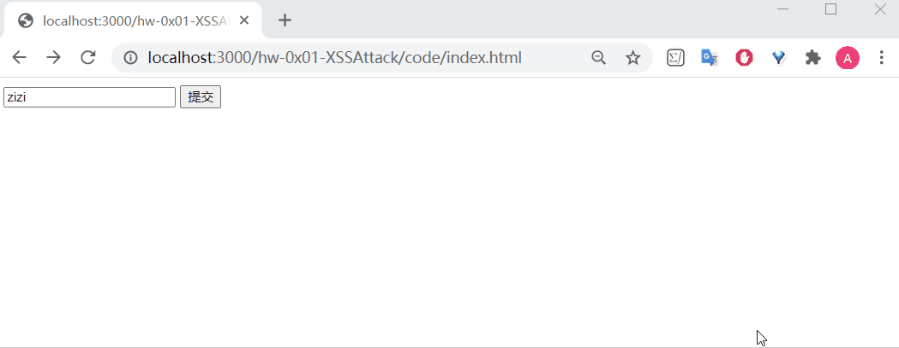
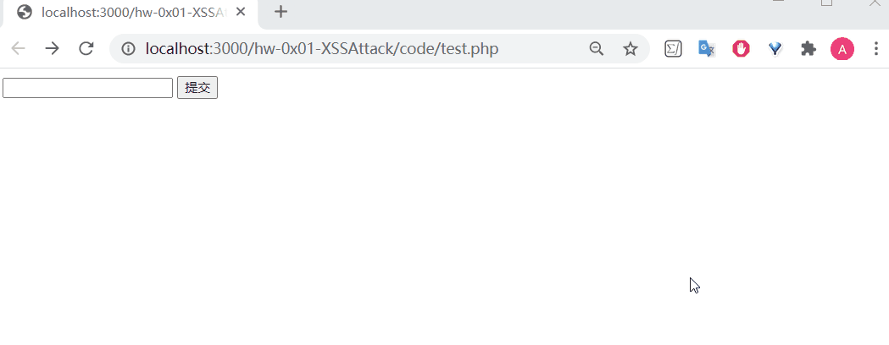
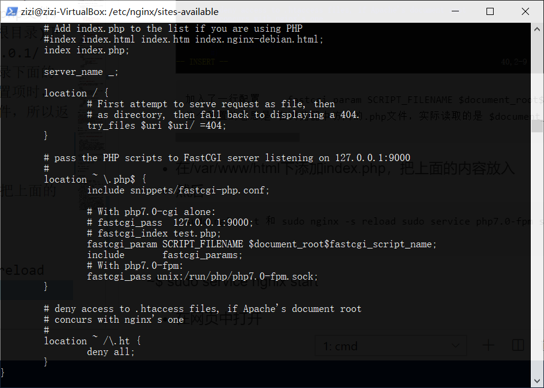
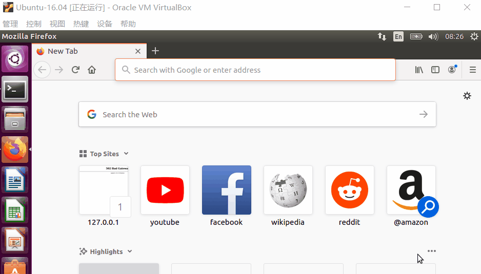
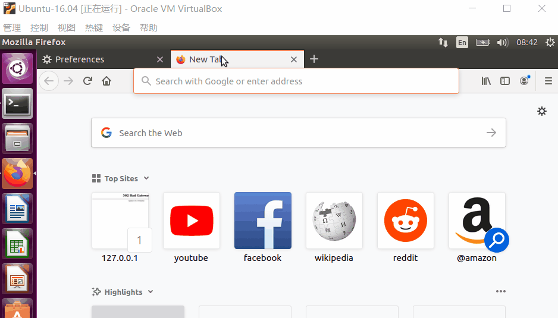
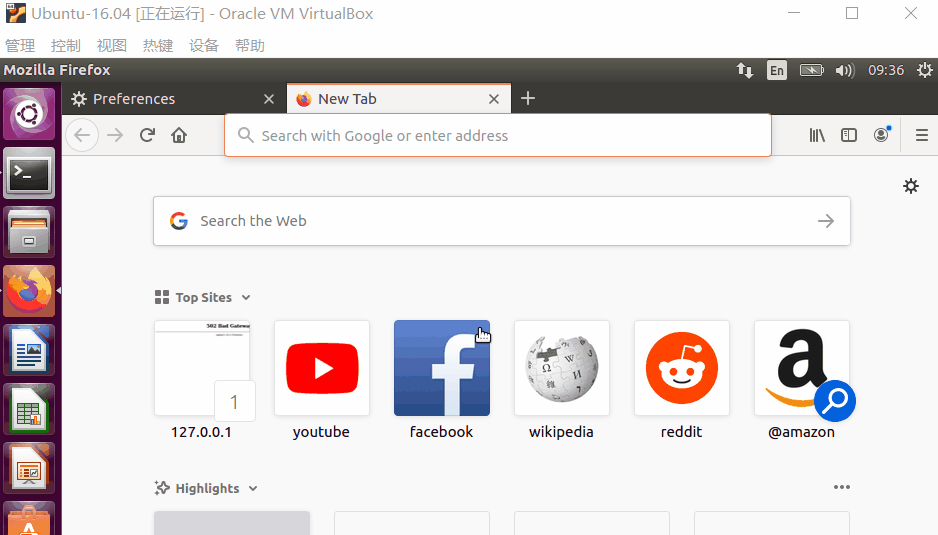

# XSS(Cross Site Script 跨站脚本)攻击

# 实验要求

- [x] 编写并且运行含有漏洞的简单页面，实现XSS攻击

# 实验环境

- Windows系统 10 企业版 x64
- Linux系统

# 实验过程

## Windows

- Apache/Nginx + php
- php + vscode的php插件

### ~~Windows下Apache+php环境搭建(略过)~~

### Windows下PHP环境环境搭建(用vscode php插件)

#### Install PHP

- [php官网下载链接](https://windows.php.net/download/)，下载版本`php-7.4.7-Win32-vc15-x64 Thread Safe`，验证散列值
- 将下载的 `.zip `压缩包解压到指定目录为`E:\php`
- 将 PHP 的根目录下的 php.ini-development 或者 php.ini-production复制一份并改名为 php.ini，作为PHP的配置文件
- 打开php.ini，修改配置信息:
  - ini文件的注释是英文分号，取消`; extension_dir = "ext" `的注释
  - 或者修改为extension_dir = "\${phphome}\ext"；${phphome}是PHP的根目录，配置文件中写成绝对路径，即`E:\php`
  - 启用需要加载的扩展文件(这将取决于要使用的库，但是以下扩展名应该适合大多数应用程序)
        ```
        extension=curl
        extension=gd2
        extension=mbstring
        extension=mysql
        extension=pdo_mysql
        extension=xmlrpc
        ```
- 将`E:\php`添加至环境变量

#### 运行php文件

- 插件：php server(Serve Project)直接可以在浏览器跑了 

#### debug php文件(ext:php debug)

- 在vscode的`settings file`指定机器上PHP可执行文件的路径
  - 为用户全局配置PHP设置
    - F1 > type 'user' > 选择User Settings 用户设置 > 在`settings.json`中编辑
  - 为用户配置当前工作空间下PHP设置
    - 在`.vscode`下`settings.json`配置

        ```json
        "php.validate.enable": true,
        "php.validate.executablePath": "E:\\php\\php.exe",
        "php.validate.run": "onType"
        }
        ```
- vscode的php debug插件支持php的调试器[Xdebug](https://xdebug.org/download.php) 
  - 需下载，此处版本为PHP 7.4 VC15 TS (64 bit)，放入目录`E:\php\ext\`下
- 修改`php.ini`文件，填入
    
    ```ini
    zend_extension = "E:\php\ext\php_xdebug-2.9.6-7.4-vc15-x86_64.dll"

    [XDebug]
    xdebug.remote_enable = 1
    xdebug.remote_autostart = 1
    ```
- debug下断点，不会停下

### XSS攻击

- 思路：`index.html`点击提交后，数据提交给`index.php`文件处理，如果是文本内容则会显示`welcome text`，如果是js代码则会出现js代码想要实现的效果
- 编写[`index.html`](./code/index.html)和[`index.php`](./code/index.php)文件
    ```html
    <html>
    <body>
        <form method="post" action="index.php">
            <input type="text" name="name">
            <button>提交</button>
        </form>
    </body>
    </html>
    ```
    - 详解：
    ```php
    <?php
        $name= $_POST["name"];
        echo "welcome $name";
    ?>
    ```
    - 详解
- xss攻击过程：`<script>alert('xss attack')</script>`
  
  

- 也可以直接运行php文件，在php代码中实现表单，见[`test.php`](code/test.php)
  ```
  <html>
  <body>
    <?php
        if(isset($_POST["name"]) && $_POST["submit"]=="提交"){
            $name=$_POST["name"];
            echo "welcome $name";
        }
    ?>
    <form name="form" method="post" action="">
        <input type="text" name="name">
        <input type="submit" name="submit">
    </form>
  </body>
  </html>
  ```

  

#### 参考资料

- [Manual Installation part](https://www.sitepoint.com/how-to-install-php-on-windows/)
- [Configuring Visual Studio Code for PHP development](https://docs.microsoft.com/zh-cn/archive/blogs/nicktrog/configuring-visual-studio-code-for-php-development)

---

## Linux

### Nginx + php

- 安装
    ```bash
    sudo apt-get update
    sudo apt-get install nginx
    sudo apt-get install php
    ```
- 把/etc/nginx/sites-available/default的index修改
  
  

  ```
  加入了一行配置 　　fastcgi_param SCRIPT_FILENAME $document_root$fastcgi_script_name;
  这个配置的意思是 在浏览器中访问的.php文件，实际读取的是 $document_root(网站根目录)下的.php文件 -- 也就是说当访问127.0.0.1/index.php的时候，需要读取网站根目录下面的index.php文件，如果没有配置这一配置项时，nginx不回去网站根目录下访问.php文件，所以返回空白
  ```

- 在/var/www/html下添加index.php，把上面的内容放入。代码根据虚拟机要稍做修改，比如要把提交改为 浏览器中显示的 Submit Query
  ```html
  <html>
    <body>
        <form name="form" method="post" action="">
            <input type="text" name="name">
            <input type="submit" name="submit">
        </form>
        <?php
            if(isset($_POST["name"]) && $_POST["submit"]=="Submit Query"){
                $name=$_POST["name"];
                echo "welcome $name";
            }
        ?>
    </body>
  </html>
  ```
- 然后
  ```
  sudo nginx -t
  sudo nginx -s reload 
  sudo service php7.0-fpm start
  ```
- 在网页中打开
  
  

- ~~Apache + php~~
  - Apache太重量级，先略

## 预防XSS攻击

- PHP htmlspecialchars() 函数
  - 会把预定义的字符如 "<" （小于）和 ">" （大于）转换为 HTML 实体
  - 预定义的字符是
    ```
    & （和号）成为 &
    " （双引号）成为 "
    ' （单引号）成为 '
    < （小于）成为 <
    > （大于）成为 >
    ```
  - 第二个参数
    ```
    ENT_COMPAT - 默认。仅编码双引号。
    ENT_QUOTES - 编码双引号和单引号。
    ENT_NOQUOTES - 不编码任何引号
  - php部分修改为
    ```php
    <?php
        if(isset($_POST["name"]) && $_POST["submit"]=="Submit Query"){
            $name=$_POST["name"];
            echo "welcome ";
            echo htmlentities($name, ENT_QUOTES);
        }
    ?>
    ```
  - 结果
    
    

  - 但是使用htmlspecialchar()过滤后会使有些需要显示的Html效果被屏蔽掉
- `strip_tags($string);`这个函数可以除去字符串中HTML和PHP标签，仅仅保留参数中指定的标签。例如`strip_tags($string, '<a>')`，表示只允许a标签，如果是不加第二个参数，则html标签都会被过滤
  
  下面的例子修改为只允许h1标签，结果如下
  
  
  
- 用封装好的正则去处理

# 实验总结

- HTML 是用来描述网页的一种语言
  - 指的是超文本标记语言 (Hyper Text Markup Language)
  - 不是一种编程语言，而是一种**标记语言** (一套标记标签 markup tag )
  - HTML文档也叫做 web 页面
  - **静态**
- PHP 是一种创建**动态交互性**站点的强有力的服务器端**脚本语言**
  - 指的是超文本预处理器 (Hypertext Preprocessor)
  - 脚本语言是一种为了缩短传统的编写-编译-链接-运行（edit-compile-link-run）过程而创建的计算机编程语言
  - PHP 文件可包含文本、HTML、JavaScript代码和 PHP 代码，默认文件扩展名是 ".php"
  - PHP 代码在 Web 服务器上执行，结果以纯 HTML 形式返回给浏览器 （支持Mysql的主机）
- 关于html、css、js、php的一些知乎奇妙比喻
  - html负责展示内容，css使得html变漂亮，js让页面动起来，php动态修改输出html显示内容
  - html是咖啡店里服务员妹子，css是她身上的衣服，js是她的员工手册，php是追她的小伙子
  - html是骨架，css是皮肤（负责展现），js是肌肉（负责功能），php与后端交互