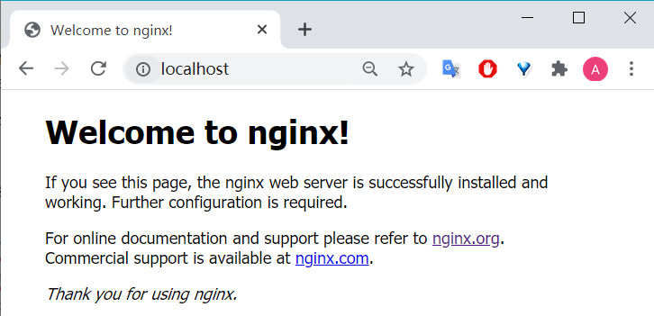
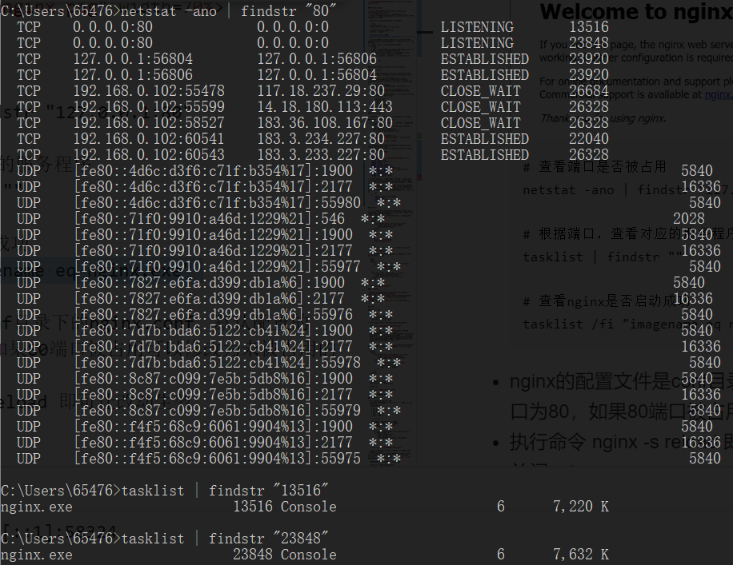

# XSS(Cross Site Script 跨站脚本)攻击

# 实验要求

- [x] 编写并且运行含有漏洞的简单页面，实现XSS攻击

# 实验环境

- Windows系统 10 企业版 x64
- Linux系统

# 实验过程

## Windows

- Apache/Nginx + php
- php + vscode的php插件

### ~~Windows下Apache / Nginx +php环境搭建~~

虽然可以搭建，但是一般不在Windows下搭建Web服务器，一般选择Linux

[**php的配置**](#install-php)

#### Windows Apache

- [下载对应的zip文件并且解压](https://www.apachelounge.com/download/)
  - 查看自己的机器，我机器上Microsoft Visual C++到[VC15](https://www.apachelounge.com/download/VC15/)
- 进入到解压目录下的`Apache24`目录，打开`conf`目录找到`httpd.conf`
  ```conf
  # 将c:/Apache24修改为自己对应的盘符
  Define SRVROOT "c:/Apache24"
  
  ServerRoot "${SRVROOT}"

  # 如果想修改端口的话 找到 listen 以及ServerName进行修改
  ```
- 进入apache的bin目录下，检查httpd.conf有无问题，输入`httpd.exe -t`，如果正常的话只会显示一行Syntax OK
  ```cmd
  # 如果显示如下内容
  AH00558: httpd.exe: Could not reliably determine the server's fully qualified domain name, using fe80::7d7b:bda6:5122:cb41. Set the 'ServerName' directive globally to suppress this message

  # 解决方法 指定ServerName 将配置文件中对应部分改成 ServerName localhost
  ```
- `httpd.exe`，在浏览器输入`localhost`即可进入主页

#### Apache + php

- Apache 通常用 TS 版（也可以用 NTS）
- 将自己的php文件(test.php)放入`Apache24/htdocs`目录下
- 编辑Apache的httpd.conf
  - 查找LoadModule，在配置文件尾部加入
        ```conf
        LoadModule php7_module E:/php/php7apache2_4.dll
        PHPIniDir E:/php
        ```
  - 查找AddType  
        ```conf
        AddType application/x-httpd-php .php .html .htm

        <IfModule dir_module>
            DirectoryIndex index.html test.php
        </IfModule>
        ```
- 保存配置，在命令行中运行httpd.exe -t检查配置
- 启动apache服务，在浏览器中输入`localhost/test.php`

#### Windows Nginx

- [下载对应的zip文件并且解压](http://nginx.org/download/nginx-1.18.0.zip)
- 双击目录下的`nginx.exe`，一个黑色的弹窗一闪而过
- 直接在浏览器地址栏输入网址`http://localhost:80`，出现以下页面说明启动成功
  
  

  ```cmd
  # 查看端口是否被占用
  netstat -ano | findstr "127.0.0.1:80"

  # 根据端口，查看对应的服务程序
  tasklist | findstr ""

  # 查看nginx是否启动成功
  tasklist /fi "imagename eq nginx.exe" 
  ```

  

- nginx的配置文件是conf目录下的nginx.conf，默认配置的nginx监听的端口为80，如果80端口被占用可以修改为未被占用的端口即可
- 执行命令 nginx -s reload 即可让改动生效
- 关闭nginx
    ```cmd
    # 如果使用cmd命令窗口启动nginx，关闭cmd窗口是不能结束nginx进程的，可使用两种方法关闭nginx
    # 1. 输入nginx命令 nginx -s stop(快速停止nginx)  或  nginx -s quit(完整有序的停止nginx)
    # 2. 使用taskkill：taskkill /f /t /im nginx.exe
    ```

#### Nginx + php

- Nginx对应的php是NTS版
- 在php.ini中找到cgi.fix_pathinfo项目，取消注释
  - cgi.fix_pathinfo是用来设置在cgi模式下PHP是否提供PATH_INFO信息
  - 因为nginx默认不会设置PATH_INFO的值，所以需要通过上面的方法来提供
- 把自己的文件放入nginx的html的目录下，或者是把nginx.conf文件中的root改成项目地址的绝对路径如`root E:/www`
- Nginx配置文件的修改，修改conf目录下的nginx.conf文件，修改完重新启动nginx
    ```conf
    location ~ \.php$ {
        root           html;
        fastcgi_pass   127.0.0.1:9001;
        fastcgi_index  index.php;
        # $document_root其实就是上面的root，可以直接改成绝对路径
        # fastcgi_param  SCRIPT_FILENAME  /scripts$fastcgi_script_name;
        fastcgi_param  SCRIPT_FILENAME $document_root$fastcgi_script_name; 
        include        fastcgi_params;
    }
    ```
- 开启php-cgi.exe：`php-cgi.exe -b 127.0.0.1:9001 -c php.ini` (该窗口不能关闭)
- 访问`localhost/indes.php`可成功

##### vscode + nginx + php调试

- 参考[debug php文件(ext:php debug)](#debug-php文件extphp-debug)
- php文件只能是如下框架，不能为`<html></html>`的框架
    ```php
    <?php
    ?>
    ```

### Windows下PHP环境环境搭建(用vscode php插件)

#### Install PHP

- [php官网下载链接](https://windows.php.net/download/)，下载版本`php-7.4.7-Win32-vc15-x64 Thread Safe`，验证散列值
- 将下载的 `.zip `压缩包解压到指定目录为`E:\php`
- 将 PHP 的根目录下的 php.ini-development 或者 php.ini-production复制一份并改名为 php.ini，作为PHP的配置文件
- 打开php.ini，修改配置信息:
  - ini文件的注释是英文分号，取消`; extension_dir = "ext" `的注释
  - 或者修改为extension_dir = "\${phphome}\ext"；${phphome}是PHP的根目录，配置文件中写成绝对路径，即`E:\php`
  - 启用需要加载的扩展文件(这将取决于要使用的库，但是以下扩展名应该适合大多数应用程序)
        ```
        extension=curl
        extension=gd2
        extension=mbstring
        extension=mysql
        extension=pdo_mysql
        extension=xmlrpc
        ```
- 将`E:\php`添加至环境变量

#### 运行php文件

- 插件：php server(Serve Project)直接可以在浏览器跑了 

#### debug php文件(ext:php debug)

- 需要配置服务器 / 如果不配置服务程序（apache、nginx等），纯php的话，这就要考虑cli模式下xdebug调试
- [参考资料](https://www.cnblogs.com/phonecom/p/10340038.html)
- 在vscode的`settings file`指定机器上PHP可执行文件的路径
  - 为用户全局配置PHP设置
    - F1 > type 'user' > 选择User Settings 用户设置 > 在`settings.json`中编辑
  - 为用户配置当前工作空间下PHP设置
    - 在`.vscode`下`settings.json`配置

        ```json
        "php.validate.enable": true,
        "php.validate.executablePath": "E:\\php\\php.exe",
        "php.validate.run": "onType"
        }
        ```
- vscode的php debug插件支持php的调试器[Xdebug](https://xdebug.org/download.php) 
  - 需下载，此处版本为PHP 7.4 VC15 TS (64 bit)，放入目录`E:\php\ext\`下
- 修改`php.ini`文件，填入
    
    ```ini
    [XDebug]
    zend_extension = "E:\php\ext\php_xdebug-2.9.6-7.4-vc15-x86_64.dll"
    xdebug.default_enable = 1
    xdebug.scream = 1
    xdebug.coverage_enable = 1
    xdebug.profiler_enable = on
    xdebug.profiler_enable_trigger = on
    xdebug.profiler_output_dir = "E:\php\profiles"
    xdebug.remote_enable = on
    xdebug.remote_autostart  = 1
    xdebug.remote_host=127.0.0.1
    xdebug.remote_port = 9000
    ```
- vscode设置php可执行文件：文件 > 首选项 > 设置，搜索：`php.validate.executablePath`。在settings.json中编辑，添加选项："php.validate.executablePath"：php可执行文件完整目录
- 在vs下点击调试，查看`.vscode`下的`launch.json`文件，发现XDebug监听的端口为`9000`(和在`php.ini`下配置的xdebug.remote_port = "9000"一致，xdebug.remote_host = "127.0.0.1"是远程调试的ip地址，即你自己的本机ip)，则在浏览器中输入
    ```json
    {
        "name": "Listen for XDebug",
        "type": "php",
        "request": "launch",
        "port": 9000
    },
    ```

### XSS攻击

- 思路：`index.html`点击提交后，数据提交给`index.php`文件处理，如果是文本内容则会显示`welcome text`，如果是js代码则会出现js代码想要实现的效果
- 编写[`index.html`](./code/index.html)和[`index.php`](./code/index.php)文件，index.php和index.html位于同目录下，因为index.html中的action会调用index.php
    ```html
    <html>
    <body>
        <form method="post" action="index.php">
            <input type="text" name="name">
            <button>提交</button>
        </form>
    </body>
    </html>
    ```
    - 详解：
    ```php
    <?php
        $name= $_POST["name"];
        echo "welcome $name";
    ?>
    ```
    - 详解
- xss攻击过程：`<script>alert('xss attack')</script>`
  
  

- 也可以直接运行php文件，在php代码中实现表单，见[`test.php`](code/test.php)
  ```
  <html>
  <body>
    <?php
        if(isset($_POST["name"]) && $_POST["submit"]=="提交"){
            $name=$_POST["name"];
            echo "welcome $name";
        }
    ?>
    <form name="form" method="post" action="">
        <input type="text" name="name">
        <input type="submit" name="submit">
    </form>
  </body>
  </html>
  ```

  - 此处action=""，即form没有指定action地址，默认就是提交到当前url

  

#### 参考资料

- [Manual Installation part](https://www.sitepoint.com/how-to-install-php-on-windows/)
- [Configuring Visual Studio Code for PHP development](https://docs.microsoft.com/zh-cn/archive/blogs/nicktrog/configuring-visual-studio-code-for-php-development)

---

## Linux

### Nginx + php

- 安装
    ```bash
    sudo apt-get update
    sudo apt-get install nginx
    sudo apt-get install php
    ```
- 把/etc/nginx/sites-available/default的index修改
  
  

  ```
  加入了一行配置 　　fastcgi_param SCRIPT_FILENAME $document_root$fastcgi_script_name;
  这个配置的意思是 在浏览器中访问的.php文件，实际读取的是 $document_root(网站根目录)下的.php文件 -- 也就是说当访问127.0.0.1/index.php的时候，需要读取网站根目录下面的index.php文件，如果没有配置这一配置项时，nginx不回去网站根目录下访问.php文件，所以返回空白
  ```

- 在/var/www/html下添加index.php，把上面的内容放入。代码根据虚拟机要稍做修改，比如要把提交改为 浏览器中显示的 Submit Query
  ```html
  <html>
    <body>
        <form name="form" method="post" action="">
            <input type="text" name="name">
            <input type="submit" name="submit">
        </form>
        <?php
            if(isset($_POST["name"]) && $_POST["submit"]=="Submit Query"){
                $name=$_POST["name"];
                echo "welcome $name";
            }
        ?>
    </body>
  </html>
  ```
- 然后
  ```
  sudo nginx -t
  sudo nginx -s reload 
  sudo service php7.0-fpm start
  ```
- 在网页中打开
  
  

- ~~Apache + php~~
  - Apache太重量级，先略

## 预防XSS攻击

- PHP htmlspecialchars() 函数
  - 会把预定义的字符如 "<" （小于）和 ">" （大于）转换为 HTML 实体
  - 预定义的字符是
    ```
    & （和号）转义成为 &符号
    " （双引号）转义成为 "符号
    ' （单引号）转义成为 '符号
    < （小于）转义成为 <符号
    > （大于）转义成为 >符号
    ```
  - 第二个参数
    ```
    ENT_COMPAT - 默认。仅编码双引号。
    ENT_QUOTES - 编码双引号和单引号。
    ENT_NOQUOTES - 不编码任何引号
  - php部分修改为
    ```php
    <?php
        if(isset($_POST["name"]) && $_POST["submit"]=="Submit Query"){
            $name=$_POST["name"];
            echo "welcome ";
            echo htmlentities($name, ENT_QUOTES);
        }
    ?>
    ```
  - 结果
    
    

  - 但是使用htmlspecialchar()过滤后会使有些需要显示的Html效果被屏蔽掉
- `strip_tags($string);`这个函数可以除去字符串中HTML和PHP标签，仅仅保留参数中指定的标签。例如`strip_tags($string, '<a>')`，表示只允许a标签，如果是不加第二个参数，则html标签都会被过滤
  
  下面的例子修改为只允许h1标签，结果如下
  
  
  
- 用封装好的正则去处理

# 实验总结

- HTML 是用来描述网页的一种语言
  - 指的是超文本标记语言 (Hyper Text Markup Language)
  - 不是一种编程语言，而是一种**标记语言** (一套标记标签 markup tag )
  - HTML文档也叫做 web 页面
  - **静态**
- PHP 是一种创建**动态交互性**站点的强有力的服务器端**脚本语言**
  - 指的是超文本预处理器 (Hypertext Preprocessor)
  - 脚本语言是一种为了缩短传统的编写-编译-链接-运行（edit-compile-link-run）过程而创建的计算机编程语言
  - PHP 文件可包含文本、HTML、JavaScript代码和 PHP 代码，默认文件扩展名是 ".php"
  - PHP 代码在 Web 服务器上执行，结果以纯 HTML 形式返回给浏览器 （支持Mysql的主机）
- 关于html、css、js、php的一些知乎奇妙比喻
  - html负责展示内容，css使得html变漂亮，js让页面动起来，php动态修改输出html显示内容
  - html是咖啡店里服务员妹子，css是她身上的衣服，js是她的员工手册，php是追她的小伙子
  - html是骨架，css是皮肤（负责展现），js是肌肉（负责功能），php与后端交互