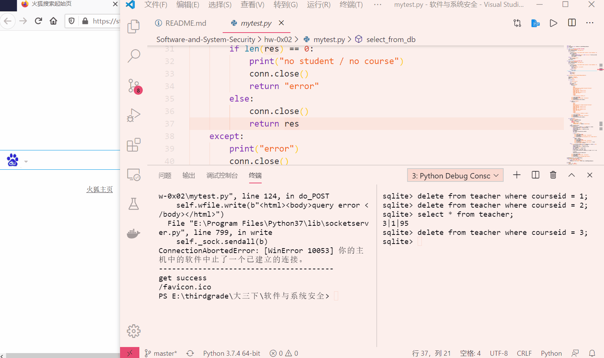

# 简易教务系统的web开发过程

## 实验要求

- 在不使用Django的情况下，使用更底层的[pyhton的sqlite库](https://docs.python.org/3/library/sqlite3.html)来编程操作数据库
- 在[httpserver.py](./code/httpserver.py)的基础上，继续编写漏洞。写两个页面，一个是教师录入成绩页面，一个是学生查询成绩页面
  - 教师录入成绩页面表单有三个字段，课程id，学生id，成绩。录入提交以后，httpserver调用sqlite库使用sql语句写入数据库
  - 学生查询成绩表单，学生输入学生id，课程id，httpserver使用sql语句查询成绩后返回给用户
  - 不需要做登录功能，课程用直接输入id的方式，而不是下拉菜单的方式或者其他选择的方式

## 实验过程

### sqlite的使用

- 创建一个数据库名为`edu_admin.db`，并且新建`teacher`表格。见[dbinstruction.py](./dbinstructions.py)文件。
    ```
    # -*- coding: utf-8 -*-
    import sqlite3
    conn = sqlite3.connect('edu_admin.db')
    c = conn.cursor()

    # Create teacher table 
    c.execute('''CREATE TABLE teacher(courseid,studentid,grade)''')
    # Insert a row of data
    # c.execute("INSERT INTO teacher VALUES ('1','1','90')")
    # Save (commit) the change
    conn.commit()
    # We can also close the connection if we are done with it.
    # Just be sure any changes have been committed or they will be lost.
    conn.close()
    ```


### 编写教师录入成绩页面 & 学生查询成绩页面

- 见[mytest.py](./code/mytest.py)
- 插入，查询

    

## 问题与解决

- Message: Unsupported method ('POST'). Error 501 Python
  解决：POST和GET是平级关系，一开始把POST放在GET中了。

## 实验总结

- 在数据库插入语句中%s，两边不加引号 - 否则会错
- string转bytes
- post和get的关系和位置
- 顺序不能发生变化
  ```
  self.send_response(200)
  self.send_header("Content-type", "text/html")
  self.end_headers()
  self.wfile.write(form_html.encode())
  ```

## 参考资料

- [Python BaseHTTPServer 模块解析](https://blog.csdn.net/xhw88398569/article/details/49179967)