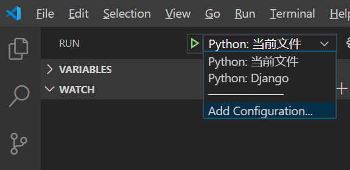
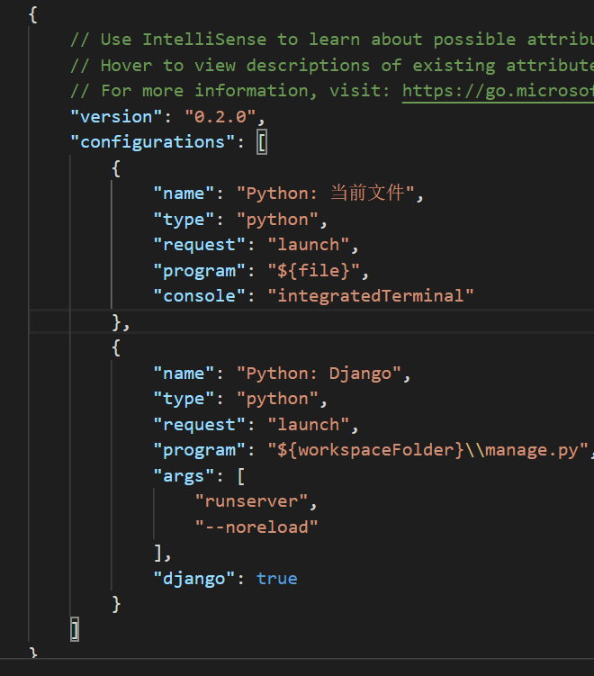
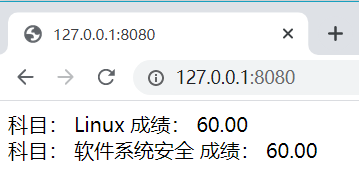
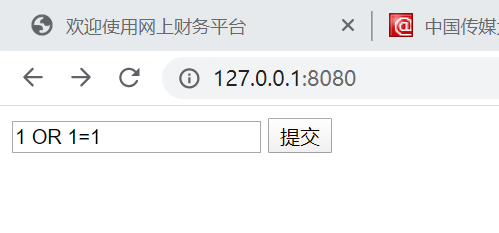

# SQL injection - [课上内容]

## 学习 [sql_injection.py](./code/sql_injection.py)

- 通过用户输入拼接sql语句
    ```
    sql = 'SELECT edu_admin_course.name, edu_admin_score.score FROM edu_admin_score INNER JOIN edu_admin_course ON edu_admin_score.course_id=edu_admin_course.id WHERE student_id = %s ' % input_data
    ```
- 并且调库查询，数据库的路径要注意(不能出现中文，执行路径py文件和数据库在同一目录下)
    ```
    import sqlite3
    conn = sqlite3.connect('db.sqlite3')
    c = conn.cursor()
    query_result = c.execute(sql)
    response_content = ''
    for i in query_result:
        #response_content += '科目： %i 成绩： %.2f <br>' % i
        response_content += '科目： %s 成绩： %.2f <br>' % i
    conn.close()
    ```
- 效果
  
  

## 运行

- 独立运行py文件`python sql_injections.py`
- 这个文件是一个独立的httpserver，因此和django没有什么关系，但是需要用到db.sqlite3数据库，所以要和其放在同一个目录下，预先实验传送门[实验上](./2020-3-25.md)&[实验下](./2020-4-1.md)

## 调试

- 在vscode中调试，我们需要增加launch.json的配置
  
  

  在调试界面，点击 “增加配置”，选python当前文件。然后在 launch.json中，会增加一个配置项

  

  用这种方式可以调试sql_injection，然后点击sql_inejction文件，使其成为编辑器的当前文件，就可以调试了。
  
- 运行以后，是一个编辑框，输入学生ID，查询对应的成绩。
  - 这里简化了很多，实际的系统不可能这么设计，肯定是需要一个用户系统的。我们这里没有用户系统，所以示例一下。

## 查询

- 通过直接查询数据库，我们知道当前的用户的ID是1，所以输入1，查询。返回了用户id 1的成绩
- 如果数据库中有多个用户，还可以查询Id为2和3的用户的成绩
  
  

## sql注入

- sql_inject漏洞就出现在这里：往输入框中输入`1 OR 1=1`
  
  

  查出了当前系统中所有用户的成绩，相当于整个数据库都获得了

  

## 问题代码

问题在代码的43行，我们直接把用户输入的数据，作为sql语句中的查询条件。最后的sql语句为：

```sql
SELECT edu_admin_course.name, edu_admin_score.score FROM edu_admin_score INNER JOIN edu_admin_course ON edu_admin_score.course_id=edu_admin_course.id WHERE student_id = 1 OR 1=1
```

查询条件变成了 student_id = 1 OR 1=1。1=1恒为真，任何数OR真值，也是真。所以，相当于:

```sql
SELECT edu_admin_course.name, edu_admin_score.score FROM edu_admin_score INNER JOIN edu_admin_course ON edu_admin_score.course_id=edu_admin_course.id WHERE true;
```

或者没有WHERE，变成了无条件查询，于是显示出了数据中的所有记录。


使用`1;drop table edu_admin_student;`会报错
> sqlite3.Warning: You can only execute one statement at a time.
> execute() will only execute a single SQL statement. If you try to execute more than one  statement with it, it will raise a Warning. Use executescript() if you want to execute  multiple SQL statements with one call

在sqlite中可以用[PRAGMA table_info(table_name)](https://www.runoob.com/sqlite/sqlite-syntax.html)取得表项的名字。因为表项的名字是Django建的，我们要知道表项的名字可以用这种方法。

## 总结

在软件安全中，有一个原则，所有用户的输入都是不可信的。因此，我们必须对用户输入进行过滤，进行严格的限制。
  
如何打补丁？如何修改才能避免这个漏洞？
- 既然输入的为ID，那么ID是不是只能是整数。
- [使用参数化查询语言](https://www.jianshu.com/p/c07fb5ae9631)：不将用户的输入作为SQL指令的一部分处理，而是在完成SQL指令的编译后，才套用参数执行，因此就算参数中含有恶意的指令，由于已经编译完成，就不会被数据库所运行
- 对用户输入进行过滤
  - 在这个具体的漏洞中，我们可以判断一下input_data是否数字就可以。用python内置函数isdigit判断
  - 但是对于大型的系统，会有很多sql语句拼接和执行的地方，每一个都去过滤，编程效率很低，而且不一定能保证写的过滤就是对的。实际系统的业务远比我们这里输入ID要复杂。
- Django的框架ORM的意义
  - ORM完全避免了程序员直接接触sql语言，所有的sql语句都在模型管理器中有框架进行拼接。程序员在编程时，只需要使用模型管理器提供的方法进行查询，创建等，就可以了。
  - result = Score.objects.filter(student=request.user)。底层在进行sql的拼接。就避免了这种情况。Django的模型管理器中，主要有filter get等获取数据的方法。这些方法返回的数据类型是QuerySet数据类型。这个数据类型是一个数据库访问的接口。在调用filter时，实际上还未查询数据库，只是初步完成了数据库sql语句的拼接。
  - 实际的查询是在render中进行的。Django会根据render时需要的具体数据，来精确优化查询语句，所有这里的result，并不是真正的查询结果。而是一个查询对象。render(request, 'score.html',{'result': result})
  - 在模板 score.html 我们用到了数据 {{ i.course.name }}。course 是 socre表的一个外键，course.name实际是在course表中。所有这里其实是一个跨表查询。这种两个表的跨表查询，我们自己写的sql语言已经比较复杂了。真实系统往往会有多个表的联合跨表查询，sql语句会非常复杂。但是Django处理后，查询数据库的操作就变得非常简单，把数据中的值的访问，变成了python对象的属性访问。
- 从学习的角度，我们需要知道Django内部是怎么做的，但也需要一些底层的http server的开发原理，比如request response模式、html、sql语言、数据库表结构等。底层知识要了解、助于我们理解Django的工作原理，对一些高级的操作也能比较深入理解。
- 但是，具体做工程的时候，就尽量不要直接使用原始的方法了。
  - 就比如，学过windows GDI，都知道，所有的界面原始都是使用GDI绘制出来的，但是如果我们写一个软件会自己去用GDI来做原始操作吗？不会，因为有上层的软件做好了控件，我们直接调用控件，然后有了html。我们直接编写html可以快速的构建软件界面，比自己写GDI，效率高一万倍。
  - 别人已经做好了的事情，我要了解原理，但是没有必要自己再去做一遍。这就是那句名言，不要重复发明轮子的意思。