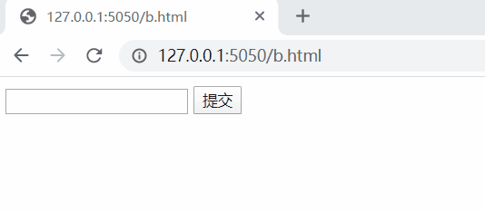

# SQL injection

# 学习 [sql_injection.py](./code/sql_injection.py)

- 通过用户输入拼接sql语句
    ```
    sql = 'SELECT edu_admin_course.name, edu_admin_score.score FROM edu_admin_score INNER JOIN edu_admin_course ON edu_admin_score.course_id=edu_admin_course.id WHERE student_id = %s ' % input_data
    ```
- 并且调库查询，数据库的路径要注意(不能出现中文，执行路径py文件和数据库在同一目录下)
    ```
    import sqlite3
    conn = sqlite3.connect('db.sqlite3')
    c = conn.cursor()
    query_result = c.execute(sql)
    response_content = ''
    for i in query_result:
        #response_content += '科目： %i 成绩： %.2f <br>' % i
        response_content += '科目： %s 成绩： %.2f <br>' % i
    conn.close()
    ```
- 效果
  
  

