# 内存管理

## Requirements

1. 验证不同进程的相同的地址可以保存不同的数据。
   (1) 在VS中，设置固定基地址，编写两个不同可执行文件。同时运行这两个文件。然后使用调试器附加到两个程序的进程，查看内存，看两个程序是否使用了相同的内存地址；
   (2) 在不同的进程中，尝试使用VirtualAlloc分配一块相同地址的内存，写入不同的数据。再读出。
2. (难度较高)配置一个Windbg双机内核调试环境，查阅Windbg的文档，了解
   (1) Windbg如何在内核调试情况下看物理内存，也就是通过物理地址访问内存
   (2) 如何查看进程的虚拟内存分页表，在分页表中找到物理内存和虚拟内存的对应关系。然后通过Windbg的物理内存查看方式和虚拟内存的查看方式，看同一块物理内存中的数据情况

## Experiment

### 虚拟内存

在一般计算机中 一个物理地址是唯一的，同一个物理地址下的数据是相同的

在虚拟内存管理当中，每个进程的地址是独立的，实际在物理地址中是两个不同的存储空间，但是虚拟的内存地址是相同的，不同进程，相同内存地址，在内核部分映射成为不同的物理地址，这就是为什么进程能在计算机上相互隔离运行的原因

### 实验过程

#### 查看内存地址

- 新建两个vs项目，写入不同的代码
  
  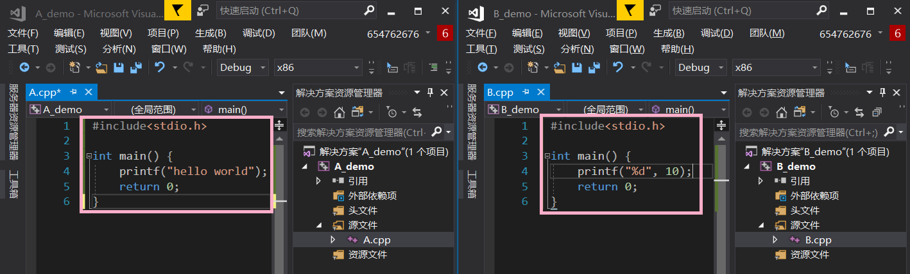

- 设置固定基址
  
  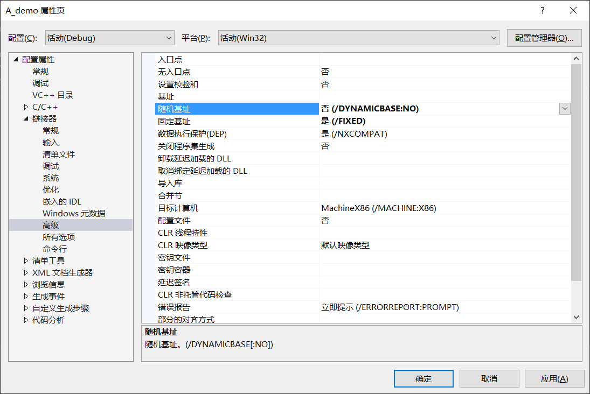

- 下断点调试，打开内存窗口 (vs导航栏：调试 > 窗口 > 内存)
  
  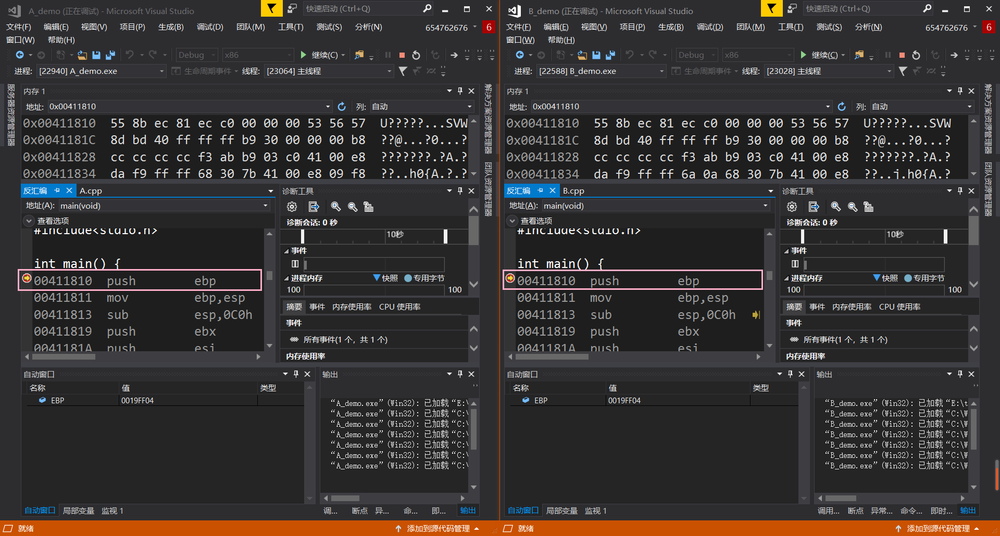

  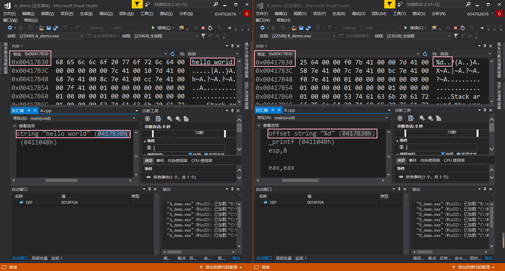


总结：两个程序使用了相同的内存地址；同时运行却能使用相同的地址，是因为使用的是虚拟地址，映射于不同的物理地址

#### 使用VirtualAlloc分配一块相同地址的内存，写入不同的数据再读出

##### 代码

```c
#include <windows.h>
#include <tchar.h>
#include <stdio.h>
#include <stdlib.h>             // For exit

int main() {
	printf("Demo A virtualalloc\n");

	LPVOID lpvBase;               // Base address of the test memory
	LPTSTR lpPtr;                 // Generic character pointer
	BOOL bSuccess;                // Flag
	DWORD i;                      // Generic counter
	SYSTEM_INFO sSysInfo;         // Useful information about the system

	GetSystemInfo(&sSysInfo);     // Initialize the structure.

	DWORD dwPageSize = sSysInfo.dwPageSize;
	// dwPageSize = 4096
	printf("%d\n", dwPageSize);

	// Reserve pages in the virtual address space of the process.
	int PAGELIMIT = 1;

	lpvBase = VirtualAlloc(
		(LPVOID)0x40000000,                 // System selects address
		PAGELIMIT*dwPageSize, // Size of allocation
		MEM_RESERVE | MEM_COMMIT,          // Allocate reserved pages
		PAGE_READWRITE);       // Protection = no access
	if (lpvBase == NULL)
	{
		_tprintf(TEXT("Error! %s with error code of %ld.\n"), TEXT("VirtualAlloc reserve failed."), GetLastError());
		exit(0);
	}

	lpPtr = (LPTSTR)lpvBase;

	// Write to memory.
	for (i = 0; i < PAGELIMIT*dwPageSize; i++) {
		lpPtr[i] = 'a';
	}

	// Read from memory
	for (i = 0; i < PAGELIMIT*dwPageSize; i++) {
		printf("%c", lpPtr[i]);
	}

	bSuccess = VirtualFree(
		lpvBase,       // Base address of block
		0,             // Bytes of committed pages
		MEM_RELEASE);  // Decommit the pages

	_tprintf(TEXT("\nRelease %s.\n"), bSuccess ? TEXT("succeeded") : TEXT("failed"));

	return 0;
}
```

##### 测试

- 调试A_demo，观察字符a写入过程
- `61h`是a的ascii值的16进制
- `00411929  mov         byte ptr [eax],61h  
` 代码执行完这句后，去查看eax寄存器的值，存的是a所在的地址

    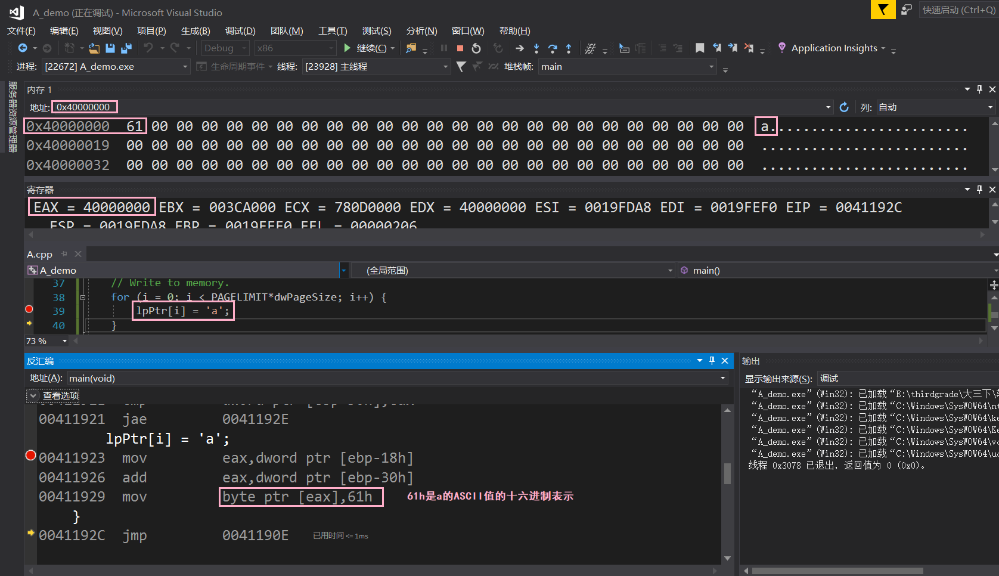

    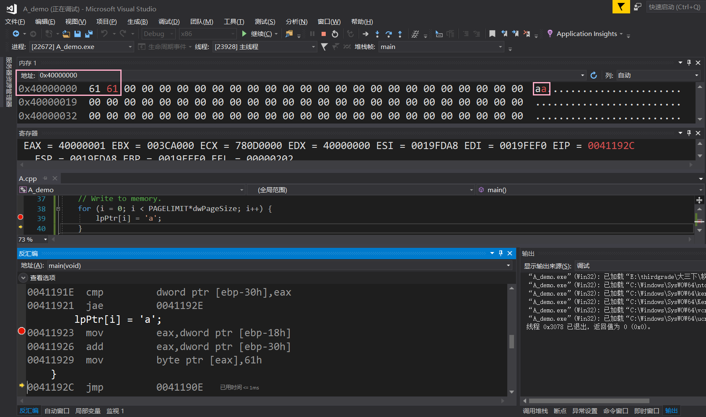

    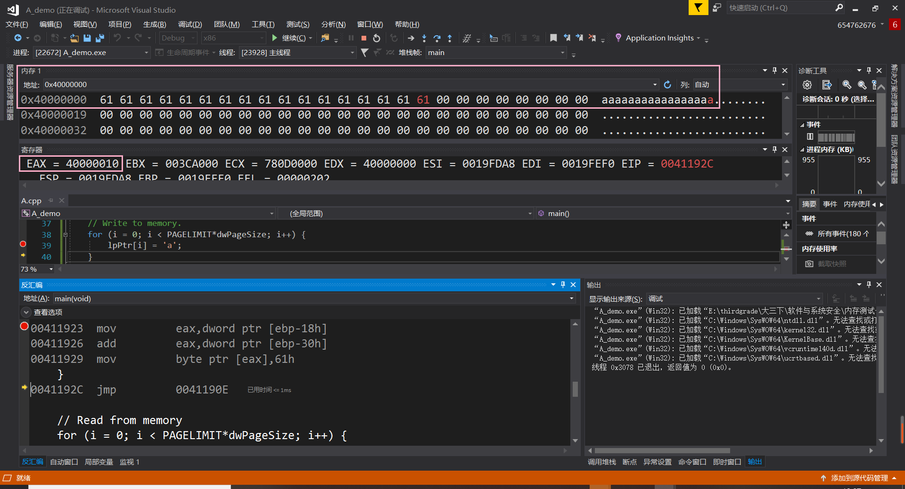

- 此时调试B_demo，b也可以写入

    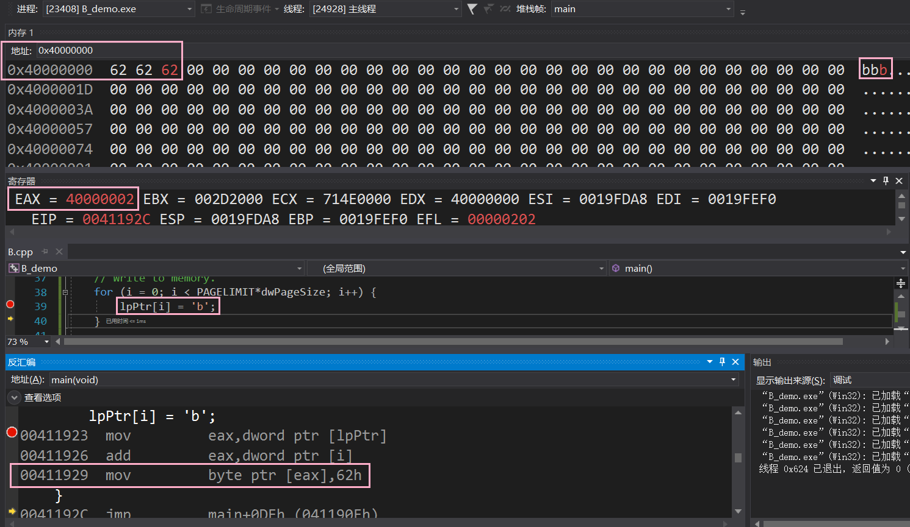

- 相同内存地址存入了不同的数据，证明不同进程相同内存地址可以保存不同的数据

    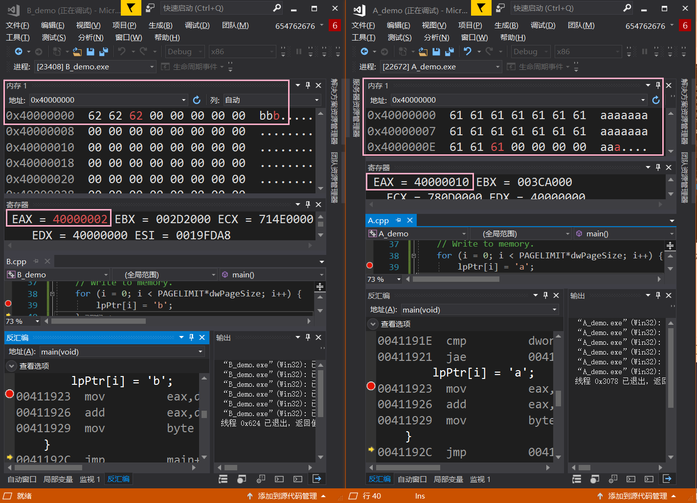

### Windbg双机内核调试

#### 思路

- 由于我们直接调试的操作系统内核，所以需要两台计算机安装两个Windows，然后连个计算机使用串口进行连接
- 所以我们需要再虚拟机中安装一个Windows（安装镜像自己找，XP就可以），然后通过虚拟串口和host pipe连接的方式，让被调试系统和windbg链接，windbg可以调试
- 使用Windbg  内核调试 VirtualBox 关键字搜索，能找到很多教程
- 如果决定Windows虚拟机太重量级了，可以用Linux虚拟机+gdb也能进行相关的实验，以gdb 远程内核调试 为关键字搜索，也能找到很多教程

#### 环境

- 主机：windows 10 企业版 1909 64位
- 虚拟机：windows 7 专业版 sp1_vl_build_x64
- Windows Software Development Kit - Windows 10.0.19041

#### 环境搭建

将主机称为Host端，windbg运行在主机上，通过虚拟串口连接虚拟机。将虚拟机称为Guest端，运行着待调试的系统

##### Guest端配置

- 为了让Windos支持内核调试，需要配置启动参数。首先需要对虚拟机配置虚拟串口，目的是为了建立host到guest的调试通信连接。如下图所示，选择`com1`并且映射成为`\\.pip\com_1`
  
  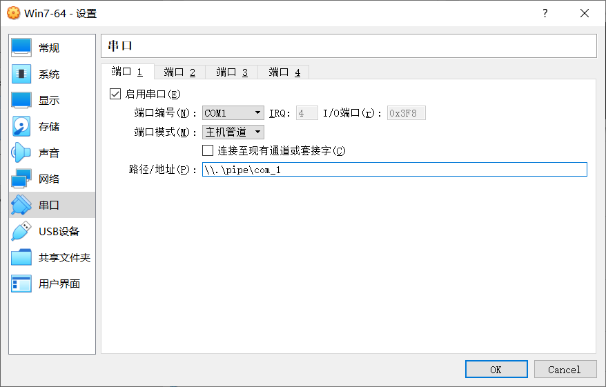

  - 注意不要选择 连接至现有通道或套接字：因为目前还没有建立管道，否则启动虚拟机时会报错误`不能为虚拟电脑打开一个新任务`
- 启动虚拟机，进入Window内部进行配置。以管理员身份启动CMD，输入以下命令
  
  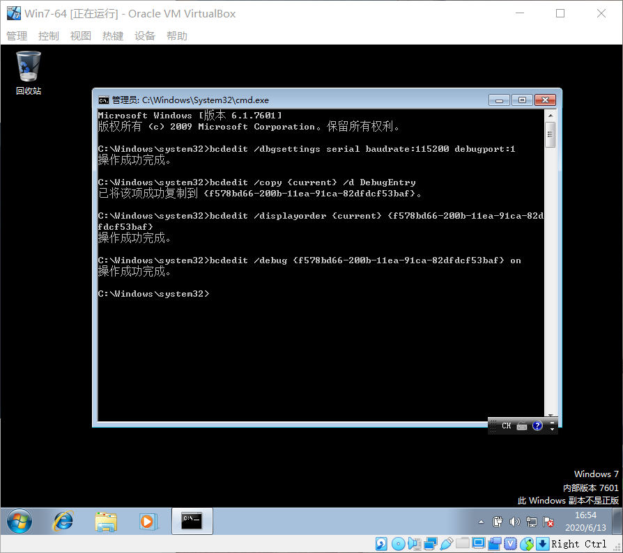

  ```cmd
  # 设置端口1
  bcdedit /dbgsettings serial baudrate:115200 debugport:1
  
  # 复制一个开机选项，命名为“DebugEntry”，可任意命名
  
  # 增加一个开机引导项
  bcdedit /copy {current} /d DebugEntry

  # 激活debug
  bcdedit /displayorder {current} {替换第二个命令显示的UUID}
  bcdedit /debug {替换第二个命令显示的UUID} on
  ```

  [BCDEdit](https://docs.microsoft.com/en-us/windows-hardware/manufacture/desktop/bcdedit-command-line-options)用于管理启动配置数据（BCD）的命令行工具
- 重新启动系统，在开机的时候选择DebugEntry[启用调试程序]，能够正常启动系统
  
  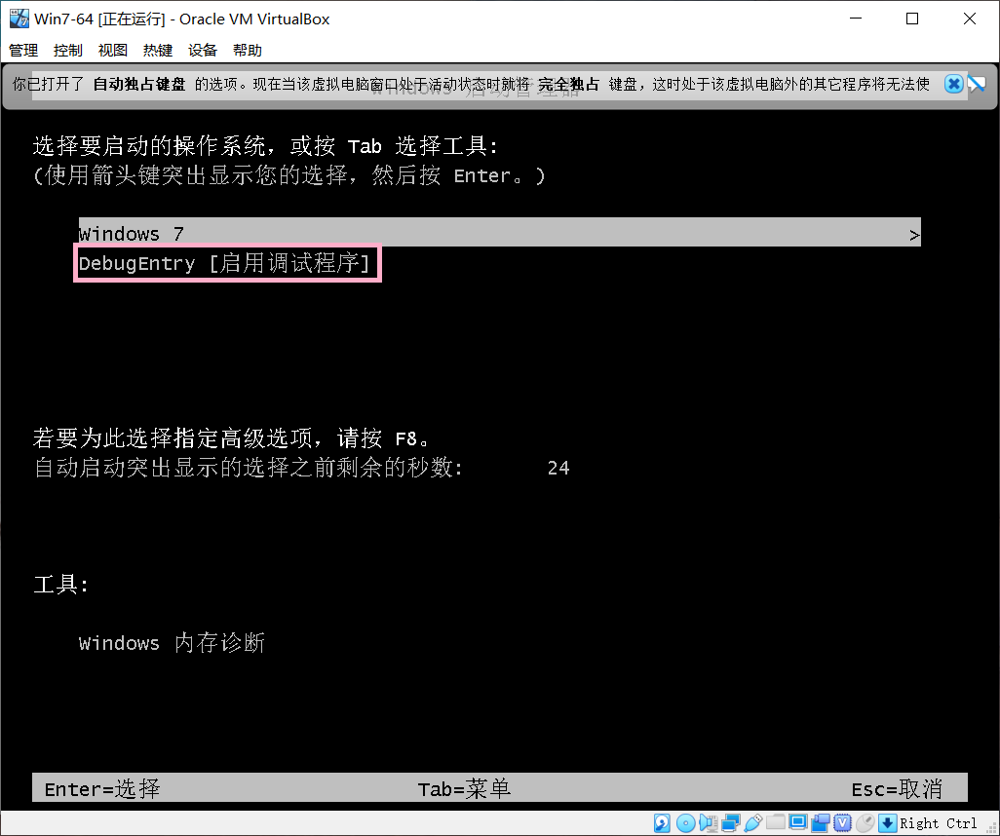

##### Host端配置

- [安装windbg](https://docs.microsoft.com/en-us/windows-hardware/drivers/debugger/debugger-download-tools)
  - [下载链接](https://developer.microsoft.com/zh-cn/windows/downloads/windows-10-sdk/)
  - Debugging Tools for Windows (WinDbg, KD, CDB, NTSD)
    
    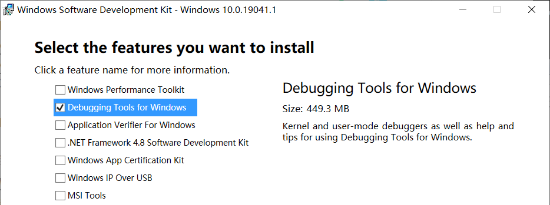

  - 找到windbg的路径为：`xxx\Windows Kits\10\Debuggers\x64`

- 在host端首先需要安装windbg，使用以下命令启动windbg
  - **注意启动时机是有要求的：先启动guest上的win7系统，后启动windbg**

    ```cmd
    # 以管理员的身份打开cmd命令行
    windbg.exe -k com:port=\\.\pipe\com_1,baud=115200,pipe
    ```

    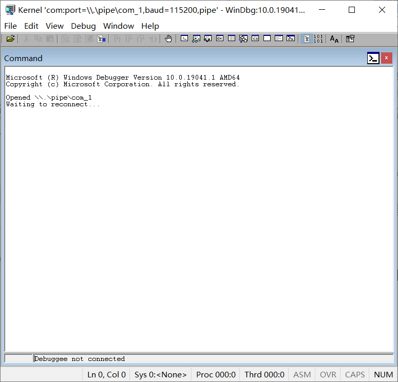

    - 时间过久，可以断住此时待调试的windows：在windbg的上方状态栏Debug > Break (此时虚拟机是不可以使用的)

      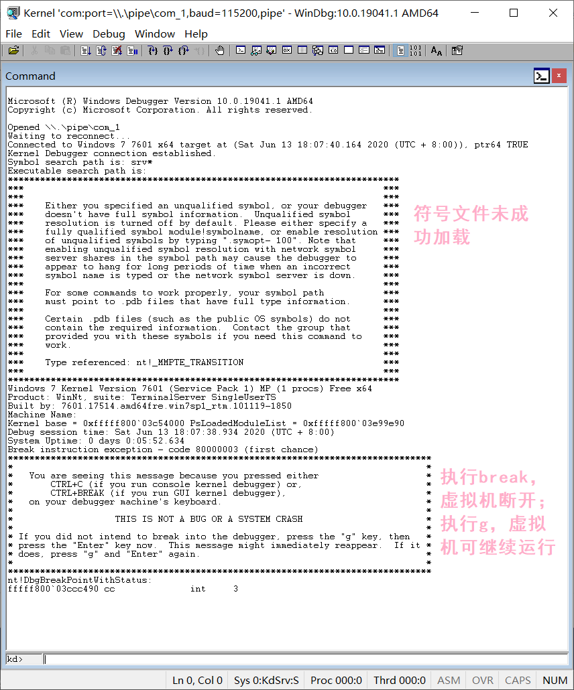  

    - 如果要让虚拟机继续，则在windbg下输入`g`，虚拟机又可以使用了
    - 上面的报错是因为符号文件还没有加载

- 配置windbg的符号下载地址：File > Symbol File Path 
  - 在`E:\WinSym`目录下存储信息，勾选reload
    
    ```
    srv*E:\WinSym*https://msdl.microsoft.com/download/symbols
    ```
    
    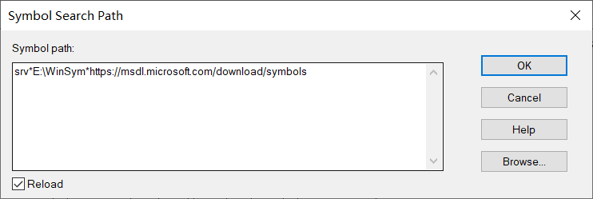

  - 在`.reload`之后，一直出现如下报错

    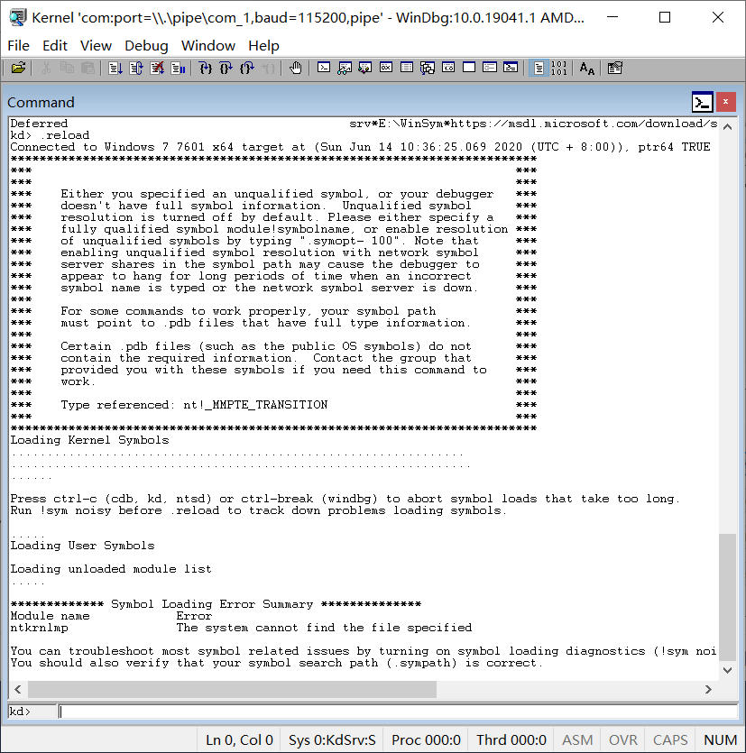

    - 解决方法：
        ```
        # 查看调试符号路径
        .sympath
        # 开启符号加载噪音模
        !sym noisy
        # 看看具体是怎么解析加载符号
        .reload /f ntkrnlmp
        ```
    
    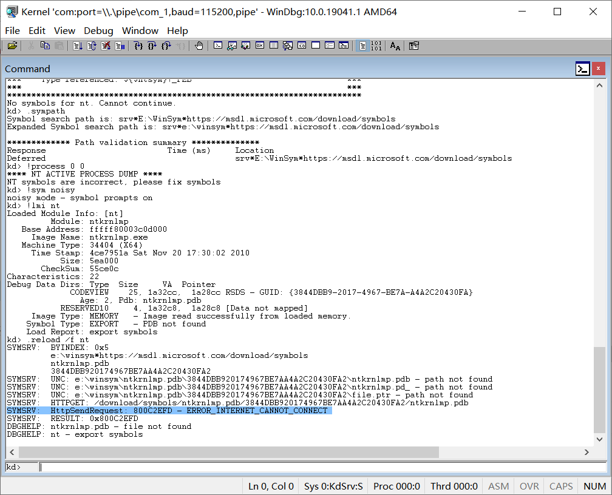

    - 原因其中之一无法访问网络 - 微软符号服务器有时好有时坏
    - 最后的解决方法：https://blog.csdn.net/xiangbaohui/article/details/103832850
      - WINDBG为什么无法从官网下载符号表呢？主要是我们的WINDBG设置的不够科学，没有搭建翻墙梯子，需要我们自建梯子
      - 根据自己的梯子，在命令行下输入：若要选择用于 symsrv，若要使用的特定代理服务器，则设置IP的代理服务器后，跟冒号和端口号。 
        
        ```
        # 可以在windows的自动代理设置下查看 - 在windows的搜索栏下搜索代理服务器设置
        set _NT_SYMBOL_PROXY=127.0.0.1:1084

        # 然后再用该命令行打开windbg
        ```

        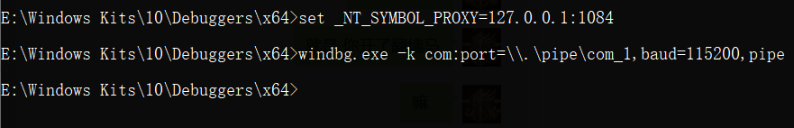

    - 最终访问成功

        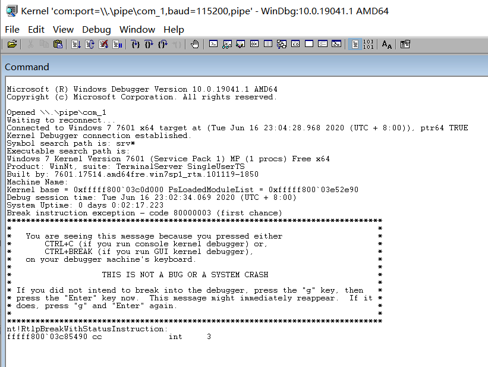

#### x64 寻址简介

在保护模式，CPU发出的线性地址，内存管理单元(MMU)，根据当前CR3寄存器所指向的页表物理地址将该线性地址翻译成物理地址进行内存访问，该过程称为地址翻译

在x64体系结构中，线性地址的结构如图：

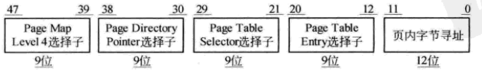 

主要讨论的是4K页面大小的寻址方式，因为在个人计算机上，普遍都是4K；页面寻址，其他的方式也主要就是页面大小的差异。

4K页面： 使用PML4T(Page Map Level4选择子)，PDPT(Page Directory Pointer选择子)，PDT和PT四级页转化表结构；

对下级表的物理地址的存储4K页面寻址遵循如下规则：

① 当MAXPHYADDR为52位时，上一级table entry的12 ~ 51位提供下一级table物理基地址的高40位，低12位补零，达到基地址在4K边界对齐；

② 当MAXPHYADDR为40位时，上一级table entry的12 ~ 39位提供下一级table物理基地址的高28位，此时40~51是保留位，必须置0，低12位补零，达到基地址在4K边界对齐；

③ 当MAXPHYADDR为36位时，上一级table entry的12 ~ 35位提供下一级table物理基地址的高24位，此时36~51是保留位，必须置0，低12位补零，达到基地址在4K边界对齐。

##### 使用WinDbg查看保护模式分页机制下的物理地址 - 根据虚拟地址通过分页机制找到物理地址

- 在windbg的debug下选择Go
- 在虚拟机中打开notepad.exe，并且写入helloworld
  
  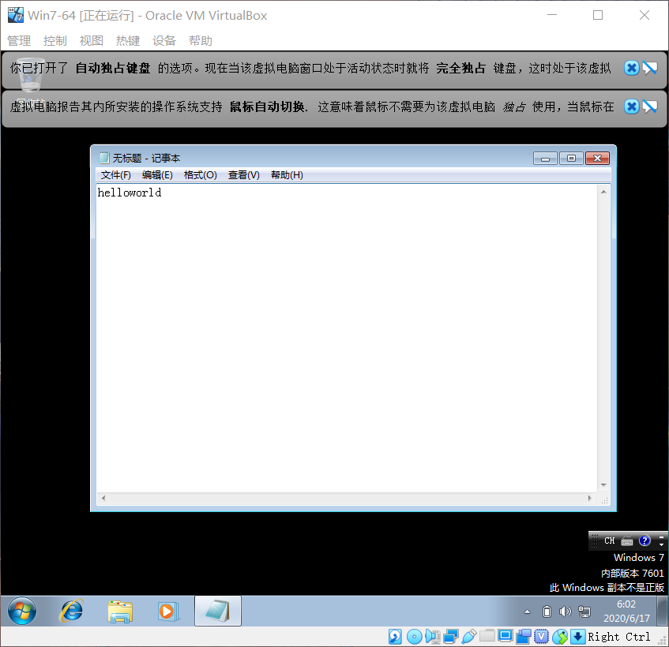

- 然后点击WinDbg的break按钮，使操作系统断下来
- 使用 `!process 0 0` 命令查看当前系统所有进程信息，找到记事本所在进程
  
  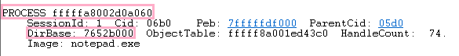

  - 记事本进程的进程块起始地址为`fffffa8002d0a060`
  - 记事本进程的页表基址(DirBase)是`7652b000`
- 当前是在系统进程断下，所以此时我们要切换到记事本的进程
  - 使用`.process -i fffffa8002d0a060`(进程块地址)命令
  - 再输入 g 命令将WinDbg当前调试进程切换到notepad.exe
  - 然后在记事本进程中搜索 helloworld 这个字符串：`s -u 0x00000000 L0x01000000 "helloworld"`
  
    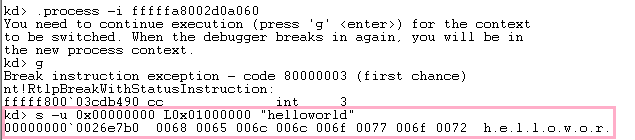

    - 发现字符串所在的虚拟地位为 `virtualaddress：000000000026e7b0`
    - 使用format命令转化为二进制：  

        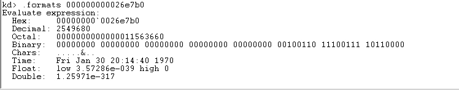

        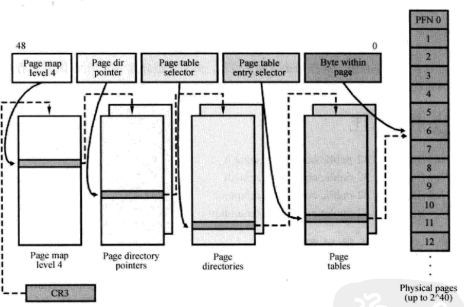

        > PML4T(Page Map Level4 Table)及表内的PML4E结构，每个表为4K，内含512个PML4E结构，每个8字节
        > PDPT(Page Directory Pointer Table)及表内的PDPTE结构，每个表4K，内含512个PDPTE结构，每个8字节
        > PDT(Page Directory Table)及表内的PDE结构，每个表4K，内含512个PDE结构，每个8字节
        > PT(Page Table)及表内额PTE结构，每个表4K，内含512个PTE结构，每个8字节
        > 每个table entry 的结构都是8个字节64位宽，而virtual address中每个索引值都是9位，因此每个table都是512x8= 4K字节
        
        | PML4E(9位) | PDPTE(9位) | PDE(9位) | PTE(9位) | 页内偏移(12位) |
        | --- | --- | --- | --- | --- |
        | 0000 0000 0 | 000 0000 00 | 00 0000 001 | 0 0110 1110 | 0111 1011 0000 |

- 通过`!process 0 0`得知记事本页表基址(DirBase)是`7652b000`
  - d*命令显示给定范围内存的内容，dq:四字值(Quad-word values) (8 bytes)。默认显示数量为16个四字 (128 = 4 X 32 字节)

    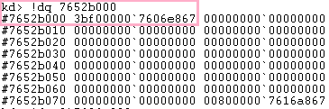

- 因为PML4E的索引为0(查看 `0000 0000 0`)，所以我们的目标PML4E项的值为`0x3bf000007606e867`，12~35位为`0x07606e`，低12位补零，得`0x7606e000`

  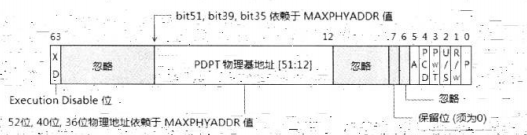
  
  | PML4E(9位) | 35~12 | 11~0 |
  | ---- | ----- | ---- |
  | 0000 0000 0| 07606e | 867 -> 000 |

  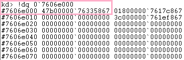

- PDPTE的索引也为0，目标PDPTE项的值为 0x47b00000`76335867，PS位(第7位)为0，12~35位为 0x076335 ，低12位补零，得0x76335000

  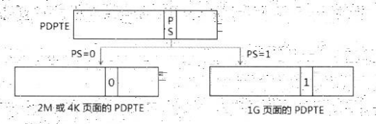

  当PDPTE.PS=1，也就是PDPTE的第7位为1时，PDPTE将提供1G的物理页面地址；当PDPTE.PS=0，也就是PDPTE的第7位为0时，使用非1G的页面，将提供下一级的PDT的物理基地址，同样受MAXPHYADDR规则的约束

  1G页面下的PDPTE 的结构解析如下：

  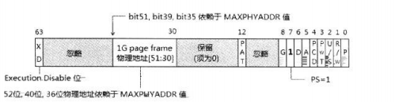

  4K和2M页面下的PDPTE结构解析如下：

  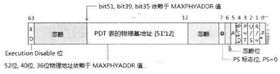
  
  | PDPTE(9位) | 35~12 | 11~0 |
  | ---------- | ----- | ---- |
  | 000 0000 00 | 0x76335 | 867 -> 000 |

- 因为PDE的索引为1，所以我们要加上8，目标PDE项的值为 ：05000000`75cc8867
  
  PDE的结构和PDPTE类似，也是用PS(第7位)表示是使用2M（PS=1）的页面还是4K 的页面，下面是4K 页面的PDE结构解析：

  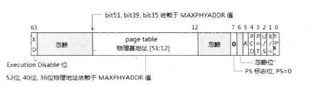

  | PDE(9位) | 
  | --- |
  | 00 0000 001 | 

  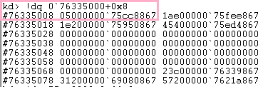

- 由PDE的PS位(第7位)为0，12~35位为 0x75cc8，低12位补零，得`0x75cc8000`，又因为PTE的索引为0x6e，所以要加上0x6e*8，得到目标PTE项的值为：cab00000`75c12867
  
  | PTE(9位) |
  | --- |
  | 0 0110(6) 1110(e) |
  
  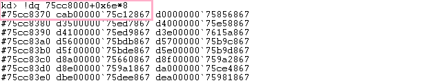

  PTE的结构解析：

  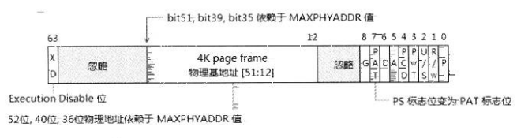

- 由PTE项的值为`cab00000`75c12867，则12~35位为 0x075c12，低12补零，得到页面物理基地址`0x75c12000`，再加上页面偏移，我们是0x7b0,则：

  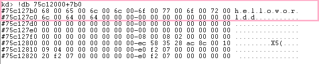

##### Windbg如何在内核调试情况下看物理内存，也就是通过物理地址访问内存

```
!address： 显示内存信息，比如内存的地址范围
```

##### 然后通过Windbg的物理内存查看方式和虚拟内存的查看方式，看同一块物理内存中的数据情况

虚拟地址通过pte指令，找到pfn(页帧号，页帧有唯一的物理地址，将该地址 x/1000h，所产生的一个唯一的编号)

找到pte对应的pfn为`75c12`，单位是4k（4096）

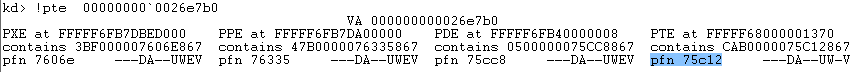

据pfn和相对地址，找到虚拟地址对应物理地址位置

pfn为0x75c12，则物理页地址是0x75c12000（0x75c12 × 0x1000）

页内偏移是7b0 

物理地址=**物理页地址**+**页内偏移** = 0x75c12000+0x7b0 = 0x75c127b0

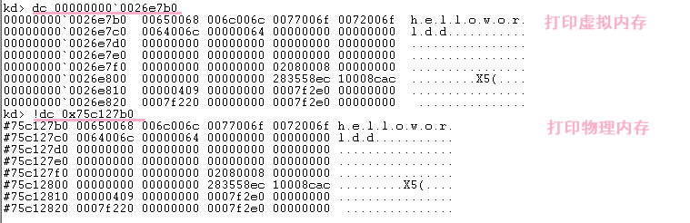

在windbg中，指令前加!代表物理内存，不加代表虚拟内存；物理地址前面有#

##### 分页内存和非分页内存

Windows NT把内核模式地址空间分成分页内存池和非分页内存池。(用户模式地址空间总是分页的) **必须驻留**的代码和数据放在非分页池；**不必常驻**的代码和数据放在分页池中。非分页内容的空间是很小的，所以一般的东西都会放入分页内存中。

nt!MmNonPagedStart 保存基本NonPagedd内存池的开始地址

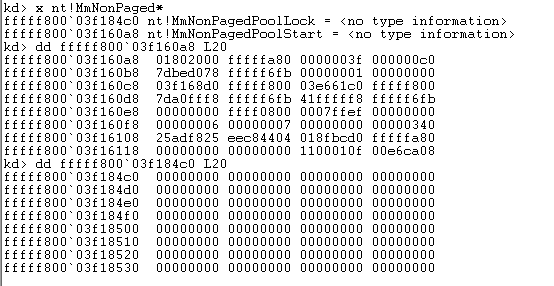

##### 内核调试案例

###### 查看SSDT

SSDT全称System Service Descriptor Table (SSDT)，是Windows内核对外提供服务的索引表，在ring3层的Windows API调用都会映射到SSDT中的项目里

使用 `x nt!kes*des*table*`命令查看系统中 KeServiceDescriptorTable变量的地址；获得地址后使用``` dd fffff800`03f16840 ``` 查看这个变量的内容；最后使用 ```dds fffff800`03ce6300 L191 ``` 查看SSDT表

**前提需要加载好符号**

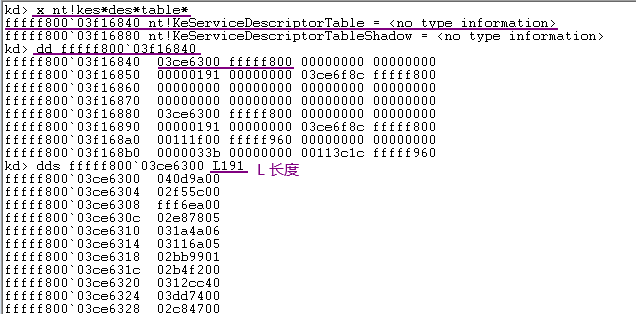

###### 查看单个进程的信息

在process命令显示出的地址指向了每个进程的描述数据结构

使用 !process 0 0 找到notepad进程的指针，然后使用dt命令查看进程信息

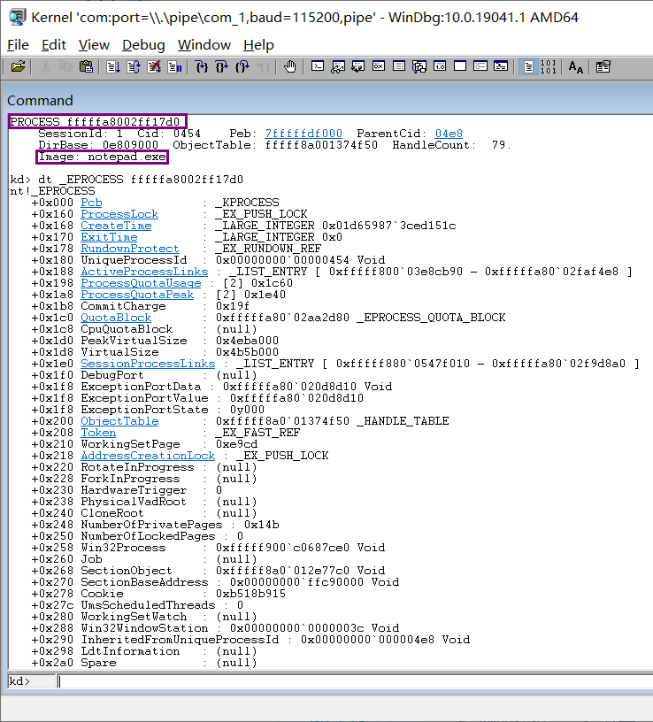

比较重要的是PEB,这里显示的地址就是用户空间的进程信息指针
>+0x338 Peb              : 0x000007ff`fffdf000 _PEB

使用.process fffffa8002ff17d0
 设置当前notepad进程。然后使用```!peb 0x000007ff`fffdf000``` 或者 ```dt _PEB 0x000007ff`fffdf0000```查看进程信息

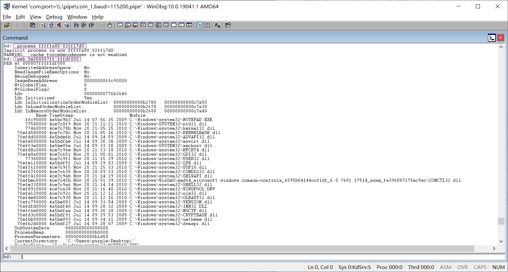

## Conclusion

内存泄漏：也称作“存储渗漏”，用动态存储分配函数动态开辟的空间，在使用完毕后未释放，结果导致一直占据该内存单元，直到程序结束

Windows操作系统中出现的内存泄露主要是指用户态进程或者内核态驱动一直申请内存不释放，导致操作系统内存池耗尽（分页内存池和非分页内存池）

## References

- [X64 操作系统内存寻址](https://blog.csdn.net/LOVE_JFJ/article/details/75385536?utm_source=blogxgwz0)
- [windbg由虚拟地址查找对应物理地址（内核调试）](https://blog.csdn.net/wesley2005/article/details/81303435)
- [参考资料](https://www.cnblogs.com/lanrenxinxin/p/4735027.html)
- [虚拟地址空间](https://docs.microsoft.com/zh-cn/windows-hardware/drivers/gettingstarted/virtual-address-spaces)
- [win7 32位虚拟机 windbg遍历进程页表查看内存](https://www.cnblogs.com/ck1020/p/6148399.html)
- [xpsp3 windbg下看系统非分页内存](https://blog.csdn.net/lixiangminghate/article/details/54667694)
- [Win7 x86 sp1 使用WinDbg查看保护模式分页机制下的物理地址](https://blog.csdn.net/weixin_42486644/article/details/80747462)
- [软件安全4.内存布局](https://www.jianshu.com/p/09fab7c07533)
- [Windows 内核调试](https://zhuanlan.zhihu.com/p/47771088)
- [!pte](https://docs.microsoft.com/en-us/windows-hardware/drivers/debugger/-pte)
- [windbg - What is the relation between the VAD (!vad), the PTEs (!pte), and loaded modules and sections (lm and !dh)?](https://reverseengineering.stackexchange.com/questions/21031/windbg-what-is-the-relation-between-the-vad-vad-the-ptes-pte-and-loade)
- [When Kernel Debugging - Find The Page Protection of a User Mode Address](https://stackoverflow.com/questions/16749764/when-kernel-debugging-find-the-page-protection-of-a-user-mode-address)