# KLEE

# Environment

- ~~window 10 企业版 64位 wsl & 虚拟机：Ubuntu 18.04.3 LTS bionic > docker环境可能搭不起来，需要管理员或者一些配置~~
- windows主机 & virtualbox 6.0.22 r137980 (Qt5.6.2) & Ubuntu server 18.04.4 LTS bionic
- docker version 19.03.11
- KLEE 2.2-pre LLVM version 6.0.1 clang version 6.0.1

注：以下使用的 Docker image is based on an Ubuntu 18.04 LTS image.

# Experiment

## KLEE installation

- windows下搭建docker麻烦，不选择
- [docker installation tutorial](https://docs.docker.com/engine/install/ubuntu/) > **虚拟机下搭建顺利** / [windows子系统坑见踩坑](#踩坑)
  - `getconf LONG_BIT`确认64位
  - 在`apt-cache madison docker-ce`步骤中，选择第一行的第二列的版本` 5:19.03.11~3-0~ubuntu-bionic`
  - 在`sudo docker run hello-world`出现以下报错
  
    ```bash
    docker: Cannot connect to the Docker daemon at unix:///var/run/docker.sock. Is the docker daemon running?.See 'docker run --help'.
    
    首先查看docker是否启动
    未启动则应该启动 docker > sudo service docker start
    * Starting Docker: docker   [ OK ]
    ```
- **注意运行docker要加sudo**
- 选择官方给的法一 > Pulling from the Docker Hub
- 创建KLEE Docker容器 - **即建即销毁**
  ```
  docker run --rm -ti --ulimit='stack=-1:-1' klee/klee

  # --ulimit选项在容器内设置无限的堆栈大小。这是为了避免在运行KLEE时出现堆栈溢出问题
  # --rm标志与docker run命令一起使用时，在容器（/ bin / bash）中运行的应用程序终止时，容器被销毁
  ```
- 创建持久性的容器
  ```
  docker run -ti --name=my_first_klee_container --ulimit='stack=-1:-1' klee/klee
  
  # 查看存在的docker
  docker ps -a

  # exit docker 后
  docker start -ai my_first_klee_container

  # 当不需要的时候
  docker rm my_first_klee_container
  ```
- Inside the Docker image the klee user has sudo access (**password is klee**) 

## KLEE Tutorial

### Tutorial 1 - Testing a small function

- 源代码`get_sign.c`，位于`/home/klee/klee_src/examples/get_sign`目录下
    ```
    /*
    * First KLEE tutorial: testing a small function
    */

    #include <klee/klee.h>

    int get_sign(int x) {
        if (x == 0)
            return 0;
        
        if (x < 0)
            return -1;
        else 
            return 1;
    } 

    int main() {
        int a;
        klee_make_symbolic(&a, sizeof(a), "a");
        return get_sign(a);
    } 
    ```
    - 为了使用KLEE测试此功能，需要在符号输入（symbolic input）上运行它
    - 要将变量标记为符号变量，使用klee_make_symbolic（）函数，在klee / klee.h中定义
    - 该函数带有三个参数：希望将其视为符号变量的地址（内存位置），大小，名称（可以是任何名称）
    - 这是一个简单的main（）函数，该函数将变量a标记为符号，并使用它来调用get_sign（）：
- KLEE使用LLVM位码(LLVM bitcode)进行操作
  - 要使用KLEE运行程序，首先使用clang -emit-llvm将其编译为LLVM位代码
  - 进入`/home/klee/klee_src/examples/get_sign`目录输入
    ```bash
    clang -I ../../include -emit-llvm -c -g -O0 -Xclang -disable-O0-optnone get_sign.c

    # 会在同目录下create a get_sign.bc file in LLVM bitcode format
    # 使用-I参数，以便编译器可以找到klee / klee.h，其中包含用于与KLEE虚拟机进行交互的内在函数的定义，例如klee_make_symbolic
    # -c只想将代码编译到目标文件（而不是本机可执行文件）
    # -g导致其他调试信息存储在目标文件中，KLEE将使用该信息来确定源行号信息、生成源行级统计信息
    # -O0 -Xclang -disable-O0-optnone用于进行编译而不会进行任何优化，但不会阻止KLEE进行自身的优化，而使用-O0进行编译则是最优化的
    ```
- KLEE跑起来 `klee get_sign.bc`
  
  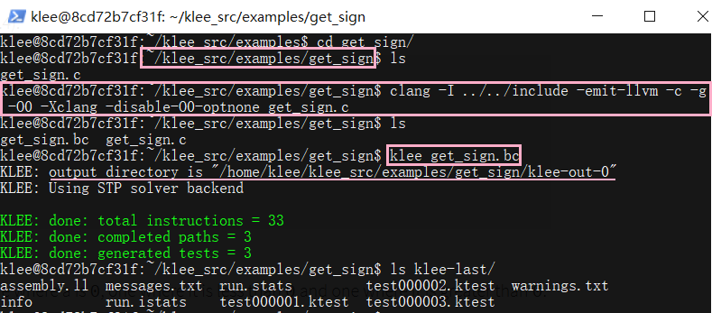

  - 简单函数有3条路径，a等于0，a小于0，a大于0。KLEE通知我们它在程序中探索了3条路径并生成了一个测试用例
  - 对于探索的每条道路，KLEE执行的输出是一个目录（在本例中为klee-out-0），其中包含KLEE生成的测试用例
  - KLEE将输出目录命名为klee-out-N，其中N是可用的最小数字（因此，如果再次运行KLEE，它将创建一个名为klee-out-1的目录），并且还会为了方便生成一个名为klee-last的符号链接到该目录
- KLEE生成的测试用例
  - KLEE生成的测试用例被写入扩展名为.ktest的文件中。这些是二进制文件，可以使用ktest-tool实用程序读取，即`ktest-tool klee-last/test000001.ktest`
    
    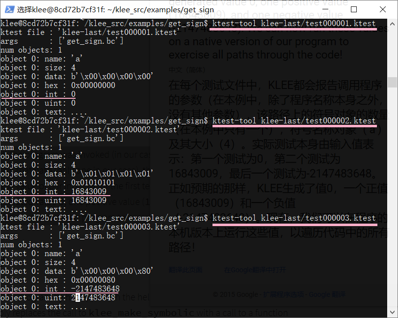

  - 在每个测试文件中，KLEE都会报告调用程序的参数（在本例中，除了程序名称本身之外，没有其他参数），该路径上的符号对象的数量（在本例中只有一个），符号名称对象（'a'）及其大小（4）
  - 实际测试本身由输入值表示：第一个测试为0，第二个测试为16843009，最后一个测试为-2147483648。正如预期的那样，KLEE生成了值0，一个正值（16843009）和一个负值（-2147483648）
- Replaying a test case [理解是干嘛的] - error
    ```
    $ export LD_LIBRARY_PATH=path-to-klee-build-dir/lib/:$LD_LIBRARY_PATH
    $ gcc -I ../../include -L path-to-klee-build-dir/lib/ get_sign.c -lkleeRuntest
    # 报错 - 未解决
    /usr/bin/ld: cannot find -lkleeRuntest
    collect2: error: ld returned 1 exit status

    $ KTEST_FILE=klee-last/test000001.ktest ./a.out
    $ echo $?
    0
    $ KTEST_FILE=klee-last/test000002.ktest ./a.out
    $ echo $?
    1
    $ KTEST_FILE=klee-last/test000003.ktest ./a.out
    $ echo $?
    255
    ```

    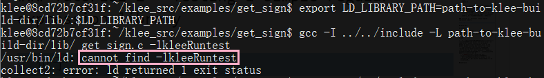

    - 尽管我们可以在程序上手动运行KLEE生成的测试用例（或借助现有的测试基础架构），但KLEE提供了一个方便的重播库，该库简单地将对klee_make_symbolic的调用替换为对分配函数的调用输入到.ktest文件中的值
    - 我们的程序在运行第一个测试用例时返回0，在运行第二个用例时返回1，在运行最后一个用例时返回255（-1转换为0-255范围内的有效退出代码值）

### Tutorial 2 - Testing a simple regular expression library

- 位于`/home/klee/klee_src/examples/regexp`下的`Regexp.c`，包含一个简单的正则表达式匹配功能
- 编译源代码，在同目录下生成`Regexp.bc`
  ```
  clang -I ../../include -emit-llvm -c -g -O0 -Xclang -disable-O0-optnone Regexp.c
  ```

  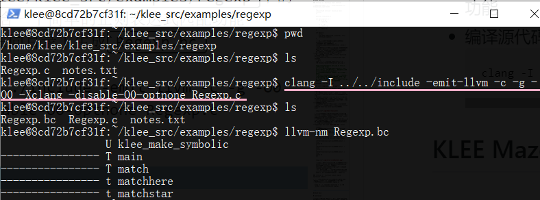

- 用KLEE执行代码
  ```bash
  klee --only-output-states-covering-new Regexp.bc
  ```

  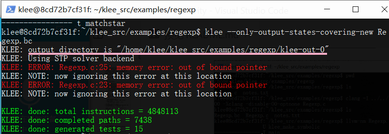

  - 启动时，KLEE将打印用于存储输出的目录（在本例中为klee-out-0）。默认情况下，KLEE将使用第一个空闲的klee-out-N目录，并创建一个klee-last符号链接，该链接指向最新创建的目录
  - 发生错误：在KLEE运行时，它将打印“重要”事件的状态消息，例如，在程序中发现错误时。在这种情况下，KLEE在我们的测试程序的第23和25行上检测到两次无效的内存访问
    
    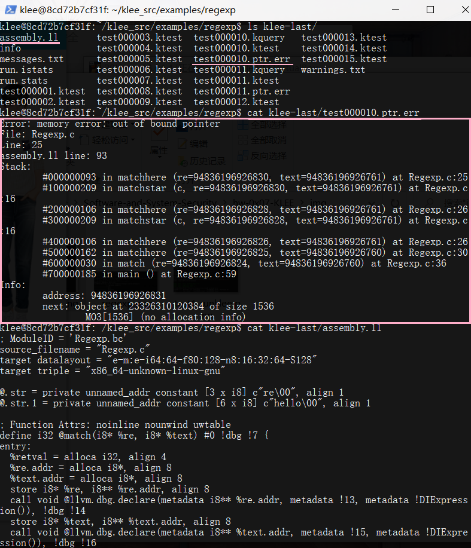

    - 对于所有程序错误，KLEE都会在.err文件中写入一个简单的回溯(backtrace)
    - backtrace的每一行列出了帧号，指令行（这是在assembly.ll文件中与运行输出一起找到的行号），函数和参数（包括具体参数的值）以及源信息
    - 特定的错误报告可能还包括其他信息。对于内存错误，KLEE将显示无效地址，以及该地址之前和之后的堆中有哪些对象。在这种情况下，我们可以看到该地址恰好是前一个对象末尾的一个字节
  - 最后，当KLEE完成执行时，它会打印出一些有关运行的统计信息。在这里KLEE总共执行了4848113条指令，探索了7438条路径，并生成了15个测试用例 
  - KLEE仅生成15个测试用例，因为命令将测试生成限制为使用--only-output-states-covering-new覆盖实际上覆盖新代码的状态。如果我们忽略此标志，KLEE将创建很多个个测试用例
  - 尽管如此，KLEE并没有为每个路径创建一个测试用例。每当发现错误时，都会为到达该错误的第一个状态创建测试用例。在相同位置到达该错误的所有其他路径均被**静默终止**。如果您不介意错误案例的重复，请使用--emit-all-errors生成所有7438条路径的测试案例
  - 许多现实的程序都具有无数（或非常多）的路径，并且KLEE通常不会终止。默认情况下，KLEE会一直运行到用户按下Control-C（即klee获得SIGINT）为止，但是还有其他选项可以限制KLEE的运行时和内存使用情况：-max-time=\<time span\>、-max-forks=N、-max-memory=N
- 出现错误的原因是输入正则表达式缓冲区完全具有符号性，但是match函数（Regexp.c的main函数下的函数）期望它是一个以null终止的字符串
- 解决方法 > 在将符号设置为符号后，在缓冲区的末尾存储“\0”，修改`Regexp.c`代码
  ```c
  int main() {
    // The input regular expression.
    char re[SIZE];

    // Make the input symbolic.
    klee_make_symbolic(re, sizeof re, "re");
    re[SIZE - 1] = '\0';

    // Try to match against a constant string "hello".
    match(re, "hello");

    return 0;
  }
  ```

  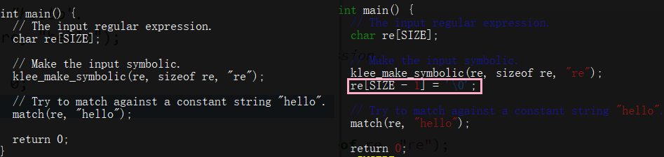

  内存报错消失

  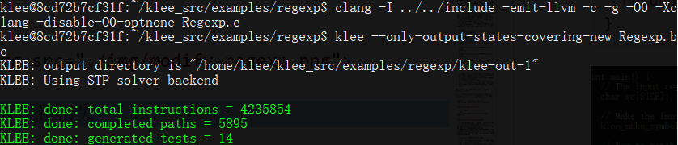

  另一种解决方法：使用klee_assume内在函数。
  - klee_assume采用单个参数（无符号整数），该参数通常应为某种条件表达式，并“假定”该表达式在当前路径上为真（如果永远不会发生，即该表达式可证明是假，则KLEE将报告一个错误）
  - 使用klee_assume添加\0
    ```c
    klee_make_symbolic(re, sizeof re, "re");
    klee_assume(re[SIZE - 1] == '\0');
    ```
  - klee_assume通过显式声明约束，强制测试用例中包含'\ 0'。在第一个示例中显式编写了终止null，符号输入的最后一个字节是什么都无关紧要而且KLEE可以自由生成任何值

## Tutorial 3 - KLEE Maze

### 手工运行

#### Method 1. [使用github上的项目](https://github.com/grese/klee-maze)

```bash
# 在docker下
sudo apt-get update
sudo apt-get upgrade
sudo apt-get install -y git-core
git clone https://github.com/grese/klee-maze.git ~/maze
cd ~/maze
# build
gcc maze.c -o maze
# run manually
./maze
# 此时命令行会等待输入，输入如下
# 表示移动命令 w (up), d (right), s (down), a (left)
ssssddddwwaawwddddssssddwwww
```

#### Method 2. 依据项目修改[官网示例代码](https://pastebin.com/raw/6wG5stht)
- 在`~/maze`目录下
- `wget https://pastebin.com/raw/6wG5stht`，存为`maze-copy.c`
- 加入头文件`#include <unistd.h>`
- 然后进行编译`gcc maze-copy.c -o maze-copy`，跑`./maze-copy`

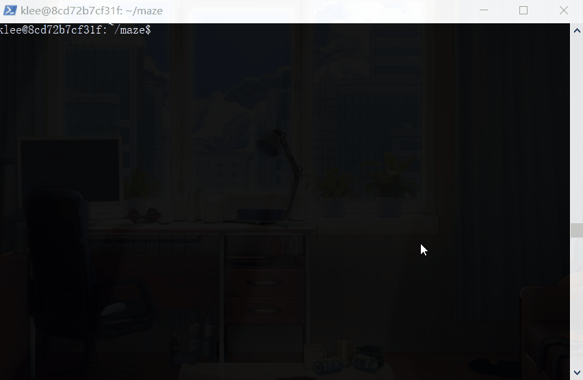

### KLEE运行

#### Method 1. 根据项目

```bash
cd ~/maze

# Build LLVM Bytecode，运行作者写好的shell文件
# clang -c -I../klee_src/include -emit-llvm ./maze_klee.c -o ./maze_klee.bc
./scripts/build_bc.sh
# Ignore the "implicit declaration of function '__assert_fail'" warning.

# Run Klee on Bytecode
# klee --emit-all-errors ./maze_klee.bc
# klee --only-output-states-covering-new ./maze_klee.bc
./scripts/run_klee.sh

# Show solutions
./scripts/show_solutions.sh

TESTID       SOLUTION
test000139:  sddwddddsddw................
test000210:  ssssddddwwaawwddddsddw......
test000252:  sddwddddssssddwwww..........
test000301:  ssssddddwwaawwddddssssddwwww

# 查看klee-last有309个测试样例
ls klee-last
```

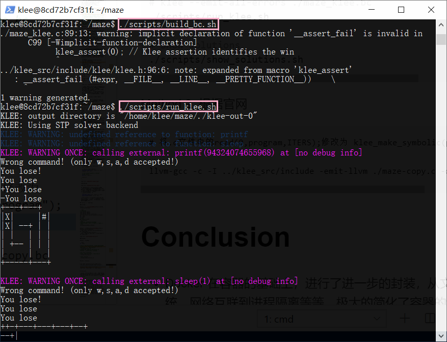

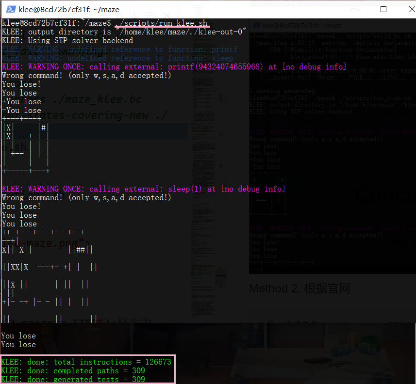

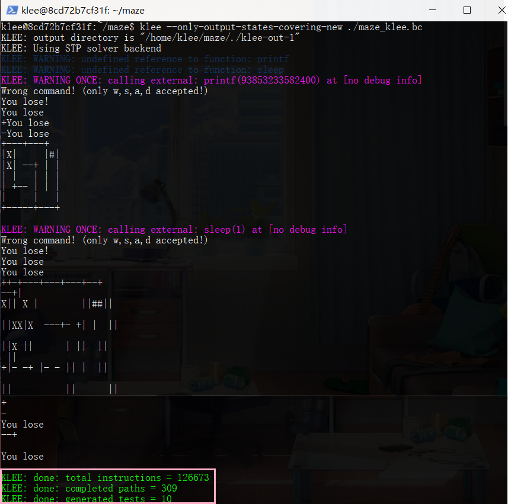

fake walls:

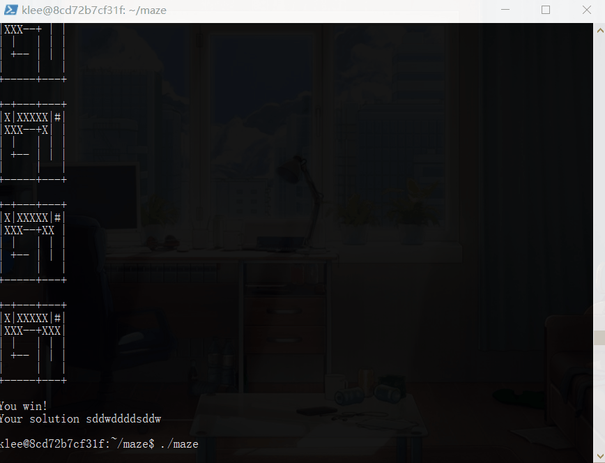

#### Method 2. 根据官网

```bash
# 为了使用KLEE进行测试，我们需要将代码中的某些内容标记为符号，让我们将所有迷宫输入标记为符号
# 这是迷宫代码在主要功能开始时读取的动作数组，KLEE将获得一系列动作的“符号控制”
# 将.c文件中的read(0,program,ITERS);修改为 klee_make_symbolic(program,ITERS,"program");

# 加上头文件 #include<klee/klee.h>

clang -c -I ../klee_src/include -emit-llvm ./maze-copy.c -o ./maze-copy.bc
# llvm-gcc命令没有（不想装了），换成clang

klee maze-copy.bc

# KLEE将从任何输入中找到所有可能的代码/迷宫路径。如果其中一些路径导致典型的错误情况（例如内存故障等），则KLEE会发出信号
```

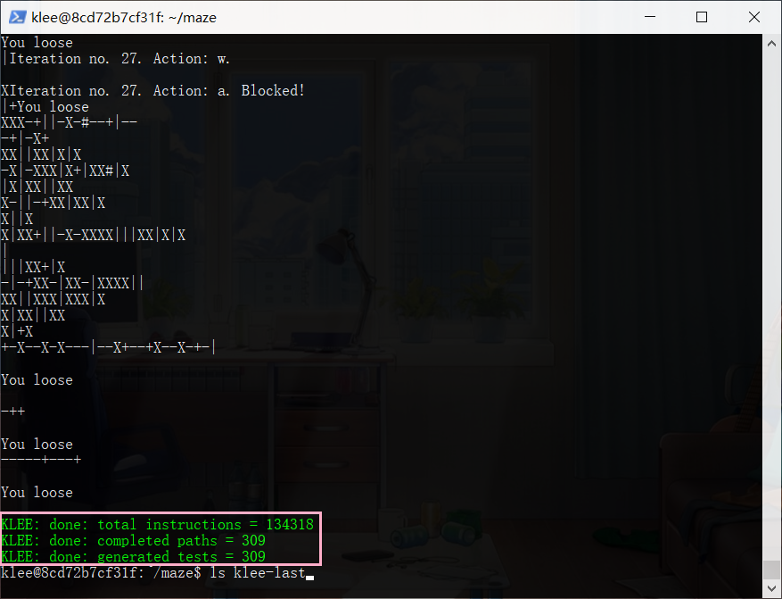

```bash
ls klee-last

ktest-tool klee-last/test000309.ktest
```

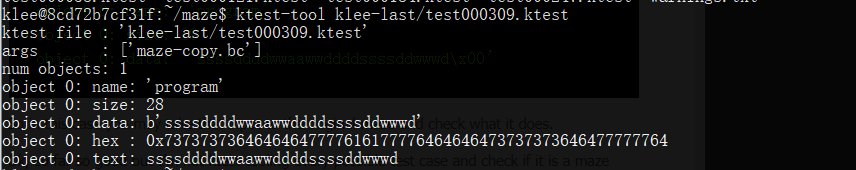

##### 区分正常的测试用例和成功的测试用例

```c
printf ("You win!\n");
klee_assert(0);  //Signal The solution!!
```

- 重新build和run
- 通过assert.err后缀名辨别出是成功的测试用例，并且查看
  ```
  ls -1 klee-last/ |grep -A2 -B2 err
  # 假如列出了test000098.assert.err
  ktest-tool klee-last/test000098.ktest
  ```

  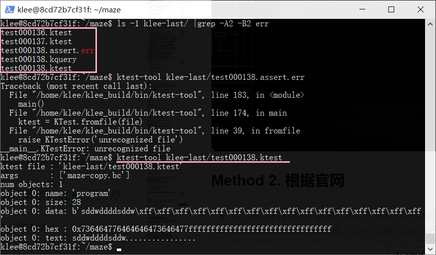

- 使用`klee --emit-all-errors maze_klee.bc`，因为只需要一种方法即可达到错误状态，因此KLEE不会显示达到相同错误状态的其他方法，所以需要测试所有路径，得到四个解决方法

    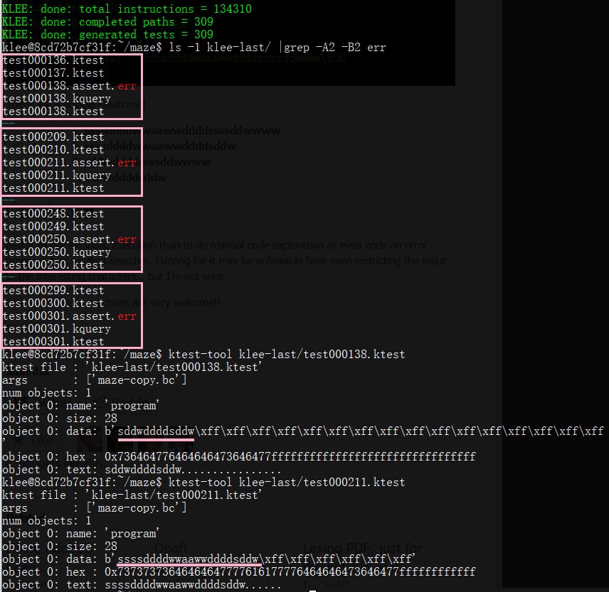

# Conclusion

## Docker

- Docker 在容器的基础上，进行了进一步的封装，从文件系统、网络互联到进程隔离等等，极大的简化了容器的创建和维护。使得 Docker 技术比虚拟机技术更为轻便、快捷

## LLVM

- llvm是low level virtual machine的简称，其实是一个编译器框架
- llvm的主要作用是它可以作为多种语言的后端，它可以提供可编程语言无关的优化和针对很多种CPU的代码生成功能
- 此外llvm目前已经不仅仅是个编程框架，它目前还包含了很多的子项目，比如clang

## 符号执行

### 静态 / 动态符号执行

- 动态符号执行是以**具体数值**作为输入来模拟执行程序代码

### 挑战与优化

#### 路径选择

由于在每一个条件分支都会产生两个不同约束，符号执行要探索的执行路径依分支数指数增长。在时间和资源有限的情况下，应该对最相关的路径进行探索，通过路径选择的方法缓解指数爆炸问题，主要有两种方法：
- 使用**启发式函数**对路径进行搜索，目的是先探索最值得探索的路径
- 使用一些可靠的程序分析技术减少路径探索的复杂性

#### 约束求解优化

符号执行所需求的约束求解能力超出了当前约束求解器的能力，优化方法：
- 不相关约束消除
- 增量求解

# 踩坑

- 开始使用的是windows子系统下的linux启动程序，在启动docker的时候`sudo docker run hello-world`一直报错`docker: Cannot connect to the Docker daemon at unix:///var/run/docker.sock. Is the docker daemon running?.See 'docker run --help'.`和`sudo systemctl start docker`的时候报错`System has not been booted with systemd as init system (PID 1). Can't operate.` > 查资料说win下的linux装docker会有问题 > 简单解决方法：以管理员身份启动wsl，多试几次
  - [参考资料](https://blog.csdn.net/li_yan_sring/article/details/84408701)
  - 谷歌搜索关键词：windows wsl docker is not running，主要原因是`docker daemon(守护进程)`不能在wsl上运行

# Reference