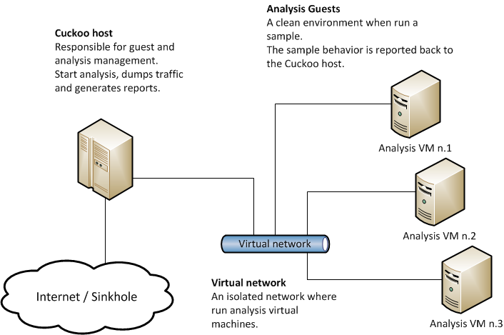

# [Cuckoo Sandbox](https://cuckoosandbox.org/)

上大多讲述的是Cuckoo Sandbox在Ubuntu下的搭建（官方的文档也是这种环境），而Windows平台下的搭建的相关资料却异常稀少（官方的文档里只是一句“To be documented”

## Cuckoo的架构设计

在 Host 机上运行 Cuckoo 主程序，多个 Guest 机通过虚拟网络与 Host 机相连，每个 Guest 机上有一个 Cuckoo Agent 程序，用来做 Cuckoo 的监控代理。其实就是说，在host的web上提交的文件，会被分配到各个guest上运行，收集该文件调用的状况

## 安装与配置

- https://www.trustwave.com/en-us/resources/blogs/spiderlabs-blog/cuckoo-linux-subsystem-some-love-for-windows-10/
- https://www.secpulse.com/archives/74821.html