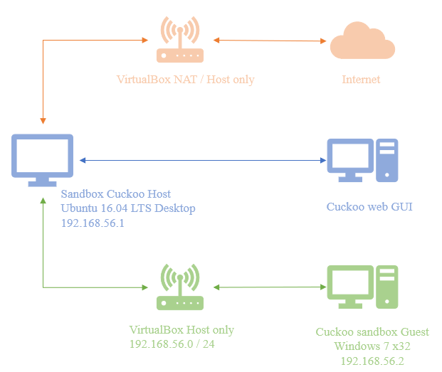

# [Cuckoo Sandbox](https://cuckoosandbox.org/)

上大多讲述的是Cuckoo Sandbox在Ubuntu下的搭建（官方的文档也是这种环境），而Windows平台下的搭建的相关资料却异常稀少（官方的文档里只是一句“To be documented”

## Cuckoo的架构设计


在 Host 机上运行 Cuckoo 主程序，多个 Guest 机通过虚拟网络与 Host 机相连，每个 Guest 机上有一个 Cuckoo Agent 程序，用来做 Cuckoo 的监控代理。其实就是说，在host的web上提交的文件，会被分配到各个guest上运行，收集该文件调用的状况

## Environment

| 机器 | 系统 | Host-Only地址 |
| --- | ---- | ------------- |
| 宿主机 Host | Ubuntu 16.04 Desktop | (手动分配) 192.168.56.105 |
| 客户机 Guest | Win7 x64 | (手动配置) 192.168.56.104 |

> 主机与客户机之间的连接方式：Host-Only + IP转发
> 
> cuckoo的网络配置中使用Host-Only连接方式的原因：
> 根据cuckoo的架构可以得知，一个恶意软件被安装配置了cuckoo的host提交到各个guest进行运行分析时，host是想要知道guest的所有流量信息的，因为绝大部分的恶意软件搞破坏都依赖网络。
> 此时只有设置Host-Only连接，host才能截获guest与互联网之间流经的所有流量，才能更好的分析恶意软件的行为方式。


照众多教程，应该是在Ubuntu主机中安装virtualbox，然后再在这个virtualbox中新建一个win7客机虚拟机。然鹅我们此处的环境是在Ubuntu主机和Win7客机都是virtualbox的虚拟机，所以要在虚拟机中再装一个虚拟机 [ 电脑吃不消 ] 




如果不使用套娃行为，将Host和Guest都安装在物理主机的Virtualbox软件中进行测试，我还实现不了

## Preparing the Host 

### requirements

> At this point we only fully support Python 2.7. Older version of Python and Python 3 versions are not supported by us (although Python 3 support is on our TODO list with a low priority).

```bash
$ python --version
python 2.7.12

$ sudo apt-get install python python-pip python-dev libffi-dev libssl-dev
$ sudo apt-get install python-virtualenv python-setuptools
$ sudo apt-get install libjpeg-dev zlib1g-dev swig

# In order to use the Django-based Web Interface, MongoDB is required
$ sudo apt-get install mongodb

# In order to use PostgreSQL as database (our recommendation), PostgreSQL will have to be installed as well
$ sudo apt-get install postgresql libpq-dev

# Virtualization Software 
$ echo deb http://download.virtualbox.org/virtualbox/debian xenial contrib | sudo tee -a /etc/apt/sources.list.d/virtualbox.list
$ wget -q https://www.virtualbox.org/download/oracle_vbox_2016.asc -O- | sudo apt-key add -
$ sudo apt-get update
$ sudo apt-get install virtualbox-5.2

# Installing tcpdump
$ sudo apt-get install tcpdump apparmor-utils
$ sudo aa-disable /usr/sbin/tcpdump

# Installing Volatility
$ sudo apt-get install -y volatility

# Installing M2Crypto
$ sudo apt-get install swig
$ sudo pip install m2crypto==0.24.0

# Installing guacd
$ sudo apt install libguac-client-rdp0 libguac-client-vnc0 libguac-client-ssh0 guacd
```

### Cuckoo install

> Make sure that the user that runs Cuckoo is the same user that you will use to create and run the virtual machines (at least in the case of VirtualBox), otherwise Cuckoo won’t be able to identify and launch these Virtual Machines.

```bash
# Create a new user
$ sudo adduser cuckoo

# If you’re using VirtualBox, make sure the new user belongs to the “vboxusers” group (or the group you used to run VirtualBox)
$ sudo usermod -a -G vboxusers cuckoo

# Install Cuckoo in a virtualenv
$ virtualenv venv
$ . venv/bin/activate
(venv)$ pip install -U pip setuptools
(venv)$ pip install -U cuckoo

# cuckoo 或者 cuckoo -d 测试结果
```


按照以上步骤还是没有安装成功，注意
- 某些依赖包需翻墙
- setuptools的报错
  > ERROR: Package 'setuptools' requires a different Python: 2.7.12 not in '>=3.5'
  > https://blog.csdn.net/weixin_43350700/article/details/104597730
  > pip install setuptools==44.0.0
- 提示有什么依赖包没有获取需要retry到则重新pip install，依赖包的版本需要严格按照提示安装

### Preparing the Guest

> We recommend either 64-bit Windows 7 or Windows XP virtual machines. For Windows 7 you will have to disable User Access Control.
> in this case Python 2.7 is preferred.

```cmd
# windows python 2.7.12 https://www.python.org/downloads/release/python-2712/

```

#### 虚拟网络设置

> Use only static IP addresses for your guest, as Cuckoo doesn’t support DHCP and using it will break your setup.
> The recommended setup is using a Host-Only networking layout with proper forwarding

virtualbox的主机网络管理设置为


win7 x64的网络配置为：一块Host-Only网卡


此时Host-Only网络还是未识别的状态，需要手动配置。
- 在控制面板处找到网络和Internet选项，选择查看网络状态和任务
  

- 点击“本地连接”，选择属性，修改如下

  

> disable the “auto update” or “check for updates” feature of any additional software.
> disabling Windows Firewall and the Automatic Updates. 
> The reason behind this is that they can affect the behavior of the malware under normal circumstances and that they can pollute the network analysis performed by Cuckoo, by dropping connections or including irrelevant requests.

在win7**控制面板**中找到**系统与安全**
- 找到**Windows防火墙**，左侧**打开或关闭Windows防火墙**

  

- 找到**Windows Update**，将重要更新的设置改为“从不检查更新(不推荐)”，另外将推荐更新、谁可以安装更新、Microsoft Update选项下的三个勾全部去掉 [ 此处未安装，就啥都没改了 ]

  

关闭UAC - disable User Access Control ：在win7**控制面板**中找到**用户账户和家庭安全**，选择**用户账户**，选择**更改用户账户控制设置**，修改如下


测试主机和客机的连接
  


#### 设置IP报文转发

Ubuntu中的操作，因为win7无法上网，所以要通过主机才能访问网络，所以需要以下操作

```bash
$ sudo vim /etc/sysctl.conf
net.ipv4.ip_forward=1
$ sudo sysctl -p /etc/systl.conf
```

使用iptables提供NAT机制

```bash
$ sudo iptables -A FORWARD -o [Ubuntu中的nat网卡名称] -i [Ubuntu中的hostonly网卡名称] -s 192.168.56.0/24 -m conntrack --ctstate NEW -j ACCEPT
$ sudo iptables -A FORWARD -m conntrack --ctstate ESTABLISHED,RELATED -j ACCEPT
$ sudo iptables -A POSTROUTING -t nat -j MASQUERADE

$ sudo vim /etc/network/interfaces
# 新增如下两行
pre-up iptables-restore < /etc/iptables.rules # 开机启动iptables规则
post-down iptables-save > /etc/iptables.rules # 关机保存当前所有的iptables的规则

$ sudo service networking restart

$ sudo apt-get install -y dnsmasq
$ sudo service dnsmasq start

### 注
-i 网卡名称 匹配从这块网卡流入的数据
-o 网卡名称 匹配从这块网卡流出的数据
```

- 虽然设置了，但是guest仍旧无法访问网络

#### Installing the Agent

拷贝Host机器`~/.cuckoo/agent`目录下的agent.py文件到Guest机器，并且在Guest下用python启动。在任务管理器中查看进程，或在命令行中执行netstat -ano | findstr 8000查看是否有8000端口的监听，来确定agent是否在运行

> The Agent will launch a small API server that the host will be able to talk to.

- 将agent.py文件放进C:\Users\\[USER]\AppData\Roaming\MicroSoft\Windows\Start Menu\Programs\Startup\ 下，并把后缀名改为.pyw。其中users是指用户名
- 配置系统开机自动登录
  - 使用Administrator权限启动cmd,并依序在cmd中输入以下指令。[USERNAME]和[PASSWORD]需替换为登入的Windows user与对应的password
    ```cmd
    reg add "hklm\software\Microsoft\Windows NT\CurrentVersion\WinLogon" /v DefaultUserName /d [USERNAME] /t REG_SZ /f
    reg add "hklm\software\Microsoft\Windows NT\CurrentVersion\WinLogon" /v DefaultPassword /d [PASSWORD] /t REG_SZ /f
    reg add "hklm\software\Microsoft\Windows NT\CurrentVersion\WinLogon" /v AutoAdminLogon /d 1 /t REG_SZ /f
    reg add "hklm\system\CurrentControlSet\Control\TerminalServer" /v AllowRemoteRPC /d 0x01 /t REG_DWORD /f
    reg add "HKEY_LOCAL_MACHINE\SOFTWARE\Microsoft\Windows\CurrentVersion\Policies\System" /v LocalAccountTokenFilterPolicy /d 0x01 /t REG_DWORD /f
    ```

安装PIL：命令行进到C:\Python27\Scripts路径下`pip install Pillow -i https://pypi.tuna.tsinghua.edu.cn/simple`

#### 创建快照

- 用virtualbox创建，名为`snapshot1`
- cuckoo在每次执行任务的时候会先恢复虚拟机快照

### Cuckoo配置

https://cuckoo.readthedocs.io/en/latest/installation/host/configuration/

配置文件路径`~/.cuckoo/conf`

#### cuckoo.conf

```conf
[resultserver]
# The Result Server is used to receive in real time the behavioral logs
# produced by the analyzer.
# Specify the IP address of the host. The analysis machines should be able
# to contact the host through such address, so make sure it's valid.
# NOTE: if you set resultserver IP to 0.0.0.0 you have to set the option
# `resultserver_ip` for all your virtual machines in machinery configuration.
ip = 192.168.56.1 # 此处填写主机host-only网卡设置的静态IP

[cuckoo]
version_check = no # 每次启动都要检查更新很费时间，可以选择关闭
machinery = virtualbox
# process_results = no 
# 默认为yes，强烈建议修改，虽然会导致启动Cuckoo Sandbox需要多一个步骤。该设置将会让Cuckoo的主模块与处理报告的模块分离，大幅提升Cuckoo的稳定性，避免各种意外发生
```

#### auxillary.conf

```conf
[sniffer]
enabled = yes
tcpdump = /usr/sbin/tcpdump # which tcpdump
```

#### virtualbox.conf

```conf
[virtualbox]
mode = gui # gui是有界面，headless是无界面，调试的时候可以选择
path = /usr/bin/vboxmanage
interface = vboxnet0
machines = cuckoo1 # 你的虚拟机名称 即启动win7 输入密码对应的用户名
controlports = 5000-5050

[cuckoo1]  # 需要与machines一致
label = cuckoo1 # 你的虚拟机名称，需要与machines一致
platform = windows
ip = 192.168.56.101 # 虚拟机IP 
snapshot = snapshot1 # 创建的快照名称
```

#### reporting.conf

```conf
[mongodb]
enabled = yes  # 默认是no
host = 127.0.0.1
port = 27017
db = cuckoo # 数据集名称
store_memdump = yes 
paginate = 100
```

#### 社区签名库

```bash
#虚拟环境下，运行以下命令下载Cuckoo提供的社区版行为签名库
(venv)$ cuckoo community
#或先在浏览器下载再导入：
(venv)$ cuckoo community --file cuckoo_master.tar.gz
```

### 启动Cuckoo

`cuckoo`或者`cuckoo -d`启动
- 报错1：
> CuckooCriticalError: Unable to bind ResultServer on 192.168.56.1:2042 [Errno 99] Cannot assign requested address. This usually happens when you start Cuckoo without bringing up the virtual interface associated with the ResultServer IP address. Please refer to https://cuckoo.sh/docs/faq/#troubles-problem for more information.
> 解决：https://cuckoo.readthedocs.io/en/latest/faq/#unable-to-bind-result-server-error

- 报错2：
  
  

  > CRITICAL: CuckooCriticalError: Please update your configuration. Unable to shut 'purple' down or find the machine in its proper state: The virtual machine 'purple' doesn't exist! Please create one or more Cuckoo analysis VMs and properly fill out the Cuckoo configuration!

  觉得应该是guest客机和主机没有配置好的缘故
  
  但是`cuckoo web`仍旧可以访问页面，但是没有了guest是无法分析出东西的，页面只会是pending状态，分析不出结果

  

<details>

<summary>还是乖乖的套娃吧</summary>

### Installing the Guest

- 在Ubuntu中装virtualbox

</details>

## Reference

- https://blog.csdn.net/baobaoyu_/article/details/103047082
- https://blog.csdn.net/Bingoooooo_/article/details/94248229

在win10上搭建的参考资料

- [Cuckoo Linux Subsystem: Some Love for Windows 10](https://www.trustwave.com/en-us/resources/blogs/spiderlabs-blog/cuckoo-linux-subsystem-some-love-for-windows-10/)
- [从零开始搭建Cuckoo Sandbox(1)](https://www.secpulse.com/archives/74821.html)